# 📁 TEAM-ORDNER-SYSTEM - UMFASSENDES REDESIGN

## 🎯 VISION & KONZEPT

**Problem:** Das aktuelle Kunden/Kampagnen-System ist zu komplex und unflexibel für den täglichen E-Mail-Workflow.

**Lösung:** Einfaches, teambasiertes Ordnersystem mit persönlichen und gemeinsamen Bereichen.

### 🏗️ NEUE ORDNER-STRUKTUR

```
📧 INBOX HAUPTNAVIGATION
├── 📥 Allgemeine Anfragen (Shared Inbox)
│   ├── 🆕 Neu (unbearbeitet)
│   ├── 🔄 In Bearbeitung
│   └── ✅ Erledigt
│
├── 👥 TEAM-ORDNER
│   ├── 👤 Stefan Kühne
│   │   ├── 📁 Eigene Unterordner
│   │   ├── 📁 Kundenprojekte
│   │   └── 📁 Persönliche Notizen
│   │
│   ├── 👤 Team-Mitglied 2
│   │   ├── 📁 Marketing Anfragen
│   │   └── 📁 Support Cases
│   │
│   └── 👤 [Weitere Team-Mitglieder]
│
└── 🏢 ORGANISATIONSORDNER
    ├── 📁 VIP-Kunden
    ├── 📁 Wichtige Kampagnen
    └── 📁 Archiv
```

## 🔄 E-MAIL-FLOW KONZEPT

### 1. Eingehende E-Mail-Verteilung

```mermaid
graph TD
    A[📧 Neue E-Mail] --> B{Kunde zugeordnet?}
    B -->|Ja| C[📁 Allgemeine Anfragen + Team-Ordner]
    B -->|Nein| D[📁 Nur Allgemeine Anfragen]
    
    C --> E[Automatische Benachrichtigung an zuständiges Team-Mitglied]
    D --> F[Manuelle Zuweisung möglich]
    
    E --> G[📋 Team-Mitglied kann in eigenen Ordner verschieben]
    F --> G
    G --> H[📂 Weitere Unterordner-Organisation möglich]
```



### 2. E-Mail-Sichtbarkeit

**GRUNDPRINZIP:**
- **Allgemeine Anfragen**: Für ALLE Team-Mitglieder sichtbar
- **Team-Ordner**: Nur für den jeweiligen Besitzer sichtbar (optional: Team-Sharing)
- **Kundenverknüpfung**: E-Mail bleibt im Allgemeinen + wird in zugewiesenen Team-Ordner kopiert

## 🏗️ TECHNISCHE IMPLEMENTIERUNG

### Phase 1: Datenmodell-Erweiterung (2-3 Tage)

#### 1.1 Neue Folder-Entities

```typescript
// src/types/team-folders.ts
interface TeamFolder {
  id: string;
  organizationId: string;
  ownerId: string;                    // Team-Member ID
  ownerName: string;
  name: string;
  description?: string;
  icon?: string;
  color?: string;
  
  // Hierarchie
  parentFolderId?: string;            // Für Unterordner
  level: number;                      // 0 = Root, 1 = Sub, etc.
  path: string[];                     // ["Stefan", "Kundenprojekte"]
  
  // Einstellungen
  isShared: boolean;                  // Mit Team teilen?
  sharedWithUserIds?: string[];       // Spezifische Berechtigung
  isSystem: boolean;                  // System-Ordner (nicht löschbar)
  
  // Verhalten
  autoAssignRules?: AutoAssignRule[];
  emailCount: number;
  unreadCount: number;
  
  createdAt: Timestamp;
  updatedAt: Timestamp;
}

interface AutoAssignRule {
  id: string;
  type: 'domain' | 'keyword' | 'sender' | 'subject';
  pattern: string;                    // Email-Domain, Keyword, etc.
  isActive: boolean;
}

interface EmailThreadFolder {
  id: string;
  threadId: string;
  folderId: string;
  folderPath: string[];               // ["Allgemein", "Stefan", "Kundenprojekte"]
  assignedBy?: string;                // Wer hat verschoben
  assignedAt: Timestamp;
  isOriginalLocation: boolean;        // True für Allgemeine Anfragen
}
```

#### 1.2 Enhanced Email Thread Model

```typescript
// Erweitern von EmailThread in inbox-enhanced.ts
interface EmailThread {
  // Bestehende Felder...
  
  // Neue Folder-Zuordnung
  folderAssignments: EmailThreadFolder[];  // Multi-Location Support
  primaryFolderId: string;                 // Haupt-Ordner
  
  // Team-Features
  assignedToUserId?: string;               // Zugewiesenes Team-Mitglied
  assignedToUserName?: string;
  assignedBy?: string;
  assignedAt?: Timestamp;
  
  // Auto-Assignment
  autoAssignedTo?: string;                 // Automatisch zugewiesen durch Regeln
  autoAssignReason?: string;               // "Domain-Match: kunde.de"
  
  // Workflow
  isInPersonalFolder: boolean;             // Liegt in persönlichem Ordner
  sharedWithTeam: boolean;                 // Mit Team geteilt
  needsAttention: boolean;                 // Aufmerksamkeit erforderlich
}
```

### Phase 2: Services & Datenlogik (3-4 Tage)

#### 2.1 Team Folder Service

```typescript
// src/lib/email/team-folder-service.ts
export class TeamFolderService {
  
  // System-Ordner erstellen (beim ersten Login)
  async createSystemFolders(organizationId: string, userId: string, userName: string) {
    const systemFolders = [
      {
        name: "📥 Allgemeine Anfragen",
        ownerId: "system",
        isSystem: true,
        isShared: true
      },
      {
        name: `👤 ${userName}`,
        ownerId: userId,
        isSystem: true,
        isShared: false
      }
    ];
    
    // Batch-Create...
  }
  
  // Persönliche Ordner verwalten
  async createUserFolder(organizationId: string, userId: string, folderData: Partial<TeamFolder>) {
    // Validierung: Max 10 Ordner pro User
    // Hierarchie-Validierung: Max 3 Ebenen
    // Name-Duplikat prüfen
  }
  
  // Ordner-Hierarchie laden
  async getFolderTree(organizationId: string, userId: string): Promise<FolderTreeNode[]> {
    // Hierarchische Struktur aufbauen
    // User-Berechtigungen prüfen
    // System + eigene + geteilte Ordner
  }
  
  // E-Mail in Ordner verschieben
  async moveEmailToFolder(threadId: string, targetFolderId: string, userId: string) {
    // Multi-Location Support
    // Original in "Allgemeine Anfragen" behalten
    // Kopie in Ziel-Ordner erstellen
  }
  
  // Auto-Assignment Regeln
  async processAutoAssignment(email: EmailMessage): Promise<string[]> {
    // Domain-basierte Zuweisung
    // Keyword-Matching
    // Sender-basierte Regeln
    // Return: Array von Folder-IDs
  }
}
```

#### 2.2 Enhanced Email Processing

```typescript
// src/lib/email/email-processor-team-folders.ts
export class TeamFolderEmailProcessor {
  
  async processIncomingEmail(email: EmailMessage) {
    // 1. Standard-Verarbeitung (Thread-Matching, etc.)
    await this.standardProcessing(email);
    
    // 2. Kunde-Erkennung
    const customerMatch = await this.customerMatcher.matchCustomer(email);
    
    // 3. Team-Mitglied Assignment
    const assignedUser = await this.determineAssignment(email, customerMatch);
    
    // 4. Ordner-Zuweisung
    const folderAssignments = await this.determineFolders(email, assignedUser, customerMatch);
    
    // 5. Thread aktualisieren
    await this.updateThreadWithFolders(email.threadId, folderAssignments, assignedUser);
    
    // 6. Benachrichtigungen
    await this.sendAssignmentNotifications(assignedUser, email);
  }
  
  private async determineAssignment(email: EmailMessage, customerMatch?: CustomerMatch) {
    // Priority 1: Existing thread assignment
    if (email.threadId) {
      const thread = await this.getExistingThread(email.threadId);
      if (thread?.assignedToUserId) return thread.assignedToUserId;
    }
    
    // Priority 2: Customer-based assignment
    if (customerMatch?.preferredTeamMember) {
      return customerMatch.preferredTeamMember;
    }
    
    // Priority 3: Auto-assignment rules
    const autoAssignment = await this.teamFolderService.processAutoAssignment(email);
    if (autoAssignment.length > 0) {
      return this.getTeamMemberForFolder(autoAssignment[0]);
    }
    
    // Priority 4: Round-robin assignment
    return await this.getRoundRobinAssignment();
  }
  
  private async determineFolders(email: EmailMessage, assignedUser?: string, customerMatch?: CustomerMatch) {
    const folders: EmailThreadFolder[] = [];
    
    // Immer: Allgemeine Anfragen
    folders.push({
      folderId: "system_general_inbox",
      folderPath: ["Allgemeine Anfragen"],
      isOriginalLocation: true,
      assignedAt: serverTimestamp(),
      assignedBy: "system"
    });
    
    // Wenn zugewiesen: Team-Member Ordner
    if (assignedUser) {
      const userFolder = await this.getUserMainFolder(assignedUser);
      folders.push({
        folderId: userFolder.id,
        folderPath: ["Team-Ordner", userFolder.ownerName],
        isOriginalLocation: false,
        assignedAt: serverTimestamp(),
        assignedBy: "auto-assignment"
      });
    }
    
    // Auto-Assignment Regeln
    const autoFolders = await this.teamFolderService.processAutoAssignment(email);
    for (const folderId of autoFolders) {
      const folder = await this.getFolder(folderId);
      folders.push({
        folderId: folder.id,
        folderPath: folder.path,
        isOriginalLocation: false,
        assignedAt: serverTimestamp(),
        assignedBy: "auto-rule"
      });
    }
    
    return folders;
  }
}
```

### Phase 3: UI-Komponenten (4-5 Tage)

#### 3.1 Team Folder Sidebar

```typescript
// src/components/inbox/TeamFolderSidebar.tsx
export function TeamFolderSidebar() {
  const [folderTree, setFolderTree] = useState<FolderTreeNode[]>([]);
  const [selectedFolderId, setSelectedFolderId] = useState<string>("system_general_inbox");
  const [expandedFolders, setExpandedFolders] = useState<Set<string>>(new Set());
  
  return (
    <div className="team-folder-sidebar">
      {/* Allgemeine Anfragen - immer oben */}
      <GeneralInboxSection 
        selectedFolderId={selectedFolderId}
        onFolderSelect={setSelectedFolderId}
      />
      
      {/* Team-Ordner */}
      <TeamFoldersSection 
        folderTree={folderTree}
        selectedFolderId={selectedFolderId}
        expandedFolders={expandedFolders}
        onFolderSelect={setSelectedFolderId}
        onFolderToggle={toggleFolder}
      />
      
      {/* Ordner-Management */}
      <FolderManagementSection 
        onCreateFolder={handleCreateFolder}
        onEditFolder={handleEditFolder}
      />
    </div>
  );
}

// Unterkomponenten
function GeneralInboxSection({ selectedFolderId, onFolderSelect }) {
  return (
    <div className="general-inbox-section">
      <h3 className="section-title">📥 Allgemeine Anfragen</h3>
      
      <FolderItem
        id="system_general_inbox_new"
        name="🆕 Neu"
        count={unreadCount}
        isSelected={selectedFolderId === "system_general_inbox_new"}
        onClick={() => onFolderSelect("system_general_inbox_new")}
      />
      
      <FolderItem
        id="system_general_inbox_in_progress"
        name="🔄 In Bearbeitung"
        count={inProgressCount}
        isSelected={selectedFolderId === "system_general_inbox_in_progress"}
        onClick={() => onFolderSelect("system_general_inbox_in_progress")}
      />
      
      <FolderItem
        id="system_general_inbox_done"
        name="✅ Erledigt"
        count={doneCount}
        isSelected={selectedFolderId === "system_general_inbox_done"}
        onClick={() => onFolderSelect("system_general_inbox_done")}
      />
    </div>
  );
}

function TeamFoldersSection({ folderTree, selectedFolderId, expandedFolders, onFolderSelect, onFolderToggle }) {
  return (
    <div className="team-folders-section">
      <h3 className="section-title">👥 Team-Ordner</h3>
      
      {folderTree.map(userFolder => (
        <UserFolderTree
          key={userFolder.id}
          folder={userFolder}
          selectedFolderId={selectedFolderId}
          expandedFolders={expandedFolders}
          onFolderSelect={onFolderSelect}
          onFolderToggle={onFolderToggle}
          level={0}
        />
      ))}
    </div>
  );
}

function UserFolderTree({ folder, selectedFolderId, expandedFolders, onFolderSelect, onFolderToggle, level }) {
  const isExpanded = expandedFolders.has(folder.id);
  const hasChildren = folder.children && folder.children.length > 0;
  
  return (
    <div className="user-folder-tree">
      <FolderItem
        id={folder.id}
        name={folder.name}
        icon={folder.icon}
        count={folder.emailCount}
        unreadCount={folder.unreadCount}
        isSelected={selectedFolderId === folder.id}
        isExpanded={isExpanded}
        hasChildren={hasChildren}
        level={level}
        onClick={() => onFolderSelect(folder.id)}
        onToggle={() => onFolderToggle(folder.id)}
      />
      
      {isExpanded && hasChildren && (
        <div className="folder-children">
          {folder.children.map(childFolder => (
            <UserFolderTree
              key={childFolder.id}
              folder={childFolder}
              selectedFolderId={selectedFolderId}
              expandedFolders={expandedFolders}
              onFolderSelect={onFolderSelect}
              onFolderToggle={onFolderToggle}
              level={level + 1}
            />
          ))}
        </div>
      )}
    </div>
  );
}
```

#### 3.2 Drag & Drop für E-Mail-Organisation

```typescript
// src/components/inbox/EmailDragDrop.tsx
export function EmailListWithDragDrop() {
  const [draggedEmailId, setDraggedEmailId] = useState<string | null>(null);
  
  const handleDragStart = (emailId: string) => {
    setDraggedEmailId(emailId);
  };
  
  const handleDrop = async (targetFolderId: string) => {
    if (!draggedEmailId) return;
    
    try {
      await teamFolderService.moveEmailToFolder(draggedEmailId, targetFolderId, user.uid);
      toast.success("E-Mail verschoben");
      
      // UI-Update
      refetchEmails();
    } catch (error) {
      toast.error("Fehler beim Verschieben");
    } finally {
      setDraggedEmailId(null);
    }
  };
  
  return (
    <DragDropContext onDragEnd={handleDragEnd}>
      <div className="inbox-layout">
        {/* Sidebar mit Drop-Zones */}
        <Droppable droppableId="folders">
          {(provided) => (
            <div ref={provided.innerRef} {...provided.droppableProps}>
              <TeamFolderSidebar onFolderDrop={handleDrop} />
              {provided.placeholder}
            </div>
          )}
        </Droppable>
        
        {/* Email-Liste mit Drag-Items */}
        <Droppable droppableId="emails">
          {(provided) => (
            <div ref={provided.innerRef} {...provided.droppableProps}>
              {emails.map((email, index) => (
                <Draggable key={email.id} draggableId={email.id} index={index}>
                  {(provided, snapshot) => (
                    <div
                      ref={provided.innerRef}
                      {...provided.draggableProps}
                      {...provided.dragHandleProps}
                      className={`email-item ${snapshot.isDragging ? 'dragging' : ''}`}
                    >
                      <EmailListItem email={email} />
                    </div>
                  )}
                </Draggable>
              ))}
              {provided.placeholder}
            </div>
          )}
        </Droppable>
      </div>
    </DragDropContext>
  );
}
```

#### 3.3 Ordner-Management Modal

```typescript
// src/components/inbox/FolderManagementModal.tsx
export function FolderManagementModal({ isOpen, onClose, parentFolderId, editingFolder }) {
  const [folderData, setFolderData] = useState({
    name: '',
    description: '',
    icon: '📁',
    color: '#3B82F6',
    isShared: false,
    autoAssignRules: []
  });
  
  const handleSubmit = async () => {
    try {
      if (editingFolder) {
        await teamFolderService.updateFolder(editingFolder.id, folderData);
      } else {
        await teamFolderService.createUserFolder(
          currentOrganization.id, 
          user.uid, 
          { ...folderData, parentFolderId }
        );
      }
      
      toast.success(editingFolder ? "Ordner aktualisiert" : "Ordner erstellt");
      onClose();
    } catch (error) {
      toast.error("Fehler beim Speichern");
    }
  };
  
  return (
    <Dialog open={isOpen} onOpenChange={onClose}>
      <DialogContent className="folder-management-modal">
        <DialogHeader>
          <DialogTitle>
            {editingFolder ? "Ordner bearbeiten" : "Neuen Ordner erstellen"}
          </DialogTitle>
        </DialogHeader>
        
        <div className="form-grid">
          {/* Name & Icon */}
          <div className="form-group">
            <Label>Ordner-Name</Label>
            <div className="name-input-group">
              <EmojiPicker
                value={folderData.icon}
                onChange={(icon) => setFolderData({...folderData, icon})}
              />
              <Input
                value={folderData.name}
                onChange={(e) => setFolderData({...folderData, name: e.target.value})}
                placeholder="z.B. Kundenprojekte"
              />
            </div>
          </div>
          
          {/* Beschreibung */}
          <div className="form-group">
            <Label>Beschreibung (optional)</Label>
            <Textarea
              value={folderData.description}
              onChange={(e) => setFolderData({...folderData, description: e.target.value})}
              placeholder="Kurze Beschreibung des Ordners..."
            />
          </div>
          
          {/* Farbe */}
          <div className="form-group">
            <Label>Farbe</Label>
            <ColorPicker
              value={folderData.color}
              onChange={(color) => setFolderData({...folderData, color})}
            />
          </div>
          
          {/* Freigabe */}
          <div className="form-group">
            <div className="checkbox-group">
              <Checkbox
                checked={folderData.isShared}
                onCheckedChange={(checked) => setFolderData({...folderData, isShared: checked})}
              />
              <Label>Mit Team teilen</Label>
            </div>
            <p className="help-text">Andere Team-Mitglieder können diesen Ordner sehen</p>
          </div>
          
          {/* Auto-Assignment Regeln */}
          <div className="form-group">
            <Label>Automatische Zuweisungsregeln</Label>
            <AutoAssignRulesEditor
              rules={folderData.autoAssignRules}
              onChange={(rules) => setFolderData({...folderData, autoAssignRules: rules})}
            />
          </div>
        </div>
        
        <DialogFooter>
          <Button variant="outline" onClick={onClose}>
            Abbrechen
          </Button>
          <Button onClick={handleSubmit}>
            {editingFolder ? "Aktualisieren" : "Erstellen"}
          </Button>
        </DialogFooter>
      </DialogContent>
    </Dialog>
  );
}
```

### Phase 4: Auto-Assignment & Intelligente Regeln (2-3 Tage)

#### 4.1 Regel-Engine

```typescript
// src/lib/email/auto-assignment-engine.ts
export class AutoAssignmentEngine {
  
  async processEmail(email: EmailMessage): Promise<AssignmentResult[]> {
    const results: AssignmentResult[] = [];
    
    // 1. Domain-basierte Regeln
    const domainResults = await this.processDomainRules(email);
    results.push(...domainResults);
    
    // 2. Keyword-basierte Regeln
    const keywordResults = await this.processKeywordRules(email);
    results.push(...keywordResults);
    
    // 3. Sender-basierte Regeln
    const senderResults = await this.processSenderRules(email);
    results.push(...senderResults);
    
    // 4. Subject-basierte Regeln
    const subjectResults = await this.processSubjectRules(email);
    results.push(...subjectResults);
    
    // 5. Priorität-basierte Sortierung
    return this.sortByPriority(results);
  }
  
  private async processDomainRules(email: EmailMessage): Promise<AssignmentResult[]> {
    const senderDomain = this.extractDomain(email.from);
    const rules = await this.getActiveRulesForType('domain');
    
    return rules
      .filter(rule => rule.pattern === senderDomain)
      .map(rule => ({
        folderId: rule.folderId,
        folderPath: rule.folderPath,
        reason: `Domain-Match: ${senderDomain}`,
        confidence: 0.9,
        priority: rule.priority || 1
      }));
  }
  
  private async processKeywordRules(email: EmailMessage): Promise<AssignmentResult[]> {
    const content = `${email.subject} ${email.textContent}`.toLowerCase();
    const rules = await this.getActiveRulesForType('keyword');
    
    return rules
      .filter(rule => content.includes(rule.pattern.toLowerCase()))
      .map(rule => ({
        folderId: rule.folderId,
        folderPath: rule.folderPath,
        reason: `Keyword-Match: "${rule.pattern}"`,
        confidence: 0.7,
        priority: rule.priority || 2
      }));
  }
  
  // Smart Learning: Regeln lernen aus User-Verhalten
  async learnFromUserAction(emailId: string, targetFolderId: string, userId: string) {
    const email = await this.getEmail(emailId);
    const folder = await this.getFolder(targetFolderId);
    
    // Muster erkennen
    const patterns = this.extractPatterns(email);
    
    // Vorschlag für neue Regel
    const suggestion = {
      type: 'learned' as const,
      patterns: patterns,
      targetFolderId: targetFolderId,
      confidence: this.calculateConfidence(patterns),
      frequency: 1
    };
    
    // In Suggestions speichern für Admin-Review
    await this.saveSuggestion(userId, suggestion);
  }
}

interface AssignmentResult {
  folderId: string;
  folderPath: string[];
  reason: string;
  confidence: number;
  priority: number;
}
```

#### 4.2 Intelligente Ordner-Vorschläge

```typescript
// src/components/inbox/SmartFolderSuggestions.tsx
export function SmartFolderSuggestions({ email, onApplySuggestion }) {
  const [suggestions, setSuggestions] = useState<FolderSuggestion[]>([]);
  
  useEffect(() => {
    loadSuggestions();
  }, [email.id]);
  
  const loadSuggestions = async () => {
    const engineSuggestions = await autoAssignmentEngine.processEmail(email);
    const aiSuggestions = await aiService.suggestFolders(email);
    const historySuggestions = await historyService.getSimilarEmailFolders(email);
    
    setSuggestions([
      ...engineSuggestions,
      ...aiSuggestions,
      ...historySuggestions
    ].slice(0, 5)); // Top 5
  };
  
  return (
    <div className="smart-suggestions">
      <h4>💡 Ordner-Vorschläge</h4>
      
      {suggestions.map((suggestion, index) => (
        <div key={index} className="suggestion-item">
          <div className="suggestion-info">
            <span className="folder-path">
              {suggestion.folderPath.join(' > ')}
            </span>
            <span className="reason">{suggestion.reason}</span>
            <span className="confidence">
              {Math.round(suggestion.confidence * 100)}% Sicher
            </span>
          </div>
          
          <Button
            size="sm"
            variant="outline"
            onClick={() => onApplySuggestion(suggestion)}
          >
            Anwenden
          </Button>
        </div>
      ))}
      
      {suggestions.length === 0 && (
        <p className="no-suggestions">
          Keine Vorschläge verfügbar. 
          <Button variant="link" onClick={createCustomRule}>
            Eigene Regel erstellen
          </Button>
        </p>
      )}
    </div>
  );
}
```

### Phase 5: Dashboard & Analytics (1-2 Tage)

#### 5.1 Team-Ordner Dashboard

```typescript
// src/components/dashboard/TeamFolderDashboard.tsx
export function TeamFolderDashboard() {
  return (
    <div className="team-folder-dashboard">
      {/* Übersicht */}
      <div className="dashboard-overview">
        <StatCard
          title="Allgemeine Anfragen"
          value={generalInboxCount}
          change="+12 heute"
          icon="📥"
        />
        <StatCard
          title="Meine E-Mails"
          value={myEmailsCount}
          change="+5 neue"
          icon="👤"
        />
        <StatCard
          title="Team-Aktivität"
          value={teamActivityCount}
          change="8 Antworten heute"
          icon="👥"
        />
      </div>
      
      {/* Team-Performance */}
      <div className="team-performance">
        <h3>Team-Übersicht</h3>
        {teamMembers.map(member => (
          <TeamMemberCard
            key={member.id}
            member={member}
            emailCount={member.assignedEmails}
            responseTime={member.avgResponseTime}
            folders={member.folders}
          />
        ))}
      </div>
      
      {/* Auto-Assignment Analytics */}
      <div className="auto-assignment-analytics">
        <h3>Automatische Zuweisungen</h3>
        <AutoAssignmentChart data={autoAssignmentStats} />
        <RulePerformanceTable rules={activeRules} />
      </div>
    </div>
  );
}
```

## 🔄 MIGRATION STRATEGY

### Schritt 1: Datenmodell erweitern (Tag 1)
- TeamFolder Entity hinzufügen
- EmailThreadFolder Relation erstellen
- System-Ordner für alle Organisationen erstellen

### Schritt 2: Bestehende E-Mails migrieren (Tag 2)
```typescript
async function migrateExistingEmails() {
  const allThreads = await emailService.getAllThreads();
  
  for (const thread of allThreads) {
    // Alle E-Mails in "Allgemeine Anfragen" einordnen
    await teamFolderService.moveEmailToFolder(
      thread.id, 
      "system_general_inbox", 
      "migration"
    );
    
    // Falls bereits einem Team-Mitglied zugewiesen, auch in dessen Ordner
    if (thread.assignedToUserId) {
      const userFolder = await getUserMainFolder(thread.assignedToUserId);
      await teamFolderService.moveEmailToFolder(
        thread.id, 
        userFolder.id, 
        "migration"
      );
    }
  }
}
```

### Schritt 3: UI umstellen (Tag 3-4)
- CustomerCampaignSidebar durch TeamFolderSidebar ersetzen
- Neue Ordner-Navigation implementieren
- Drag & Drop aktivieren

### Schritt 4: Auto-Assignment aktivieren (Tag 5)
- System-Regeln erstellen
- Benutzer schulen
- Performance monitoring

## 🎯 BENUTZER-SZENARIEN

### Szenario 1: Neue E-Mail von bekanntem Kunden
```
1. E-Mail kommt rein von kunde@firma.de
2. Auto-Assignment erkennt Domain → Stefan zugewiesen
3. E-Mail erscheint in:
   - 📥 Allgemeine Anfragen > 🆕 Neu
   - 👤 Stefan > 📁 Hauptordner
4. Stefan kann in eigenen Unterordner verschieben
5. Status bleibt für alle Team-Mitglieder sichtbar
```

### Szenario 2: Manuelle Organisation
```
1. Stefan sieht E-Mail in "Allgemeine Anfragen"
2. Drag & Drop in eigenen Ordner "📁 Kundenprojekte"
3. E-Mail bleibt in Allgemein sichtbar (Transparenz)
4. System lernt Pattern für zukünftige Auto-Assignment
```

### Szenario 3: Team-Kollaboration
```
1. Anna sieht E-Mail in "Allgemeine Anfragen"
2. Antwortet und verschiebt in eigenen Ordner
3. Stefan kann weiterhin sehen und bei Bedarf übernehmen
4. Interne Notizen für Koordination
```

## 📊 ERFOLGS-METRIKEN

### Technische KPIs
- ✅ E-Mail-Verarbeitungszeit: < 2 Sekunden
- ✅ Ordner-Ladezeit: < 500ms
- ✅ Auto-Assignment Genauigkeit: > 80%
- ✅ System-Uptime: > 99.9%

### Benutzer-KPIs
- ✅ Reduzierte manuelle Sortierung: -70%
- ✅ Schnellere E-Mail-Bearbeitung: +40%
- ✅ Bessere Team-Koordination: Messbar durch interne Notizen
- ✅ Zufriedenheit mit Ordner-System: > 4.5/5

## 🚧 RISIKEN & MITIGATION

### Risiko 1: Performance bei vielen Ordnern
**Mitigation:** 
- Lazy Loading für Ordner-Bäume
- Hierarchie auf 3 Ebenen begrenzen
- Indices für Folder-Queries

### Risiko 2: Benutzer erstellen zu viele Ordner
**Mitigation:**
- Maximum 20 Ordner pro Benutzer
- UI-Guidance für sinnvolle Strukturen
- Admin-Dashboard für Ordner-Management

### Risiko 3: Auto-Assignment ist ungenau
**Mitigation:**
- Manuelle Override-Möglichkeit
- Machine Learning aus User-Korrekturen
- Confidence-Score UI-Display

## 🎯 NÄCHSTE SCHRITTE

### Sofort umsetzbar (Diese Woche)
1. **TeamFolder Datenmodell** definieren und implementieren
2. **System-Ordner** für alle Organisationen erstellen
3. **Basis TeamFolderService** implementieren

### Week 1: Foundation
4. **Sidebar-Komponente** entwickeln
5. **E-Mail-Migration** durchführen
6. **Grundlegende UI** testen

### Week 2: Features
7. **Drag & Drop** implementieren
8. **Ordner-Management** Modal
9. **Auto-Assignment Engine** starten

**Mit diesem Plan haben wir ein flexibles, benutzerfreundliches Team-Ordner-System! 🎯**

---

**Status:** Ready for Implementation  
**Nächster Schritt:** TeamFolder Datenmodell definieren  
**Geschätzte Entwicklungszeit:** 8-10 Tage  
**Impact:** Deutlich verbesserter E-Mail-Workflow für Teams