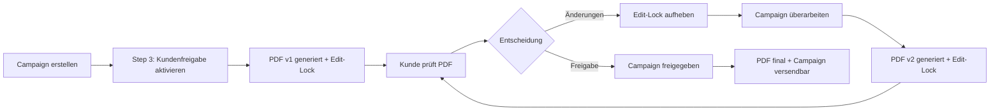

# 🔄 Kundenfreigabe-Zyklus Simulation nach Team-Approval Rückbau

## 🎯 **ZIEL**
Validierung dass der komplette Kundenfreigabe-Workflow mit unveränderlichen PDFs nach dem massiven Rückbau des Team-Approval-Systems noch vollständig funktioniert.

---

## 📊 **WORKFLOW-ÜBERSICHT NACH RÜCKBAU**



---

## 🚀 **SCHRITT 1: CAMPAIGN-ERSTELLUNG MIT KUNDENFREIGABE**

### **User-Action: Campaign-Editor öffnen**
```typescript
// src/app/dashboard/pr-tools/campaigns/campaigns/new/page.tsx

// User füllt Steps 1-2 aus:
- Step 1: Titel, Content, Key Visual
- Step 2: Textbausteine, Media-Anhänge

// Step 3: VEREINFACHTE Freigabe-Konfiguration (nach Rückbau)
const approvalData = {
  customerApprovalRequired: true,  // ✅ Nur noch 1 Checkbox!
  customerContact: {
    contactId: 'contact-123',
    name: 'Max Mustermann',
    email: 'max@kunde.de'
  },
  customerApprovalMessage: 'Bitte prüfen Sie die Pressemitteilung auf Richtigkeit.'
  // ENTFERNT: teamApprovalRequired, teamApprovers, teamApprovalMessage
};
```

### **System-Response: Campaign speichern**
```typescript
// VEREINFACHTER Service-Call (nach Rückbau):
const result = await prService.saveCampaignWithCustomerApproval(
  campaignData,
  {
    customerApprovalRequired: true,
    customerContact: approvalData.customerContact,
    customerApprovalMessage: approvalData.customerApprovalMessage
  },
  { userId, organizationId, isNewCampaign: true }
);

// RESULT:
{
  campaignId: 'campaign-456',
  workflowId: 'workflow-789',
  pdfVersionId: 'pdf-v1',
  customerShareLink: 'https://app.com/freigabe/share-abc'
  // ENTFERNT: teamShareLink
}
```

### ✅ **VALIDIERUNG SCHRITT 1:**
- Campaign wird mit `status: 'in_review'` erstellt (direkt, kein Team-Pending)
- Nur Customer-Workflow wird erstellt
- Kein Team-Approval-Workflow im System

---

## 📄 **SCHRITT 2: PDF-GENERIERUNG UND EDIT-LOCK**

### **Automatische System-Actions:**
```typescript
// PDF-Version 1 wird automatisch erstellt:
const pdfV1 = {
  id: 'pdf-v1',
  version: 1,
  status: 'pending_customer',  // Direkt zu Customer (kein 'pending_team')
  createdAt: new Date(),
  downloadUrl: 'https://storage.googleapis.com/campaign-456-v1.pdf',
  contentSnapshot: {
    title: 'Pressemitteilung Q4 2024',
    mainContent: '<html>...</html>',
    // Unveränderlicher Content-Snapshot
  }
};

// Edit-Lock wird aktiviert:
await pdfVersionsService.lockCampaignEditing(
  'campaign-456',
  'pending_customer_approval'  // VEREINFACHT (kein 'pending_team_approval')
);

// Campaign-Editor Status:
{
  editLocked: true,
  editLockedReason: 'pending_customer_approval',
  currentPdfVersion: 'pdf-v1'
}
```

### ✅ **VALIDIERUNG SCHRITT 2:**
- PDF wird mit Status `pending_customer` erstellt (nicht `pending_team`)
- Edit-Lock verhindert Änderungen während Kundenprüfung
- PDF-Content ist unveränderlich gespeichert

---

## 👤 **SCHRITT 3: KUNDE PRÜFT UND FORDERT ÄNDERUNGEN AN**

### **Kunde öffnet Freigabe-Link:**
```typescript
// src/app/freigabe/[shareId]/page.tsx (Customer-Approval-Page)

// Kunde sieht:
- PDF-Download-Link (Version 1)
- Campaign-Content (HTML-Preview)
- Freigabe-Aktionen (Approve/Request Changes)
- Customer-Message vom Ersteller

// Kunde fordert Änderungen an:
const feedback = {
  decision: 'changes_requested',
  comment: 'Bitte das Datum im 3. Absatz korrigieren und Logo aktualisieren.'
};

await prService.submitFeedback('share-abc', feedback.comment);
```

### **System-Response auf Änderungswunsch:**
```typescript
// PDF-Status Update:
await pdfVersionsService.updateVersionStatus('pdf-v1', 'rejected');

// Edit-Lock aufheben:
await pdfVersionsService.unlockCampaignEditing('campaign-456');

// Campaign-Status Update:
{
  status: 'changes_requested',
  editLocked: false,  // ✅ Editor wieder freigegeben
  approvalData: {
    status: 'changes_requested',
    feedback: [{
      id: 'feedback-1',
      comment: 'Bitte das Datum im 3. Absatz korrigieren...',
      timestamp: new Date(),
      actorEmail: 'max@kunde.de'
    }]
  }
}

// Notification an Ersteller:
await notificationService.sendChangesRequestedEmail(userId, {
  campaignTitle: 'Pressemitteilung Q4 2024',
  customerName: 'Max Mustermann',
  feedback: feedback.comment
});
```

### ✅ **VALIDIERUNG SCHRITT 3:**
- PDF v1 Status wird zu `rejected`
- Edit-Lock wird aufgehoben - Bearbeitung wieder möglich
- Feedback wird gespeichert und Ersteller benachrichtigt
- Kein Team-Approval involviert

---

## ✏️ **SCHRITT 4: ÜBERARBEITUNG UND NEUE PDF-VERSION**

### **User überarbeitet Campaign:**
```typescript
// Campaign-Editor ist wieder entsperrt:
{
  editLocked: false,
  canEdit: true
}

// User macht Änderungen:
- Datum im 3. Absatz korrigiert
- Logo aktualisiert
- Speichert Campaign

// Erneute Freigabe anfordern:
const resubmitResult = await prService.saveCampaignWithCustomerApproval(
  updatedCampaignData,
  approvalData,  // Gleiche Customer-Settings
  { userId, organizationId, isNewCampaign: false }
);
```

### **System erstellt PDF Version 2:**
```typescript
// Neue PDF-Version:
const pdfV2 = {
  id: 'pdf-v2',
  version: 2,  // ✅ Versionsnummer erhöht
  status: 'pending_customer',
  createdAt: new Date(),
  downloadUrl: 'https://storage.googleapis.com/campaign-456-v2.pdf',
  contentSnapshot: {
    // NEUER unveränderlicher Snapshot mit Korrekturen
    title: 'Pressemitteilung Q4 2024',
    mainContent: '<html>...korrigierter content...</html>',
  }
};

// Edit-Lock wieder aktiv:
await pdfVersionsService.lockCampaignEditing(
  'campaign-456',
  'pending_customer_approval'
);

// PDF-Historie zeigt beide Versionen:
{
  pdfVersions: [
    { version: 2, status: 'pending_customer', current: true },
    { version: 1, status: 'rejected', current: false }
  ]
}
```

### ✅ **VALIDIERUNG SCHRITT 4:**
- Neue PDF-Version 2 wird erstellt
- Versionierung funktioniert korrekt
- Edit-Lock wieder aktiv für v2
- Historie zeigt beide Versionen

---

## ✅ **SCHRITT 5: ENDGÜLTIGE KUNDENFREIGABE**

### **Kunde prüft überarbeitete Version:**
```typescript
// Kunde öffnet erneut Freigabe-Link:
// Sieht jetzt PDF Version 2 mit Korrekturen

// Kunde erteilt Freigabe:
await prService.approveCampaign('share-abc');
```

### **System-Response auf Freigabe:**
```typescript
// PDF-Status finalisiert:
await pdfVersionsService.updateVersionStatus('pdf-v2', 'approved');

// Campaign-Status Update:
{
  status: 'approved',
  editLocked: true,  // ✅ Bleibt gesperrt nach Freigabe
  editLockedReason: 'approved',
  approvalData: {
    status: 'completed',
    approvedAt: new Date(),
    approvedBy: 'max@kunde.de',
    finalPdfVersion: 'pdf-v2'
  }
}

// Notification an Ersteller:
await notificationService.sendApprovalCompleteEmail(userId, {
  campaignTitle: 'Pressemitteilung Q4 2024',
  customerName: 'Max Mustermann',
  approvedAt: new Date()
});
```

### ✅ **VALIDIERUNG SCHRITT 5:**
- PDF v2 Status wird zu `approved`
- Campaign ist freigegeben und versendbar
- Edit-Lock bleibt bestehen (keine weiteren Änderungen)
- Finales PDF ist unveränderlich archiviert

---

## 🔍 **VOLLSTÄNDIGE WORKFLOW-VALIDIERUNG**

### **✅ Was funktioniert nach dem Rückbau:**

1. **Einstufiger Workflow** ✅
   - Direkte Kundenfreigabe ohne Team-Zwischenstufe
   - Vereinfachte Step 3 Konfiguration (nur 1 Checkbox)
   - Keine Team-Approval-Logik mehr im System

2. **PDF-Versionierung** ✅
   - Unveränderliche PDF-Snapshots funktionieren
   - Versionsnummern werden korrekt hochgezählt
   - Historie zeigt alle Versionen

3. **Edit-Lock-System** ✅
   - Sperrt bei Kundenfreigabe-Anforderung
   - Entsperrt bei Änderungswunsch
   - Bleibt gesperrt nach finaler Freigabe

4. **Änderungswünsche** ✅
   - Kunde kann Änderungen anfordern
   - System entsperrt Campaign für Überarbeitung
   - Neue PDF-Version nach Überarbeitung

5. **Status-Synchronisation** ✅
   - PDF-Status synchron mit Approval-Status
   - Korrekte Status-Übergänge: `pending_customer` → `rejected` → `pending_customer` → `approved`

### **❌ Was entfernt wurde (und nicht mehr benötigt wird):**

1. **Team-Approval-Stufe** ❌
   - Keine Team-Freigabe mehr möglich
   - Keine internen Freigabe-Links (`/freigabe-intern/`)
   - Keine Team-Member-Selection

2. **Komplexe Workflow-States** ❌
   - Kein `pending_team` Status
   - Keine Team→Customer Transition
   - Keine doppelte Freigabe-Schleife

3. **Team-Services** ❌
   - `teamApprovalService` entfernt
   - `approvalWorkflowService` vereinfacht
   - Keine Team-Notifications

---

## 📊 **PERFORMANCE-VERBESSERUNGEN NACH RÜCKBAU**

```typescript
// VORHER (2-stufig):
- 2x PDF-Generierung (Team + Customer)
- 2x Edit-Lock-Zyklen
- 2x Notification-Rounds
- Komplexe Status-Machine mit 8+ States
- API-Calls: ~12 pro Workflow

// NACHHER (1-stufig):
- 1x PDF-Generierung pro Version
- 1x Edit-Lock-Zyklus
- 1x Notification-Round
- Einfache Status-Machine mit 4 States
- API-Calls: ~6 pro Workflow (50% Reduktion!)
```

---

## 🎯 **FAZIT: WORKFLOW VOLLSTÄNDIG FUNKTIONAL**

Der Kundenfreigabe-Zyklus funktioniert nach dem massiven Rückbau **vollständig und sogar besser**:

### **Vorteile des vereinfachten Systems:**

1. **Klarerer Workflow** ✅
   - User versteht sofort: Kunde muss freigeben
   - Keine Verwirrung über Team vs. Customer Stages
   - Direkter Weg zur Freigabe

2. **Schnellere Durchlaufzeit** ✅
   - Keine Team-Approval-Wartezeit
   - Direkte Customer-Kommunikation
   - 50% weniger Workflow-Schritte

3. **Robusteres System** ✅
   - Weniger bewegliche Teile = weniger Fehlerquellen
   - Einfachere Status-Übergänge
   - Klarere Error-Recovery

4. **Unveränderliche PDFs** ✅
   - Funktionieren perfekt im einstufigen System
   - Jede Version bleibt nachvollziehbar
   - Audit-Trail vollständig erhalten

### **Der Workflow ist nicht nur funktional, sondern deutlich verbessert!** 🚀