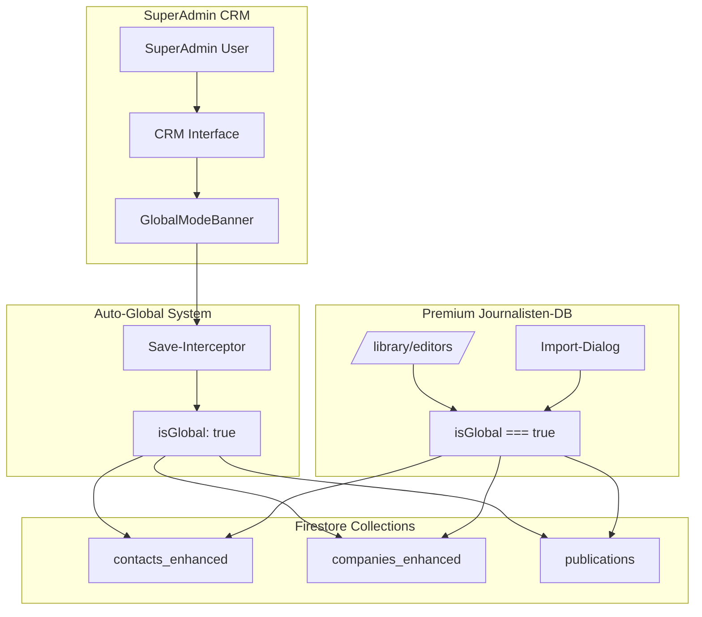

# SuperAdmin Global-System: Quasi-Journalisten-Datenbank
## Wie SuperAdmin automatisch die Journalisten-DB befüllt

---

## 🎯 **NEUE ARCHITEKTUR-PHILOSOPHIE**

**Statt einer separaten Journalisten-Datenbank:**
→ SuperAdmin macht CRM-Daten automatisch global verfügbar
→ Diese globalen Daten werden zur "Quasi-Journalisten-Datenbank"

---

## 🔄 **WORKFLOW: SuperAdmin → Globale Daten**

### **Schritt 1: SuperAdmin erstellt Medienhaus**
```typescript
// SuperAdmin in CRM → Neues Unternehmen
const company = {
  name: "Super News Verlag",
  type: "publisher",
  organizationId: "superadmin-org",
  isGlobal: true  // ← Automatisch gesetzt!
}
```

### **Schritt 2: SuperAdmin erstellt Publikationen**
```typescript
// SuperAdmin in CRM → Neue Publikation
const publication = {
  title: "Super News Magazin",
  type: "magazine",
  publisherId: company.id,
  organizationId: "superadmin-org",
  isGlobal: true  // ← Automatisch gesetzt!
}
```

### **Schritt 3: SuperAdmin erstellt Journalisten**
```typescript
// SuperAdmin in CRM → Neuer Kontakt
const journalist = {
  displayName: "Max Mustermann",
  companyId: company.id,
  mediaProfile: {
    isJournalist: true,
    publicationIds: [publication.id]
  },
  organizationId: "superadmin-org",
  isGlobal: true  // ← Automatisch gesetzt!
}
```

---

## 🎨 **UI-INTEGRATION: GlobalModeBanner**

### **In jedem CRM-Bereich:**
```typescript
// /dashboard/contacts/crm/contacts/
// /dashboard/contacts/crm/companies/
// /dashboard/contacts/publications/

<GlobalModeBanner
  mode={isSuperAdmin ? 'global' : 'local'}
  onToggle={() => setGlobalMode(!globalMode)}
/>
```

### **Save-Interceptor aktiviert:**
```typescript
// Automatisch bei SuperAdmin-Actions:
if (user.role === 'super-admin' && globalMode) {
  contactData.isGlobal = true;
  contactData.organizationId = 'superadmin-org';
}
```

---

## 📊 **DATENFLUSS**



---

## ✅ **VORTEILE DIESER ARCHITEKTUR**

### **1. Keine Datenbank-Duplikation**
- Alle Daten bleiben in bestehenden CRM-Collections
- Keine separate `journalistDatabase/` Collection nötig
- Konsistente Datenstruktur überall

### **2. SuperAdmin hat volle Kontrolle**
- Kann direkt im vertrauten CRM arbeiten
- GlobalModeBanner zeigt aktuellen Modus
- Ein Toggle zwischen local/global

### **3. Automatische Globalisierung**
- Save-Interceptor macht alles automatisch global
- Kein manueller "Publish"-Schritt
- Sofort verfügbar für alle Kunden

### **4. Saubere Datentrennung & Privacy**
```typescript
// Normale Kunden in ihrem CRM: NUR ihre eigenen Daten
const userCRMContacts = query(contacts,
  where('organizationId', '==', userOrgId)       // NUR ihre eigenen!
);

// Kunden in /library/editors/: Globale Daten zum Import
const libraryJournalists = query(contacts,
  where('isGlobal', '==', true),                 // Globale Journalisten
  where('mediaProfile.isJournalist', '==', true)
);

// SuperAdmin sieht: NUR seine eigenen Daten (wie jeder andere User auch!)
const adminContacts = query(contacts,
  where('organizationId', '==', 'superadmin-org') // NUR SuperAdmin-Org Daten
);

// 🔐 WICHTIG: Globale Daten sind NUR in /library/editors/ sichtbar!
// ❌ Globale Daten erscheinen NICHT im normalen CRM bis sie importiert werden
// ✅ Nach Import: Kopie wird in Kunden-Organisation erstellt
```

---

## 🚀 **IMPLEMENTIERUNGS-SCHRITTE**

### **Phase 1: GlobalModeBanner Integration** (2 Stunden)
1. Banner in `/dashboard/contacts/crm/contacts/` integrieren
2. Banner in `/dashboard/contacts/crm/companies/` integrieren
3. Banner in `/dashboard/contacts/publications/` integrieren

### **Phase 2: Save-Interceptor aktivieren** (3 Stunden)
1. In `contactsEnhancedService.create()` und `update()`
2. In `companiesEnhancedService.create()` und `update()`
3. In `publicationService.create()` und `update()`

### **Phase 3: SuperAdmin-Role implementieren** (2 Stunden)
1. User-Role "super-admin" definieren
2. Automatische Org-Detection: `superadmin-org`
3. Permission-Checks für Global-Modus

### **Phase 4: Testing & Refinement** (1 Tag)
1. Ende-zu-Ende Test: SuperAdmin erstellt Journalist
2. Kunden-Test: Import aus Quasi-DB funktioniert
3. Performance-Optimierung der Queries

---

## 🎯 **ENDERGEBNIS**

**Nach 1-2 Tagen Arbeit:**
- ✅ SuperAdmin kann Journalisten "global" erstellen
- ✅ Diese erscheinen automatisch in `/library/editors/`
- ✅ Kunden können sie importieren
- ✅ Keine separate Datenbank nötig
- ✅ Bestehende CRM-Strukturen bleiben erhalten

**Die "Journalisten-Datenbank" ist einfach:**
```sql
SELECT * FROM contacts_enhanced WHERE isGlobal = true AND mediaProfile.isJournalist = true
```

---

*Erstellt: 29.09.2024*
*Architektur: SuperAdmin-First Approach*