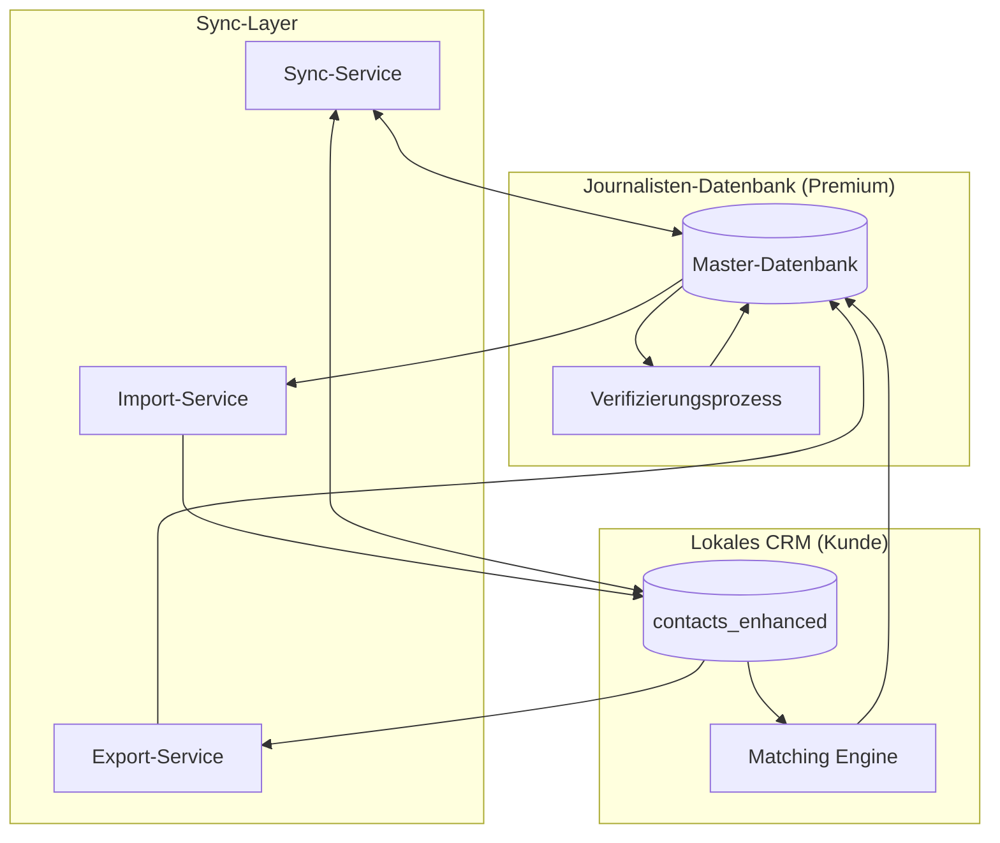

# Integrationsplan: Journalisten-Datenbank ↔ CRM

## 🔄 Bidirektionale Synchronisation

### Datenfluss-Übersicht



---

## 📊 Datenmodell-Mapping

### ContactEnhanced ↔ JournalistDatabase

```typescript
// Mapping-Tabelle
interface JournalistMapping {
  // CRM ContactEnhanced → Journalisten-DB
  localToDatabase: {
    // Basis-Daten
    'name': 'personalData.name',
    'displayName': 'personalData.displayName',
    'emails': 'personalData.emails',
    'phones': 'personalData.phones',

    // Media-Profile
    'mediaProfile.isJournalist': 'professionalData.isJournalist',
    'mediaProfile.publicationIds': 'professionalData.publicationIds',
    'mediaProfile.beats': 'professionalData.topics',
    'mediaProfile.mediaTypes': 'professionalData.mediaTypes',

    // Social Media
    'socialProfiles': 'socialMedia.profiles',

    // GDPR
    'gdprConsents': 'gdpr.consents',

    // Metriken (erweitert)
    'performanceMetrics': 'metadata.performanceMetrics',
    'clippingHistory': 'metadata.clippingHistory',
    'projectContributions': 'metadata.projectContributions'
  },

  // Journalisten-DB → CRM ContactEnhanced
  databaseToLocal: {
    // Umgekehrtes Mapping
    'personalData.firstName': 'name.firstName',
    'personalData.lastName': 'name.lastName',
    'personalData.email': 'emails[0].email',
    'professionalData.medium': 'companyName',
    'professionalData.position': 'position',
    'professionalData.topics': 'mediaProfile.beats',
    'metadata.qualityScore': 'relationshipInfo.relationshipScore',
    'metadata.verificationStatus': 'customFields.verificationStatus'
  }
}
```

---

## 🔧 Erweiterte Type-Definitionen

### 1. Neue Collection: journalistDatabase

```typescript
// src/types/journalist-database.ts

import { BaseEntity } from './international';
import { ContactEnhanced } from './crm-enhanced';

export interface JournalistDatabaseEntry extends BaseEntity {
  // Eindeutige Identifikation
  globalId: string; // UUID für globale Eindeutigkeit

  // Persönliche Daten (GDPR-konform)
  personalData: {
    name: ContactEnhanced['name'];
    displayName: string;
    emails: Array<{
      email: string;
      type: 'business' | 'private';
      isPrimary: boolean;
      isVerified: boolean;
      lastVerified?: Timestamp;
    }>;
    phones?: ContactEnhanced['phones'];
    profileImage?: string;
  };

  // Berufliche Daten
  professionalData: {
    currentMedium?: string; // Hauptarbeitgeber
    currentMediumId?: string; // Verknüpfung zu companies_enhanced
    position?: string;
    department?: string;
    topics: string[]; // Themengebiete
    mediaTypes: ('print' | 'online' | 'tv' | 'radio' | 'podcast')[];
    languages: string[];

    // Historische Daten
    previousMedia?: Array<{
      medium: string;
      position?: string;
      from: Date;
      to?: Date;
    }>;
  };

  // Social Media & Online-Präsenz
  socialMedia: {
    profiles: Array<{
      platform: string;
      url: string;
      handle?: string;
      verified: boolean;
      followers?: number;
      engagement?: number;
    }>;
    influenceScore?: number; // 0-100
  };

  // Metadaten & Qualität
  metadata: {
    createdAt: Timestamp;
    updatedAt: Timestamp;
    verificationStatus: 'unverified' | 'pending' | 'verified' | 'rejected';
    verifiedAt?: Timestamp;
    nextVerificationDate?: Timestamp;
    dataSource: 'manual' | 'api' | 'crowdsourced' | 'import';
    qualityScore: number; // 0-100
    sourceCount: number; // Anzahl der Quellen
    sourcesDetail: Array<{
      organizationId: string;
      contactId: string;
      lastUpdated: Timestamp;
      confidence: number;
    }>;

    // Performance & Analytics
    performanceMetrics?: ContactEnhanced['performanceMetrics'];
    clippingHistory?: ContactEnhanced['clippingHistory'];
    projectContributions?: ContactEnhanced['projectContributions'];
  };

  // GDPR & Datenschutz
  gdpr: {
    consentGiven: boolean;
    consentDate?: Timestamp;
    consentMethod?: 'email' | 'web' | 'import';
    consentToken?: string;
    optOutDate?: Timestamp;
    deletionRequestDate?: Timestamp;
    dataExportDates?: Timestamp[];
  };

  // Sync-Informationen
  syncInfo: {
    // Organisationen, die diesen Kontakt nutzen
    linkedOrganizations: Array<{
      organizationId: string;
      localContactId: string;
      syncEnabled: boolean;
      lastSyncedAt?: Timestamp;
      syncDirection: 'bidirectional' | 'fromDatabase' | 'toDatabase';
    }>;

    // Änderungs-Tracking
    changeHistory?: Array<{
      timestamp: Timestamp;
      field: string;
      oldValue: any;
      newValue: any;
      changedBy: string; // organizationId oder 'system'
    }>;
  };
}
```

### 2. Sync-Service Erweiterung

```typescript
// src/lib/firebase/journalist-sync-service.ts

export interface SyncConfiguration {
  organizationId: string;
  syncEnabled: boolean;
  syncDirection: 'bidirectional' | 'fromDatabase' | 'toDatabase';

  // Field-Level Sync Control
  fieldMapping: {
    // Welche Felder synchronisiert werden
    includeFields?: string[];
    excludeFields?: string[];

    // Field-Transformationen
    transformations?: Array<{
      source: string;
      target: string;
      transform?: (value: any) => any;
    }>;
  };

  // Sync-Regeln
  rules: {
    // Nur verifizierte Journalisten
    onlyVerified?: boolean;

    // Minimum Quality Score
    minQualityScore?: number;

    // Automatische Updates
    autoUpdate?: boolean;
    updateFrequency?: 'realtime' | 'daily' | 'weekly' | 'manual';

    // Konflikt-Auflösung
    conflictResolution?: 'localWins' | 'databaseWins' | 'newest' | 'manual';
  };

  // Quotas (basierend auf Subscription)
  quotas: {
    maxSyncsPerMonth: number;
    maxContactsTotal: number;
    currentUsage: {
      syncsThisMonth: number;
      totalContacts: number;
    };
  };
}
```

---

## 🔄 Matching-Algorithmus Integration

### Erweiterte CRM-Service Funktionen

```typescript
// Erweiterung für crm-service-enhanced.ts

class ContactEnhancedServiceWithDatabase extends ContactEnhancedService {

  /**
   * Sucht nach Matches in der Journalisten-Datenbank
   */
  async findDatabaseMatches(
    contact: ContactEnhanced,
    organizationId: string
  ): Promise<Array<{
    databaseEntry: JournalistDatabaseEntry;
    matchScore: number;
    matchDetails: {
      emailMatch: boolean;
      nameMatch: boolean;
      mediumMatch: boolean;
      phoneMatch: boolean;
    };
  }>> {
    // Implementierung des Fuzzy-Matching
  }

  /**
   * Importiert einen Journalisten aus der Datenbank
   */
  async importFromDatabase(
    databaseId: string,
    organizationId: string,
    options?: {
      overwriteExisting?: boolean;
      syncEnabled?: boolean;
      fieldMapping?: SyncConfiguration['fieldMapping'];
    }
  ): Promise<string> {
    // Import-Logik
  }

  /**
   * Exportiert einen lokalen Kontakt zur Datenbank (Crowdsourcing)
   */
  async contributeToDatabase(
    contactId: string,
    organizationId: string
  ): Promise<void> {
    // Anonymisierter Export für Matching
  }

  /**
   * Synchronisiert alle verknüpften Journalisten
   */
  async syncWithDatabase(
    organizationId: string,
    options?: {
      onlyChanged?: boolean;
      batchSize?: number;
    }
  ): Promise<{
    synced: number;
    conflicts: number;
    errors: Array<{
      contactId: string;
      error: string;
    }>;
  }> {
    // Batch-Sync-Logik
  }
}
```

---

## 🎯 Import/Export Workflows

### 1. Import aus Datenbank → CRM

```typescript
// Workflow-Schritte
async function importJournalistToCRM(
  databaseEntry: JournalistDatabaseEntry,
  organizationId: string
): Promise<ContactEnhanced> {

  // 1. Duplikat-Check
  const existingContact = await checkForDuplicate(databaseEntry, organizationId);

  if (existingContact) {
    // 2a. Merge oder Update
    return await mergeOrUpdate(existingContact, databaseEntry);
  } else {
    // 2b. Neuen Kontakt erstellen
    const newContact: ContactEnhanced = {
      // Basis-Daten
      name: databaseEntry.personalData.name,
      displayName: databaseEntry.personalData.displayName,

      // Media-Profile
      mediaProfile: {
        isJournalist: true,
        publicationIds: [], // Wird später gemappt
        beats: databaseEntry.professionalData.topics,
        mediaTypes: databaseEntry.professionalData.mediaTypes,
        influence: {
          score: databaseEntry.socialMedia.influenceScore
        }
      },

      // Sync-Referenz
      customFields: {
        journalistDatabaseId: databaseEntry.globalId,
        syncEnabled: true,
        lastSyncedAt: serverTimestamp()
      },

      // Weitere Felder...
    };

    // 3. In CRM speichern
    const contactId = await contactsEnhancedService.create(newContact, {
      organizationId,
      userId: 'system'
    });

    // 4. Sync-Link erstellen
    await createSyncLink(databaseEntry.globalId, contactId, organizationId);

    return newContact;
  }
}
```

### 2. Export aus CRM → Datenbank (Crowdsourcing)

```typescript
// Anonymisierter Export für Matching
async function contributeContactToDatabase(
  contact: ContactEnhanced,
  organizationId: string
): Promise<void> {

  // 1. Anonymisierung
  const anonymizedData = {
    // Keine persönlichen IDs
    emails: contact.emails?.map(e => ({
      domain: e.email.split('@')[1],
      hash: hashEmail(e.email) // Für Duplikat-Erkennung
    })),

    // Generalisierte Daten
    medium: contact.companyName,
    topics: contact.mediaProfile?.beats,
    mediaTypes: contact.mediaProfile?.mediaTypes,

    // Metadaten
    contributedBy: organizationId,
    contributedAt: serverTimestamp(),
    confidence: calculateDataConfidence(contact)
  };

  // 2. Zu Kandidaten hinzufügen
  await addToMatchingCandidates(anonymizedData);

  // 3. Matching-Prozess triggern
  await triggerMatchingProcess(anonymizedData);
}
```

---

## 🔐 Berechtigungen & Zugriffskontrolle

### Firestore Security Rules

```javascript
// firestore.rules - Erweiterung

// Journalisten-Datenbank (Master)
match /journalistDatabase/{journalistId} {
  // Lesen nur mit Premium-Subscription
  allow read: if hasActiveSubscription(request.auth.uid, 'premium');

  // Schreiben nur für Super-Admin
  allow write: if isSuperAdmin(request.auth.uid);
}

// Matching-Kandidaten
match /journalistCandidates/{candidateId} {
  // Nur Super-Admin kann lesen/schreiben
  allow read, write: if isSuperAdmin(request.auth.uid);
}

// Sync-Konfiguration
match /journalistSyncConfig/{organizationId} {
  // Organisation kann eigene Config verwalten
  allow read, write: if isOrganizationMember(request.auth.uid, organizationId)
    && hasActiveSubscription(organizationId, 'premium');
}

// Helper-Funktionen
function hasActiveSubscription(userId, tier) {
  let org = getOrganization(userId);
  return get(/databases/$(database)/documents/journalistSubscriptions/$(org))
    .data.status == 'active'
    && get(/databases/$(database)/documents/journalistSubscriptions/$(org))
    .data.plan in ['professional', 'business', 'enterprise'];
}
```

---

## 📈 Performance-Optimierungen

### 1. Indexierung

```javascript
// firestore.indexes.json - Neue Indizes

{
  "indexes": [
    {
      "collectionGroup": "journalistDatabase",
      "fields": [
        { "fieldPath": "metadata.verificationStatus", "mode": "ASCENDING" },
        { "fieldPath": "metadata.qualityScore", "mode": "DESCENDING" },
        { "fieldPath": "metadata.updatedAt", "mode": "DESCENDING" }
      ]
    },
    {
      "collectionGroup": "contacts_enhanced",
      "fields": [
        { "fieldPath": "organizationId", "mode": "ASCENDING" },
        { "fieldPath": "customFields.journalistDatabaseId", "mode": "ASCENDING" },
        { "fieldPath": "customFields.lastSyncedAt", "mode": "ASCENDING" }
      ]
    }
  ]
}
```

### 2. Caching-Strategie

```typescript
// Client-Side Caching
interface JournalistCache {
  // In-Memory Cache für häufig genutzte Journalisten
  frequentlyUsed: Map<string, {
    data: JournalistDatabaseEntry;
    timestamp: number;
    ttl: number; // Time to live in ms
  }>;

  // IndexedDB für vollständige lokale Kopie (Premium)
  localDatabase?: {
    lastFullSync: Date;
    entries: JournalistDatabaseEntry[];
    version: number;
  };
}
```

---

## 🚀 Implementierungs-Reihenfolge

### Phase 1: Basis-Integration (2 Wochen)
1. Type-Definitionen erweitern
2. Sync-Service Grundstruktur
3. Import-Funktion (DB → CRM)
4. UI für Import-Dialog

### Phase 2: Crowdsourcing (2 Wochen)
1. Anonymisierungs-Logik
2. Matching-Algorithmus
3. Kandidaten-Review UI
4. Export-Funktion (CRM → DB)

### Phase 3: Bidirektionale Sync (3 Wochen)
1. Sync-Konfiguration UI
2. Konflikt-Auflösung
3. Batch-Sync-Jobs
4. Sync-Status-Dashboard

### Phase 4: Optimierung (1 Woche)
1. Performance-Tuning
2. Caching implementieren
3. Error-Handling verbessern
4. Monitoring einrichten

---

## 📊 Metriken & Monitoring

### Tracking-Punkte

```typescript
interface SyncMetrics {
  // Import-Metriken
  totalImports: number;
  successfulImports: number;
  failedImports: number;
  averageImportTime: number;

  // Export-Metriken
  totalContributions: number;
  acceptedContributions: number;
  rejectedContributions: number;

  // Sync-Metriken
  totalSyncs: number;
  conflictsResolved: number;
  syncErrors: number;
  averageSyncTime: number;

  // Datenqualität
  dataCompleteness: number; // 0-100%
  verificationRate: number; // 0-100%
  updateFrequency: number; // Updates pro Monat
}
```

---

## 🎯 Nächste Schritte

1. **Review dieses Integrationsplans**
2. **Entscheidung über Sync-Strategie** (Realtime vs. Batch)
3. **UI/UX Mockups** für Import/Export-Dialoge
4. **API-Spezifikation** für externe Integrationen
5. **Test-Strategie** definieren

---

*Dokumentversion: 1.0*
*Erstellt: ${new Date().toLocaleDateString('de-DE')}*
*Status: Zur Review*