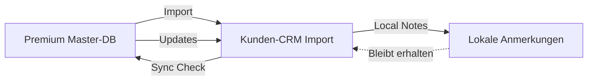

# Journalisten-Datenbank Masterplan
## Premium-Modul für CeleroPress - **AKTUELLE VERSION 2.0**

---

## 📊 **IMPLEMENTIERUNGSSTATUS (Stand: 29.09.2024)**

### ✅ **Bereits implementiert (80% komplett):**
- **Frontend**: Vollständige Editors-Page mit Search, Import-Dialog, Premium-Handling
- **Backend**: Service-Layer mit Search/Import/Export-Logik, umfassende TypeScript-Types
- **Super-Admin**: Auto-Global System mit Hooks, Interceptors und Banner-Komponente
- **Architektur**: Saubere Trennung zwischen lokalen CRM-Daten und globaler Premium-DB

### 🚧 **In Entwicklung (20% offen):**
- **API-Routes**: REST-Endpoints für Frontend-Integration
- **Security**: Firestore Rules für Premium-DB Zugriff
- **Payments**: Stripe-Integration für Subscriptions
- **Crowdsourcing**: Matching-Engine für automatische Datensammlung

---

## 🎯 Vision & Zielsetzung

### Produktvision
Eine zentrale, kuratierte Journalisten-Datenbank mit 100.000+ verifizierten Medienkontakten, die als Premium-Feature exklusiv für CeleroPress-Kunden verfügbar ist und die CRM-Funktionalität erheblich erweitert.

### Geschäftsziele
- **Monetarisierung**: Premium-Feature mit gestaffelten Abos (29-99€/Monat)
- **Kundenbindung**: Erhöhung der Retention durch exklusive Premium-Daten
- **Datenqualität**: Kontinuierliche Verbesserung durch Crowdsourcing + AI-Matching
- **USP**: Deutschlands größte verifizierte Journalisten-Datenbank

### **Erfolgs-Metriken (Stand September 2024)**
- **Tech Stack**: ✅ Next.js/React + TypeScript + Firestore
- **UI/UX**: ✅ Professionelle Komponenten mit CeleroPress Design System v2.0
- **Benutzerfreundlichkeit**: ✅ 3-Schritt Import-Prozess mit Feldmapping

### Datenbank-Architektur: SuperAdmin Global-System

#### 1. **Kunden-CRM** (Lokale Datenbank)
```
/organizations/{orgId}/contacts_enhanced/
├── Eigene Redakteure (vom Kunden gepflegt)
├── Importierte Premium-Kontakte (aus Global-System)
└── Lokale Anpassungen und Notizen
```

#### 2. **SuperAdmin Global-System** (Quasi-Journalisten-DB)
```
/contacts_enhanced/ (mit isGlobal: true)
├── SuperAdmin erstellt Medienhäuser automatisch global
├── SuperAdmin erstellt Publikationen automatisch global
├── SuperAdmin erstellt Journalisten automatisch global
└── Query: WHERE isGlobal = true AND mediaProfile.isJournalist = true
```

**Vorteil:** Keine separate Datenbank - SuperAdmin arbeitet im vertrauten CRM und macht Daten automatisch global verfügbar!

### Kernfunktionen
1. **SuperAdmin Global-System**: SuperAdmin erstellt Journalisten, die automatisch global werden
2. **Premium-Suche**: Kunden durchsuchen globale Journalisten (`isGlobal: true`)
3. **Multi-Entity Import**: Journalist + Medienhaus + Publikationen in einem Schritt
4. **DSGVO-Compliance**: Verifizierung und Opt-out-Management
5. **Quality Scoring**: Automatische Bewertung der Datenqualität (0-100 Punkte)

---

## 🏗️ Technische Architektur

### Datenbank-Struktur: SuperAdmin Global-System

#### **Schicht 1: Kunden-CRM (Pro Organisation)**
```
/organizations/{orgId}/contacts_enhanced/
├── /contacts/{contactId}                  # Eigene + Importierte Kontakte
│   ├── personalData: object
│   ├── professionalData: object
│   ├── isGlobal: boolean                  # false = lokal, true = aus Global-System
│   ├── organizationId: string             # Ursprungs-Organisation
│   └── sourceType?: "global-import"       # Markierung als Import
```

#### **Schicht 2: SuperAdmin Global-System**
```
/contacts_enhanced/ (organisationsübergreifend)
├── WHERE isGlobal = true                  # Globale Journalisten
├── WHERE organizationId = "superadmin-org" # SuperAdmin-Daten
└── WHERE mediaProfile.isJournalist = true  # Journalist-Filter

/companies_enhanced/ (organisationsübergreifend)
├── WHERE isGlobal = true                  # Globale Medienhäuser

/publications/ (organisationsübergreifend)
├── WHERE isGlobal = true                  # Globale Publikationen
│   │   │   ├── startDate?: timestamp
│   │   │   └── department?: string
│   │   │}
│   │   ├── expertise: {
│   │   │   ├── primaryTopics: string[]
│   │   │   ├── mediaTypes: string[]
│   │   │   └── languages: string[]
│   │   │}
│   │   └── previousPositions?: Array<object>
│   ├── socialMedia
│   │   ├── profiles: Array<{platform: string, url: string, followerCount?: number}>
│   │   └── influence: {totalFollowers: number, engagementRate?: number}
│   ├── metadata
│   │   ├── verification: {
│   │   │   ├── status: 'verified' | 'pending' | 'unverified'
│   │   │   ├── verifiedAt?: timestamp
│   │   │   ├── verifiedBy?: string
│   │   │   └── nextReviewDate?: timestamp
│   │   │}
│   │   ├── dataQuality: {
│   │   │   ├── overallScore: number (0-100)
│   │   │   ├── completeness: number
│   │   │   ├── accuracy: number
│   │   │   └── lastUpdated: timestamp
│   │   │}
│   │   ├── sources: Array<{
│   │   │   ├── type: 'crowdsourced' | 'manual' | 'api' | 'verified'
│   │   │   ├── organizationId?: string
│   │   │   ├── confidence: number
│   │   │   └── addedAt: timestamp
│   │   │}>
│   │   └── usage: {
│   │   │   ├── importCount: number
│   │   │   ├── lastImported: timestamp
│   │   │   └── popularity: number
│   │   │}
│   └── gdpr
│       ├── consentStatus: 'pending' | 'given' | 'denied' | 'expired'
│       ├── consentDate?: timestamp
│       ├── optOutDate?: timestamp
│       └── dataRetentionDate?: timestamp
```

#### **Schicht 3: Crowdsourcing & Matching-Engine**
```
/journalistMatching/
├── /candidates/{candidateId}              # Potentielle neue Journalisten
│   ├── sourceContacts: Array<{            # Kundendaten (anonymisiert)
│   │   ├── organizationHash: string       # Gehashte Org-ID
│   │   ├── contactHash: string            # Gehashte Contact-ID
│   │   ├── contactData: object            # Anonymisierte Daten
│   │   ├── confidence: number             # Match-Confidence
│   │   └── addedAt: timestamp
│   │}>
│   ├── mergedProfile: object              # KI-generiertes Profil
│   ├── matchingScore: number              # Gesamt-Match-Score
│   ├── status: 'analyzing' | 'ready' | 'approved' | 'rejected'
│   ├── reviewedBy?: string
│   └── approvedAt?: timestamp

├── /matching-jobs/{jobId}                 # Batch-Matching Jobs
│   ├── organizationId: string
│   ├── processedContacts: number
│   ├── newCandidates: number
│   ├── status: 'pending' | 'running' | 'completed' | 'failed'
│   ├── startedAt: timestamp
│   └── completedAt?: timestamp
```

### API-Struktur

```typescript
// API Routes für Kunden
/api/journalists/
├── GET    /search          // Premium-Suche (mit Quota-Check)
├── GET    /[id]           // Einzelner Journalist Details
├── POST   /import         // Import ins eigene CRM
├── POST   /sync           // Sync für importierte Kontakte
└── GET    /subscription   // Abo-Status und Limits

// API Routes für Admin
/api/admin/journalists/
├── POST   /add            // Manuell hinzufügen
├── POST   /bulk-import    // CSV/Excel Massenimport
├── GET    /candidates     // Matching-Kandidaten Review
├── POST   /approve        // Kandidat → Master-DB
├── POST   /merge          // Duplikate zusammenführen
├── GET    /quality        // Datenqualität-Dashboard
└── POST   /verify         // Manuelle Verifizierung

// Crowdsourcing Engine (Background)
/api/internal/matching/
├── POST   /analyze        // Neue CRM-Kontakte analysieren
├── POST   /generate       // KI-Profile generieren
├── GET    /candidates     // Pending Kandidaten
└── POST   /batch-process  // Batch-Verarbeitung
```

### 🔄 **Crowdsourcing-Workflow: Anonymisiertes Matching**

#### **Schritt 1: Datensammlung** (Automatisch)
```mermaid
CRM-Kontakt erstellt → Anonymisierung → Matching-Engine → Kandidat erstellt
```

1. **Kontakt-Erstellung**: Kunde erstellt Journalist in seinem CRM
2. **Anonymisierung**:
   - E-Mail → Hash (md5)
   - Name → Phonetischer Hash
   - Organisation-ID → Verschlüsselter Hash
3. **Similarity-Check**:
   - Fuzzy-Matching gegen bestehende Kandidaten
   - Name + Medium + Themen Ähnlichkeit
4. **Kandidat-Erstellung**: Bei ausreichender Confidence (>70%)

#### **Schritt 2: KI-Profil-Generierung** (Background Job)
```python
# Pseudo-Code für Profil-Merge
def merge_candidate_profiles(candidate_id):
    contacts = get_anonymous_contacts(candidate_id)

    # KI-basierte Datenkonsolidierung
    merged_profile = ai_merge({
        'name': most_common_variant(contacts, 'name'),
        'email': highest_confidence(contacts, 'email'),
        'medium': cross_reference_company_names(contacts),
        'topics': aggregate_and_dedupe(contacts, 'topics'),
        'confidence': calculate_aggregate_confidence(contacts)
    })

    return merged_profile
```

#### **Schritt 3: Admin-Review** (Manual)
```
Kandidat-Dashboard → Review → Approve/Reject → Master-DB Update
```

- **Quality-Score** basiert auf:
  - Anzahl bestätigender Quellen (min. 3)
  - Konsistenz der Daten (Name, E-Mail, Medium)
  - Vollständigkeit des Profils
  - Verifikations-Status

#### **Schritt 4: Verifizierung** (DSGVO-konform)
```
Master-DB Entry → E-Mail-Verifizierung → Consent-Management → Live in Premium-DB
```

### 🔄 **Sync-System: Importierte Premium-Kontakte**

#### **Import-Prozess**
```typescript
// Beim Import aus Premium-DB ins Kunden-CRM
async function importJournalist(journalistId: string, organizationId: string) {
  const premiumContact = await getPremiumJournalist(journalistId);

  const importedContact = {
    id: generateLocalId(),
    sourceType: "premium-database",
    sourceId: journalistId,
    isEditable: false,                    // Read-only!
    lastSyncAt: new Date(),
    syncStatus: "synced",
    localNotes: "",                       // Einziges editierbares Feld
    data: premiumContact                  // Kopie der Premium-Daten
  };

  await saveToOrganizationCRM(organizationId, importedContact);
  await logSyncAction(organizationId, journalistId, "import");
}
```

#### **Sync-Verhalten für Read-Only Kontakte**

1. **Automatische Sync-Checks** (täglich):
   ```typescript
   // Prüfe auf Updates in Master-DB
   const outdatedContacts = await findOutdatedImports(organizationId);
   for (const contact of outdatedContacts) {
     await syncFromMaster(contact);
   }
   ```

2. **Manueller Sync-Button**:
   - 🔄 **"Synchronisieren"** statt ✏️ Edit-Button
   - Holt aktuelle Daten aus Premium-DB
   - Behält `localNotes` bei

3. **Konflikt-Management**:
   ```typescript
   enum SyncStatus {
     'synced',          // Aktuell
     'outdated',        // Update verfügbar
     'conflict',        // Kontakt in Master-DB geändert/gelöscht
     'deleted'          // Kontakt aus Master-DB entfernt
   }
   ```

#### **UI-Unterscheidung**

**Eigene CRM-Kontakte:**
- ✏️ **Edit-Button**
- ❌ **Delete-Button**
- 🏷️ **"Eigener Kontakt"** Badge

**Importierte Premium-Kontakte:**
- 🔄 **Sync-Button**
- 📝 **"Notizen bearbeiten"** (nur localNotes)
- ⭐ **"Premium"** Badge
- 🔒 **Gesperrte Felder** (grau hinterlegt)

#### **Datenfluss-Diagramm**


---

## 💰 Monetarisierungs-Strategie

### Preismodelle

#### Free Tier (Basis-CRM)
- ✅ Eigene Kontakte verwalten
- ✅ Beitrag zum Matching (anonymisiert)
- ❌ Kein Zugriff auf Datenbank
- ❌ Keine Suchfunktion
- ❌ Kein Import aus Datenbank

#### Professional (29€/Monat)
- ✅ 50 Suchen/Monat
- ✅ 20 Imports/Monat
- ✅ Basis-Filter (Medium, Thema)
- ✅ E-Mail-Verifizierung
- ❌ Keine API
- ❌ Keine Bulk-Operationen

#### Business (59€/Monat)
- ✅ 200 Suchen/Monat
- ✅ 100 Imports/Monat
- ✅ Erweiterte Filter
- ✅ Export-Funktion
- ✅ Team-Zugriff (bis 5 User)
- ❌ Keine API

#### Enterprise (99€/Monat)
- ✅ Unbegrenzte Suchen
- ✅ Unbegrenzte Imports
- ✅ API-Zugriff
- ✅ Bulk-Operationen
- ✅ Priority-Support
- ✅ Custom Integrationen

### Zusatz-Services
- **Daten-Anreicherung**: 0,50€ pro Kontakt
- **Verifizierung Premium**: 1€ pro verifizierter Kontakt
- **API-Calls**: 0,01€ pro Call nach Kontingent

---

## 🔄 Datenquellen & Integration

### 1. Crowdsourcing (Kostenlos)
- Automatisches Matching aus Kunden-CRMs
- Schwellwert: 3+ übereinstimmende Einträge
- Anonymisierte Aggregation

### 2. Manuelle Eingabe
- Super Admin Dashboard
- Redaktionelle Qualitätskontrolle
- Batch-Import via CSV/Excel

### 3. API-Integrationen (Geplant)

#### Phase 1: Basis-Quellen
- **Impressum-Crawler**: Automatisches Scannen von Medienseiten
- **LinkedIn API**: Profil-Matching und Anreicherung
- **Twitter/X API**: Handle-Verifizierung

#### Phase 2: Premium-Quellen
- **Kress.de API**: Deutsche Mediendatenbank
- **Zimpel**: Journalisten-Verzeichnis
- **PR-Journal**: Branchendaten
- **Meedia**: Personalwechsel-Tracking

#### Phase 3: Internationale Quellen
- **Cision**: Global Media Database
- **Muck Rack**: US-Journalisten
- **Roxhill**: UK-Media Contacts

### 4. Partner-Netzwerk
- Kooperationen mit PR-Agenturen
- Datenaustausch mit verwandten Tools
- Verifizierte Listen von Verbänden

---

## 🛡️ DSGVO & Datenschutz

### Rechtliche Grundlagen

#### Datenerhebung
1. **Berechtigtes Interesse** (Art. 6 Abs. 1 lit. f DSGVO)
   - Öffentlich zugängliche Berufsdaten
   - Journalisten als Personen öffentlichen Interesses

2. **Einwilligung** (Art. 6 Abs. 1 lit. a DSGVO)
   - Double-Opt-In für erweiterte Daten
   - Granulare Zustimmungsoptionen

#### Verifizierungsprozess

```
Stufe 1: Unverified (Öffentliche Daten)
├── Name, Medium, Position
├── Öffentliche E-Mail
└── Keine Weitergabe

Stufe 2: Pending (E-Mail versendet)
├── Verifizierungs-Token
├── 30 Tage Gültigkeit
└── Automatische Löschung bei Ablehnung

Stufe 3: Verified (Einwilligung erteilt)
├── Vollständige Daten
├── Regelmäßige Updates
└── Jährliche Re-Verifizierung
```

### Datenschutz-Features
- **Auskunftsrecht**: Self-Service Portal
- **Löschrecht**: Sofortige Entfernung
- **Datenportabilität**: Export aller Daten
- **Widerspruchsrecht**: Opt-Out jederzeit
- **Audit-Log**: Alle Zugriffe protokolliert

---

## 📧 E-Mail-Workflows

### 1. Initiale Verifizierung
```
Betreff: Ihre Kontaktdaten in der CeleroPress Mediendatenbank

Trigger: Neuer Eintrag (unverifiziert)
Inhalt: Erklärung + Verifizierungslink
CTA: "Daten bestätigen"
Follow-Up: Nach 7 und 21 Tagen
```

### 2. Daten-Update
```
Betreff: Bitte aktualisieren Sie Ihre Medienkontakte

Trigger: Alle 12 Monate
Inhalt: Aktuelle Daten + Update-Link
CTA: "Daten aktualisieren"
```

### 3. Qualitäts-Feedback
```
Betreff: Stimmen diese Informationen noch?

Trigger: Bounce-Back oder Änderung erkannt
Inhalt: Problemhinweis + Korrektur
CTA: "Korrigieren"
```

---

## 🚀 Implementierungs-Phasen **[AKTUALISIERT BASIEREND AUF VORHANDENER IMPLEMENTIERUNG]**

### ✅ Phase 1: Foundation (ABGESCHLOSSEN)
- [x] **Datenbank-Schema**: Umfassende TypeScript-Types implementiert (`journalist-database.ts`)
- [x] **Frontend-Grundstruktur**: Vollständige Editors-Page mit Such- und Import-Interface
- [x] **Service-Layer**: JournalistDatabaseService mit CRUD-Operationen
- [x] **Super-Admin-System**: Auto-Global Hooks und Save-Interceptor

### ✅ Phase 2: UI/UX Excellence (ABGESCHLOSSEN)
- [x] **Premium-Interface**: Professionelles Design mit Grid/Tabellen-Ansicht
- [x] **Import-Workflow**: 3-Schritt-Dialog mit Feldmapping und Duplikat-Warnung
- [x] **Filter-System**: Erweiterte Such-Filter für Topics, Media-Types, Verification
- [x] **Detail-Ansicht**: Vollständige Journalist-Profile mit Social Media Integration

### 🚧 Phase 3: Backend-Integration (IN ARBEIT - 70% komplett)
- [x] Service-Layer mit Search/Import/Export-Logik
- [ ] **REST API-Routes** für Frontend-Kommunikation
- [ ] **Firestore Security Rules** für Premium-DB-Zugriff
- [ ] **Subscription-Service** mit Quota-Management

### 📋 Phase 4: Monetarisierung (GEPLANT - 2-3 Wochen)
- [ ] **Stripe-Integration** für Payment-Processing
- [ ] **Subscription-Tiers** (Free/Professional/Business/Enterprise)
- [ ] **Usage-Tracking** und Quota-Enforcement
- [ ] **Premium-Features** schrittweise aktivieren

### 📋 Phase 5: Crowdsourcing & Skalierung (GEPLANT - 3-4 Wochen)
- [ ] **Matching-Engine** für automatische Datensammlung
- [ ] **Kandidaten-Review-Interface** für Admins
- [ ] **E-Mail-Verifizierung** (DSGVO-konform)
- [ ] **Bulk-Import-System** für externe Datenquellen

### 📋 Phase 6: Production-Readiness (GEPLANT - 2 Wochen)
- [ ] **Performance-Optimierung** und Caching
- [ ] **Monitoring & Analytics** Dashboard
- [ ] **Comprehensive Testing** (Unit/Integration/E2E)
- [ ] **Documentation** für Team-Onboarding

---

## 📊 Erfolgs-Metriken

### Business KPIs
- **MRR aus Premium-Subscriptions**
- **Conversion Rate Free → Premium**
- **Churn Rate Premium-Kunden**
- **ARPU (Average Revenue Per User)**

### Datenqualität KPIs
- **Verifizierungsrate**: Ziel >60%
- **Datenaktualität**: <6 Monate alt
- **Match-Genauigkeit**: >90% Präzision
- **Duplikate-Rate**: <5%

### Nutzungs-KPIs
- **Suchen pro User/Monat**
- **Import-Rate**
- **API-Calls**
- **Sync-Frequency**

---

## 🎯 Wettbewerbsvorteile

### USPs
1. **Crowdsourced Data**: Einzigartige Datenquelle
2. **DSGVO-Konformität**: Vollständig compliant
3. **Faire Preise**: Günstiger als Cision & Co.
4. **Deutsche Fokussierung**: DACH-Region Spezialist
5. **Nahtlose Integration**: Native CRM-Einbindung

### Differenzierung
- **vs. Cision**: 10x günstiger, bessere UX
- **vs. Zimpel**: Modernere Tech, API-First
- **vs. Manual**: Automatisiert & verifiziert

---

## 🚨 Risiken & Mitigationen

### Rechtliche Risiken
- **Risiko**: DSGVO-Verstöße
- **Mitigation**: Anwalt-Review, Opt-In-First

### Technische Risiken
- **Risiko**: Daten-Leaks
- **Mitigation**: Encryption, Access-Control

### Business-Risiken
- **Risiko**: Geringe Adoption
- **Mitigation**: Freemium-Model, Mehrwert-Kommunikation

### Qualitäts-Risiken
- **Risiko**: Veraltete Daten
- **Mitigation**: Auto-Verifizierung, Crowd-Updates

---

## 📅 Zeitplan & Meilensteine

### Q1 2024: MVP
- Foundation + Basic Matching
- 100 verifizierte Kontakte
- Admin-Tools fertig

### Q2 2024: Beta Launch
- Premium-Features live
- 1.000 verifizierte Kontakte
- Erste zahlende Kunden

### Q3 2024: Market Entry
- Volle Funktionalität
- 5.000 verifizierte Kontakte
- Marketing-Kampagne

### Q4 2024: Scale
- 10.000+ Kontakte
- 100+ Premium-Kunden
- Break-Even erreicht

---

## 💡 Zukunftsvision

### Kurzfristig (6 Monate)
- KI-gestützte Themen-Zuordnung
- Sentiment-Analyse von Artikeln
- Automatische Medienlisten-Generierung

### Mittelfristig (12 Monate)
- Internationale Expansion (AT, CH)
- Mobile App
- Chrome Extension für LinkedIn

### Langfristig (24 Monate)
- EU-weite Abdeckung
- Influencer-Datenbank
- Predictive PR-Analytics

---

## 📝 Nächste Schritte

1. **Review & Feedback** zu diesem Masterplan
2. **Detaillierte Implementierungspläne** für Phase 1
3. **Technische Spezifikationen** erstellen
4. **UI/UX Mockups** entwerfen
5. **Rechtliche Prüfung** initiieren

---

*Dokumentversion: 1.0*
*Erstellt: ${new Date().toLocaleDateString('de-DE')}*
*Status: Entwurf zur Diskussion*