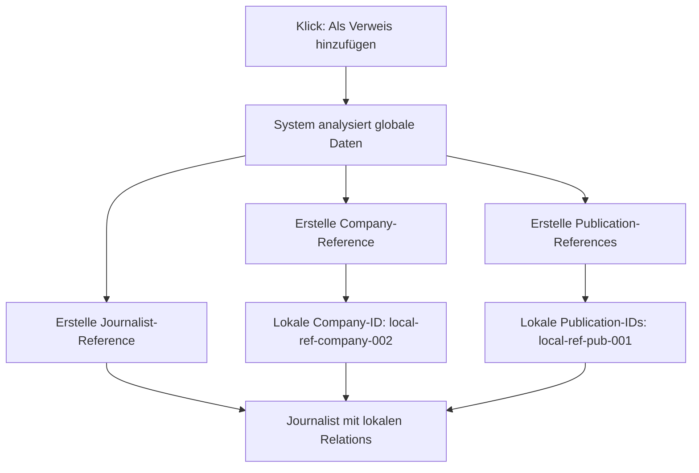

# 🔗 Multi-Entity Reference-System

## **Das Problem**

Das initiale Reference-System hatte einen kritischen Designfehler:
- ✅ Journalisten-Verweise funktionieren
- ❌ **Company/Publication Relations fehlen**
- ❌ **Listen/Projekte/Kampagnen finden References nicht**
- ❌ **8 von 9 Services ignorieren References**

**Ohne Company/Publication-References ist das System unbrauchbar!**

---

## **Die Lösung: Multi-Entity References**

### **💡 Kernidee: Automatische Entity-Kaskade**

**Ein Journalist-Import erstellt 3 References:**



### **📊 Datenbank-Struktur**

#### **Company References**
```typescript
// /organizations/{orgId}/company_references/{refId}
{
  globalCompanyId: "global-company-456",
  localCompanyId: "local-ref-company-002", // Generierte lokale ID
  addedAt: serverTimestamp(),
  addedBy: "user-123",
  isActive: true,

  // Lokale Anpassungen möglich
  localNotes?: "Wichtiges Medienhaus",
  localTags?: ["tech", "wichtig"]
}
```

#### **Publication References**
```typescript
// /organizations/{orgId}/publication_references/{refId}
{
  globalPublicationId: "global-pub-789",
  localPublicationId: "local-ref-pub-001", // Generierte lokale ID
  parentCompanyReferenceId: "local-ref-company-002", // Verknüpfung
  addedAt: serverTimestamp(),
  addedBy: "user-123",
  isActive: true,

  // Lokale Anpassungen möglich
  localNotes?: "Wichtig für Tech-News",
  localTags?: ["technologie"]
}
```

#### **Journalist References**
```typescript
// /organizations/{orgId}/journalist_references/{refId}
{
  globalJournalistId: "global-journalist-123",
  localJournalistId: "local-ref-journalist-003", // Generierte lokale ID

  // ✅ KRITISCH: Lokale Relations!
  companyReferenceId: "local-ref-company-002",
  publicationReferenceIds: ["local-ref-pub-001"],

  // Lokale Daten
  localNotes: "Experte für KI-Themen",
  localTags: ["ki", "technologie"],
  customLabel?: "Tech-Experte",

  addedAt: serverTimestamp(),
  addedBy: "user-123",
  isActive: true
}
```

---

## **🔄 Service-Integration**

### **Transparente Erweiterung**

**Statt 9 Services zu ändern**, erweitern wir `contactsEnhancedService`:

```typescript
class ContactsEnhancedService {
  async getAll(organizationId: string): Promise<ContactEnhanced[]> {
    // 1. Lade echte Kontakte
    const realContacts = await this.getRealContacts(organizationId);

    // 2. Lade und konvertiere References
    const referencedContacts = await this.getReferencedContacts(organizationId);

    // 3. Kombiniere transparent
    return [...realContacts, ...referencedContacts];
  }

  private async getReferencedContacts(organizationId: string): Promise<ContactEnhanced[]> {
    // Multi-Entity Reference-Service nutzen
    const references = await multiEntityReferenceService.getAllContactReferences(organizationId);
    return references.map(this.convertReferenceToContact);
  }
}
```

### **Backwards-Kompatibilität**

**ALLE bestehenden Services funktionieren automatisch:**
- ✅ `lists-service.ts` - findet References in Kontakt-Listen
- ✅ `project-service.ts` - kann References zu Projekten hinzufügen
- ✅ `contacts-api-service.ts` - API enthält References
- ✅ Export-Funktionen - References in CSV/Excel
- ✅ Kampagnen-System - kann References verwenden

**Kein Service muss geändert werden!**

---

## **🚀 Implementierungsplan**

### **Phase 1: Multi-Entity Reference-Service (2-3h)**

#### **1.1 Enhanced Reference-Service**
```typescript
class MultiEntityReferenceService {
  // HAUPTMETHODE: Kompletter Import
  async createJournalistReference(
    globalJournalistId: string,
    organizationId: string,
    userId: string
  ): Promise<{
    journalistRefId: string;
    companyRefId: string;
    publicationRefIds: string[];
  }>;

  // Lädt alle Entity-Types kombiniert
  async getAllContactReferences(organizationId: string): Promise<CombinedContactReference[]>;

  // Cleanup: Entfernt alle Relations atomisch
  async removeJournalistReference(localJournalistId: string, organizationId: string): Promise<void>;
}
```

#### **1.2 Atomische Multi-Entity-Creation**
```typescript
async createJournalistReference(globalJournalistId, organizationId, userId) {
  const batch = writeBatch(db);

  // 1. Lade globale Daten
  const globalJournalist = await this.getGlobalJournalist(globalJournalistId);
  const globalCompany = globalJournalist.company;
  const globalPublications = globalJournalist.publications;

  // 2. Company-Reference erstellen
  const companyRefId = await this.createCompanyReference(globalCompany, organizationId, batch);

  // 3. Publication-References erstellen
  const publicationRefIds = await this.createPublicationReferences(
    globalPublications, companyRefId, organizationId, batch
  );

  // 4. Journalist-Reference mit korrekten lokalen Relations
  const journalistRefId = await this.createJournalistReferenceWithRelations(
    globalJournalist, companyRefId, publicationRefIds, organizationId, batch
  );

  // 5. Atomisch committen
  await batch.commit();

  return { journalistRefId, companyRefId, publicationRefIds };
}
```

### **Phase 2: Service-Integration (1-2h)**

#### **2.1 ContactsEnhancedService erweitern**
- `getAll()` um References erweitern
- `getById()` für Reference-IDs unterstützen
- Konvertierung References → ContactEnhanced

#### **2.2 Transparent für alle Services**
- Listen-Service funktioniert automatisch
- Projekt-Service funktioniert automatisch
- Export funktioniert automatisch
- API funktioniert automatisch

### **Phase 3: UI-Enhancements (1h)**

#### **3.1 Reference-Management**
- "Verweis entfernen" → Alle Entity-References löschen
- Reference-Status in UI anzeigen
- Lokale Notizen für alle Entity-Types

#### **3.2 Bulk-Operations**
- Mehrere Journalisten als Verweis importieren
- Bulk-Remove für References

---

## **✨ Vorteile der Lösung**

### **🎯 Erhält die Grundidee**
- ✅ **Verweise statt Kopien** - Konzept bleibt
- ✅ **Automatische Updates** - SuperAdmin ändert → alle sehen es
- ✅ **Keine Duplikate** - echte References
- ✅ **Lokale Anpassungen** - Notizen/Tags möglich

### **🔧 Macht das System funktional**
- ✅ **Listen funktionieren** - finden References via lokale IDs
- ✅ **Projekte funktionieren** - können References hinzufügen
- ✅ **Kampagnen funktionieren** - können References verwenden
- ✅ **Export funktioniert** - References in CSV/Excel
- ✅ **API funktioniert** - References in REST-Responses

### **📈 Skalierbar und wartbar**
- ✅ **Performance** - Batch-Loading optimiert
- ✅ **Backwards-kompatibel** - keine Breaking Changes
- ✅ **Testbar** - klare Service-Trennung
- ✅ **Erweiterbar** - neue Entity-Types einfach hinzufügbar

---

## **🎮 User Experience**

### **Für den Kunden (unverändert)**
1. Geht zu `/library/editors/`
2. Sieht globale Journalisten
3. Klickt "Als Verweis hinzufügen"
4. **System macht automatisch:**
   - Company-Reference erstellen
   - Publication-References erstellen
   - Journalist-Reference mit lokalen Relations
5. Journalist erscheint im CRM mit funktionierenden Relations
6. Listen/Projekte/Kampagnen funktionieren sofort

### **Für den SuperAdmin (unverändert)**
1. Pflegt Journalisten im normalen CRM
2. Diese werden automatisch global
3. Alle Kunden sehen Updates sofort
4. Keine zusätzliche Arbeit nötig

---

## **🔄 Migration existierender References**

**Bestehende Single-Entity References müssen migriert werden:**

```typescript
async migrateExistingReferences() {
  // 1. Lade alle bestehenden Journalist-References
  // 2. Für jede Reference:
  //    - Analysiere globale Company/Publications
  //    - Erstelle fehlende Company/Publication-References
  //    - Update Journalist-Reference mit lokalen Relations
  // 3. Atomisch committen
}
```

---

## **📊 Erfolgs-Metriken**

**Das System funktioniert wenn:**
- ✅ Journalist-Import erstellt 3 Entity-References
- ✅ Listen finden References über lokale Relations
- ✅ Projekte können References hinzufügen
- ✅ Export enthält References mit korrekten Daten
- ✅ Kampagnen können References verwenden
- ✅ SuperAdmin-Änderungen propagieren automatisch

---

**Status: Ready to implement**
**Geschätzter Aufwand: 4-6 Stunden**
**Breaking Changes: Keine**
**Backwards-Kompatibilität: 100%**