# Privacy-Konzept: SuperAdmin vs. Kunden-Daten
## DSGVO-konforme Datentrennung

---

## 🔒 **GRUNDPRINZIP: STRIKTE DATENTRENNUNG**

### ❌ **SuperAdmin sieht NIEMALS:**
- Private CRM-Daten anderer Organisationen
- Interne Kontakte von Kunden
- Lokale Notizen oder Anpassungen
- Vertrauliche Geschäftskontakte

### ✅ **SuperAdmin kann NUR:**
- Seine eigenen Daten verwalten (`organizationId: 'superadmin-org'`)
- Diese Daten automatisch "global" markieren (`isGlobal: true`)
- Im vertrauten CRM-Interface arbeiten

---

## 🎯 **WORKFLOW: Wie SuperAdmin Journalisten global macht**

### **Schritt 1: SuperAdmin erstellt in SEINEM CRM**
```typescript
// SuperAdmin arbeitet in seiner eigenen Organisation
const superAdminUser = {
  organizationId: "superadmin-org",
  role: "super-admin"
}

// Erstellt einen Journalisten in SEINEM CRM
const journalist = {
  displayName: "Max Mustermann",
  organizationId: "superadmin-org",    // ← Seine eigene Org!
  mediaProfile: { isJournalist: true },
  isGlobal: true                       // ← Automatisch durch GlobalModeBanner
}
```

### **Schritt 2: Save-Interceptor aktiviert**
```typescript
// Automatisch beim Speichern:
if (user.role === 'super-admin' && globalMode === true) {
  contactData.isGlobal = true;
  // Daten werden global verfügbar, bleiben aber in superadmin-org
}
```

### **Schritt 3: Kunden sehen globale Daten NUR in Library**
```typescript
// NUR in /library/editors/ sichtbar:
const availableJournalists = query(contacts_enhanced,
  where('isGlobal', '==', true),           // Nur globale Daten
  where('mediaProfile.isJournalist', '==', true)
);

// Kunden-CRM zeigt KEINE globalen Daten:
const customerCRM = query(contacts_enhanced,
  where('organizationId', '==', customerOrgId) // NUR eigene Daten!
);
// Ergebnis: Saubere Trennung zwischen eigenem CRM und Premium-Library
```

---

## 🛡️ **PRIVACY-SCHUTZ DURCH ARCHITEKTUR**

### **1. Organisationsbasierte Trennung**
```typescript
// Jeder User sieht nur:
const userQuery = query(contacts,
  or(
    where('organizationId', '==', user.organizationId), // Eigene Daten
    where('isGlobal', '==', true)                       // Öffentliche Daten
  )
);

// SuperAdmin ist wie jeder andere User:
// organizationId: "superadmin-org" → sieht nur seine eigenen Daten!
```

### **2. Firestore Security Rules**
```javascript
// rules_version = '2';
service cloud.firestore {
  match /databases/{database}/documents {
    match /contacts_enhanced/{contactId} {
      allow read: if
        // Eigene Organisation ODER globale Daten
        resource.data.organizationId == request.auth.token.organizationId ||
        resource.data.isGlobal == true;

      allow write: if
        // Nur eigene Organisation
        resource.data.organizationId == request.auth.token.organizationId;
    }
  }
}
```

### **3. No Cross-Org Data Access**
```typescript
// ❌ UNMÖGLICH für SuperAdmin:
const otherOrgData = query(contacts,
  where('organizationId', '==', 'customer-xyz')
);
// → Firestore Rules blockieren dies!

// ✅ MÖGLICH für SuperAdmin:
const ownData = query(contacts,
  where('organizationId', '==', 'superadmin-org')
);
// → Nur seine eigenen Daten
```

---

## 🎨 **UI-DESIGN: GlobalModeBanner**

### **SuperAdmin CRM Interface:**
```typescript
<GlobalModeBanner
  currentMode={globalMode ? 'global' : 'local'}
  onToggle={() => setGlobalMode(!globalMode)}
  message={
    globalMode
      ? "Global-Modus: Neue Daten werden für alle Kunden verfügbar"
      : "Lokal-Modus: Neue Daten nur in Ihrer Organisation"
  }
/>
```

### **Kunden sehen Banner NICHT:**
```typescript
// Nur SuperAdmin sieht GlobalModeBanner
{user.role === 'super-admin' && (
  <GlobalModeBanner ... />
)}
```

---

## 📊 **DATENFLUSS-DIAGRAMM**

```mermaid
graph TB
    subgraph "SuperAdmin Org"
        SA[SuperAdmin User]
        SACRM[SuperAdmin CRM]
        SAData[(organizationId: superadmin-org)]
    end

    subgraph "Global System"
        Global[isGlobal: true]
        Library[/library/editors/]
    end

    subgraph "Customer A Org"
        CA[Customer A User]
        CACRM[Customer A CRM]
        CAData[(organizationId: customer-a)]
    end

    subgraph "Customer B Org"
        CB[Customer B User]
        CBCRM[Customer B CRM]
        CBData[(organizationId: customer-b)]
    end

    SA --> SACRM
    SACRM --> SAData
    SAData --> Global
    Global --> Library

    Library --> CACRM
    Library --> CBCRM

    CA --> CACRM
    CACRM --> CAData
    CB --> CBCRM
    CBCRM --> CBData

    %% Keine Cross-Org Zugriffe
    SA -.->|❌ KEIN ZUGRIFF| CAData
    SA -.->|❌ KEIN ZUGRIFF| CBData
    CA -.->|❌ KEIN ZUGRIFF| SAData
    CA -.->|❌ KEIN ZUGRIFF| CBData
```



---

## ✅ **DSGVO-COMPLIANCE**

### **1. Datenminimierung:**
- SuperAdmin sieht nur seine eigenen Daten
- Kunden sehen nur ihre eigenen + explizit globale Daten
- Keine Cross-Organisation Datenlecks möglich

### **2. Zweckbindung:**
- Globale Daten nur für Premium-Feature-Nutzung
- Keine anderen Verwendungszwecke
- Klare Opt-in durch Import-Action

### **3. Transparenz:**
- Import-Dialog zeigt Datenherkunft
- "Importiert aus Journalisten-Datenbank" Notiz
- Nutzer weiß, woher die Daten stammen

### **4. Kontrolle:**
- Kunden können importierte Daten lokal anpassen
- Lokale Notizen bleiben privat
- Sync nur bei expliziter Zustimmung

---

## 🎯 **FAZIT**

**SuperAdmin = Privilegierter Content-Creator, NICHT Data-Voyeur!**

- ✅ Kann hochwertige Journalisten-Daten erstellen
- ✅ Diese werden automatisch global verfügbar
- ❌ Hat KEINEN Zugriff auf private Kundendaten
- ❌ Kann NICHT in andere Organisationen "hineinschauen"

**Perfekte Balance zwischen Premium-Value und Privacy-Schutz!**

---

*Erstellt: 29.09.2024*
*DSGVO-konform & Privacy-by-Design*