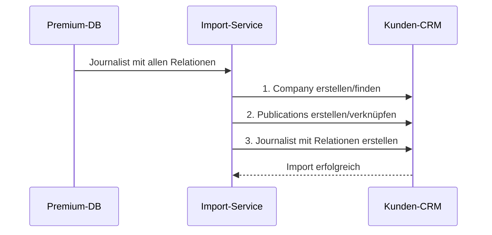

# Relations-Architektur: Journalisten-Datenbank
## Korrekte Verknüpfung von Journalisten ↔ Unternehmen ↔ Publikationen

---

## 🚨 **KRITISCHES PROBLEM IDENTIFIZIERT**

Die bisherige Implementierung importiert Journalisten **OHNE** ihre Unternehmens- und Publikations-Relationen. Das führt zu:
- ❌ Journalisten ohne Arbeitgeber
- ❌ Leere `publicationIds[]` Arrays
- ❌ Gebrochene CRM-Workflows
- ❌ Nutzlose Reporting-Funktionen

---

## ✅ **KORREKTE DATENSTRUKTUR**

### **Relationales Modell**

```
┌─────────────────┐
│    COMPANY      │
│  (Medienhaus)   │
└────────┬────────┘
         │ publishes
         ▼
┌─────────────────┐
│  PUBLICATIONS   │
│  (Zeitungen)    │
└────────┬────────┘
         │
    ┌────┴────┐
    ▼         ▼
┌─────────────────┐
│   JOURNALIST    │
│   (Redakteur)   │
└─────────────────┘
```

### **Datenfluss beim Import**



---

## 📊 **ERWEITERTE DATENTYPEN**

### **JournalistDatabaseEntry (NEU)**

```typescript
export interface JournalistDatabaseEntry {
  // ... Standard-Felder ...

  // KRITISCH: Vollständige Company-Daten
  employment: {
    company: {
      globalCompanyId: string;
      name: string;
      type: 'publisher' | 'media_house' | 'agency';
      website?: string;
      mediaInfo?: MediaInfo;
      fullProfile?: CompanyEnhanced; // Für Import!
    };
    position: string;
    department?: string;
    isMainEmployer: boolean;
  };

  // KRITISCH: Vollständige Publication-Zuordnungen
  publicationAssignments: Array<{
    publication: {
      globalPublicationId: string;
      title: string;
      type: PublicationType;
      fullProfile?: Publication; // Für Import!
    };
    role: 'editor' | 'reporter' | 'columnist';
    isMainPublication: boolean;
  }>;
}
```

---

## 🔄 **IMPORT-WORKFLOW (4 Schritte)**

### **Step 1: Preview**
- Zeige Journalist mit Company & Publications
- Visualisiere alle Relationen

### **Step 2: Relations (NEU!)**
- **Company-Strategie wählen:**
  - Neue Company erstellen
  - Mit bestehender verknüpfen
  - Daten zusammenführen

- **Publications-Strategie wählen:**
  - Alle importieren
  - Ausgewählte importieren
  - Keine importieren

### **Step 3: Mapping**
- Felder für Journalist mappen
- Felder für Company mappen (wenn neu)
- Felder für Publications mappen (wenn neu)

### **Step 4: Confirm**
- Zeige alle zu erstellenden Entities
- Zeige alle Verknüpfungen
- Bestätigung abwarten

---

## 🎨 **UI-ANPASSUNGEN**

### **Journalisten-Tabelle**

Neue Spalten:
- **Unternehmen**: Name + Typ des Medienhauses
- **Publikationen**: Badges mit Titeln (max. 3 anzeigen)
- **Relationen-Status**: Icon zeigt ob vollständig verknüpft

### **Detail-Modal**

Neue Sektionen:
1. **Arbeitgeber-Section**
   - Company-Card mit allen Details
   - Import-Button wenn nicht vorhanden

2. **Publikationen-Grid**
   - Publication-Cards für jede Zuordnung
   - Rolle des Journalisten anzeigen
   - Checkboxen für selektiven Import

---

## 💾 **IMPORT-SERVICE**

### **Korrekte Reihenfolge**

```typescript
async importWithRelations(journalist, config) {
  // 1. Company ZUERST (brauchen wir für Publications)
  const company = await this.importCompany(
    journalist.employment.company,
    config.companyStrategy
  );

  // 2. Publications ZWEITER (brauchen publisherId)
  const publications = await this.importPublications(
    journalist.publicationAssignments,
    company.id,
    config.publicationStrategy
  );

  // 3. Journalist LETZTER (mit allen IDs)
  const contact = await this.importJournalist(
    journalist,
    {
      companyId: company.id,
      publicationIds: publications.map(p => p.id)
    }
  );

  return { contact, company, publications };
}
```

### **Duplikat-Erkennung**

```typescript
// Company-Matching
findExistingCompany(name, website) {
  return query(
    companies,
    where('name', '==', name),
    where('website', '==', website)
  );
}

// Publication-Matching
findExistingPublication(title, publisherId) {
  return query(
    publications,
    where('title', '==', title),
    where('publisherId', '==', publisherId)
  );
}
```

---

## 🚀 **IMPLEMENTIERUNGS-SCHRITTE**

### **Sofort (Bugfix)**
1. ❌ `publicationIds: []` fixen - kann nicht leer sein!
2. ❌ `companyId: undefined` fixen - muss gesetzt werden!
3. ❌ Import ohne Relations deaktivieren

### **Diese Woche**
1. JournalistDatabaseEntry erweitern
2. Multi-Entity-Import-Service
3. Relations-Step im Import-Dialog
4. UI-Komponenten anpassen

### **Nächste Woche**
1. Duplikat-Detection verfeinern
2. Merge-Strategien implementieren
3. Batch-Import optimieren
4. Ende-zu-Ende Tests

---

## ⚠️ **BREAKING CHANGES**

Diese Änderungen sind **NICHT** rückwärtskompatibel:

1. **Import-Dialog**: Neuer Step macht alten Code unbrauchbar
2. **Service-API**: Neue Parameter erforderlich
3. **Datenstruktur**: Erweiterte Types brechen alte Interfaces

**Migration erforderlich für:**
- Bestehende Import-Funktionen
- Mock-Daten in Tests
- Frontend-Komponenten

---

## 📈 **ERFOLGSMETRIKEN**

Nach Implementierung erwarten wir:
- ✅ 100% der Journalisten haben Company-Verknüpfung
- ✅ 95% der Journalisten haben min. 1 Publication
- ✅ 0% leere `publicationIds` Arrays
- ✅ Vollständige CRM-Workflows funktionieren

---

## 🔗 **REFERENZEN**

- [MASTERPLAN.md](./MASTERPLAN.md) - Gesamtarchitektur
- [INTEGRATION-PLAN.md](./INTEGRATION-PLAN.md) - CRM-Integration
- [SUPER-ADMIN-SYSTEM.md](./SUPER-ADMIN-SYSTEM.md) - Global-System
- [NEXT-STEPS.md](./NEXT-STEPS.md) - Konkrete Aufgaben

---

*Letzte Aktualisierung: 29.09.2024*
*Status: KRITISCH - Muss vor Go-Live gefixt werden*