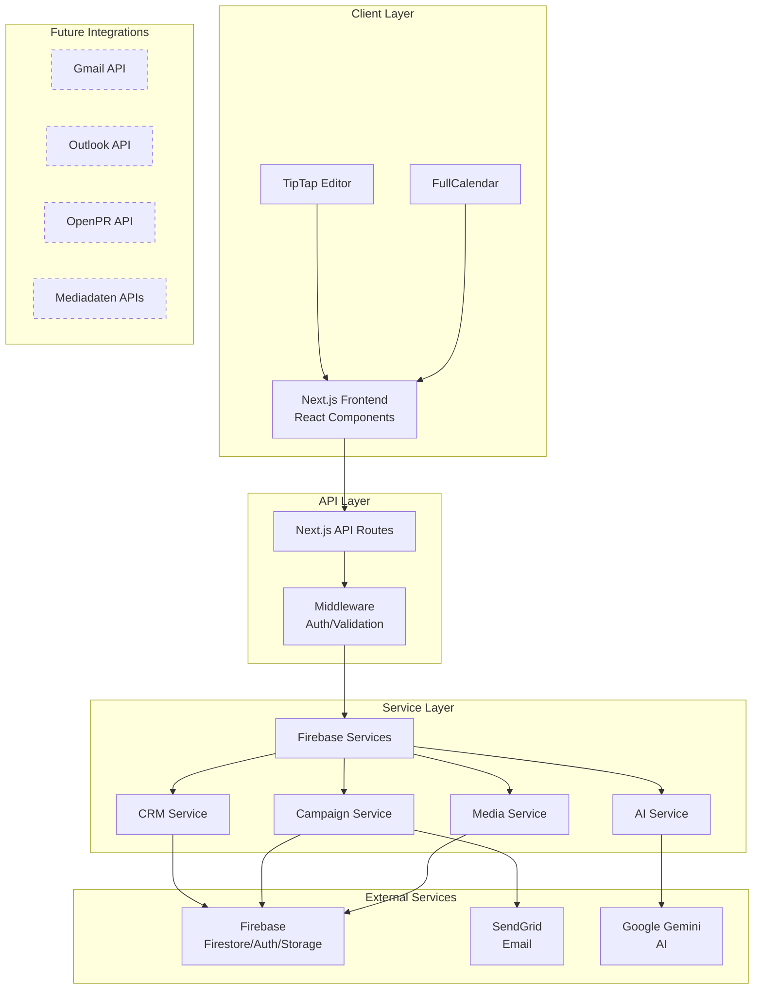

# CeleroPress Architektur-Übersicht

## 📋 Inhaltsverzeichnis
- [Technologie-Stack](#technologie-stack)
- [System-Architektur](#system-architektur)
- [Hauptkomponenten](#hauptkomponenten)
- [Datenfluss](#datenfluss)
- [Externe Services](#externe-services)
- [Sicherheitskonzept](#sicherheitskonzept)
- [Deployment](#deployment)
- [Architektur-Entscheidungen](#architektur-entscheidungen)

## 🛠 Technologie-Stack

### Frontend
- **Framework**: Next.js 15.4.4 (App Router)
- **UI Library**: React 18
- **Styling**: Tailwind CSS 3.4.17
- **UI Components**: Headless UI 2.2.4
- **Icons**: Heroicons 2.2.0
- **Rich Text Editor**: TipTap 2.25.0
- **Kalender**: FullCalendar 6.1.18
- **Charts**: Recharts 2.8.0
- **Animationen**: Framer Motion 12.18.1
- **Drag & Drop**: Hello Pangea DnD 18.0.1 (React Beautiful DnD Fork)
- **Sprache**: TypeScript 5
- **Validation**: Zod 4.0.10
- **Date Handling**: date-fns 4.1.0
- **MDX Support**: @next/mdx 15.3.5

### Backend & Datenbank
- **BaaS**: Firebase 11.9.1
  - **Datenbank**: Firestore
  - **Authentifizierung**: Firebase Auth
  - **File Storage**: Firebase Storage
  - **Hosting**: Firebase Hosting (optional)
- **API Routes**: Next.js API Routes
- **File Processing**: 
  - CSV: Papaparse 5.5.3
  - Excel: XLSX 0.18.5
  - PDF: html2pdf.js 0.10.3

### Externe Services
- **E-Mail**: SendGrid 8.1.5
- **KI**: Google Gemini (Generative AI 0.24.1)
- **Cloud AI**: Google Cloud Vertex AI 1.10.0
- **Internationalization**: i18n-iso-countries 7.14.0
- **Security**: DOMPurify 3.2.6

### Development Tools
- **Bundler**: Next.js integriert (Turbopack)
- **Linter**: ESLint 8 + Next.js Config
- **CSS Processing**: PostCSS + Autoprefixer 10.4.21
- **Testing**: Jest 30.0.5 + React Testing Library 16.3.0 + Jest DOM 6.6.4
- **TypeScript**: TypeScript 5 (strict mode)
- **State Management**: React Query/TanStack Query 5.84.1

## 🏗 System-Architektur



## 🧩 Hauptkomponenten

### 1. Frontend-Architektur

#### App Router Struktur
```
src/app/
├── (auth)/          # Öffentliche Auth-Seiten
├── (dashboard)/     # Geschützter Bereich
│   ├── contacts/    # CRM-Modul
│   └── pr-tools/    # PR-Werkzeuge
├── api/             # Backend API Routes
└── share/           # Öffentliche Freigabe-Links
```

#### State Management
- **Globaler State**: React Context API
  - `AuthContext`: Authentifizierung
  - `AppContext`: App-weite Einstellungen
  - `CrmDataContext`: Shared CRM-Daten
- **Lokaler State**: React Hooks (useState, useReducer)
- **Server State**: React Server Components + Firestore

### 2. Backend-Services

#### Service Layer Pattern
```typescript
// Beispiel: CRM Service
export const companiesService = {
  getAll(userId: string): Promise<Company[]>
  getById(id: string): Promise<Company>
  create(data: CompanyData): Promise<string>
  update(id: string, data: Partial<Company>): Promise<void>
  delete(id: string): Promise<void>
}
```

#### API Route Struktur
```
/api/
├── ai/              # KI-Funktionen
│   ├── generate/    # Pressemeldung generieren
│   └── templates/   # Vorlagen
├── auth/            # Authentifizierung
├── campaigns/       # Kampagnen-Management
└── webhooks/        # External Webhooks
    └── sendgrid/    # E-Mail Events
```

### 3. Datenbank-Design

#### Firestore Collections
```
users/
├── {userId}/
│   └── preferences/

companies/
├── {companyId}
│   ├── name
│   ├── type
│   ├── mediaInfo
│   └── tagIds[]

contacts/
├── {contactId}
│   ├── companyId (reference)
│   └── mediaInfo.publications[]

campaigns/
├── {campaignId}
│   ├── status
│   ├── recipients[]
│   └── approvals/

media/
├── {assetId}
│   ├── folderId
│   └── clientIds[]
```

**Wichtige Entscheidung**: Keine Subcollections für bessere Query-Flexibilität
→ Siehe [ADR-0003](./adr/0003-firestore-data-structure.md)

## 🔄 Datenfluss

### 1. Kampagnen-Erstellung
```
User Input → TipTap Editor → Campaign Service → Firestore
                ↓
            AI Service → Gemini API
```

### 2. E-Mail-Versand
```
Campaign → Distribution List → SendGrid API → Recipient
              ↓                    ↓
         Contact Filter      Webhook Events
```

### 3. Medien-Upload
```
File Select → Firebase Storage → CDN URL → Media Service → Firestore
```

## 🔌 Externe Services

### Aktuelle Integrationen

#### Firebase (Google Cloud)
- **Warum**: Nahtlose Integration, Serverless, Google-Ökosystem
- **Verwendung**: 
  - Firestore: NoSQL Datenbank
  - Auth: Benutzer-Authentifizierung
  - Storage: Datei-Uploads (Bilder, Dokumente)
- **Kosten**: Pay-as-you-go, großzügige Free Tier

#### SendGrid (Twilio)
- **Warum**: Zuverlässigkeit, Vorhandene Erfahrung
- **Verwendung**: 
  - Transaktionale E-Mails
  - Massen-Versand für Pressemeldungen
  - Event-Webhooks für Tracking
- **Alternative**: Firebase Extensions (Trigger Email)

#### Google Gemini
- **Warum**: Google-Ökosystem, Deutsch-Support, Kosteneffizient
- **Verwendung**:
  - Pressemeldungen generieren
  - Texte verbessern
  - Zukünftig: Zusammenfassungen
- **Fallback**: Manuelle Eingabe bei API-Ausfall

### Geplante Integrationen

#### E-Mail & Kalender Sync
- **Gmail API**: OAuth2, Kontakt-Historie, Kalender-Events
- **Microsoft Graph API**: Outlook/Exchange Integration
- **Herausforderungen**: OAuth-Flows, Token-Management, Rate Limits

#### Pressedaten-Import
- **Zimpel/Mediadaten**: Deutsche Pressekontakte
- **Cision/PR Newswire**: Internationale Kontakte
- **OpenPR API**: Automatisches Posting
- **Herausforderungen**: Kosten, Datenqualität, Dubletten

## 🔐 Sicherheitskonzept

### Authentifizierung & Autorisierung
- Firebase Auth mit E-Mail/Passwort
- Session-basierte Authentifizierung
- Role-Based Access Control (geplant)

### Datenschutz
- Firestore Security Rules
- Row-Level Security via userId
- Verschlüsselte Verbindungen (HTTPS)
- DSGVO-konforme Datenhaltung

### API-Sicherheit
- API-Key Management via Umgebungsvariablen
- Rate Limiting (geplant)
- Input Validation
- CORS-Konfiguration

## 🚀 Deployment

### Aktuell: Development
```bash
npm run dev  # Lokale Entwicklung
```

### Produktion (Optionen)
1. **Vercel** (Empfohlen)
   - Automatisches Deployment
   - Edge Functions
   - Analytics

2. **Firebase Hosting**
   - Vollständig im Google-Ökosystem
   - Cloud Functions für SSR

3. **Self-Hosted**
   - Docker Container
   - Node.js Server

## 📐 Architektur-Entscheidungen

Die wichtigsten Architektur-Entscheidungen sind in separaten ADRs dokumentiert:

| ADR | Titel | Status |
|-----|-------|--------|
| [ADR-0001](./adr/0001-nextjs-app-router.md) | Next.js 14 mit App Router | Accepted |
| [ADR-0002](./adr/0002-firebase-backend.md) | Firebase als Backend | Accepted |
| [ADR-0003](./adr/0003-firestore-data-structure.md) | Firestore ohne Subcollections | Accepted |
| [ADR-0004](./adr/0004-sendgrid-email.md) | SendGrid für E-Mail-Versand | Accepted |
| [ADR-0005](./adr/0005-gemini-ai.md) | Google Gemini für KI | Accepted |
| [ADR-0006](./adr/0006-no-redux.md) | Context API statt Redux | Accepted |
| [ADR-0007](./adr/0007-tiptap-editor.md) | TipTap als Rich-Text Editor | Accepted |

## 🔮 Zukunftsvisionen

### Phase 1 (Q1 2025)
- [ ] Gmail/Outlook Integration
- [ ] Erweiterte Benutzerrollen
- [ ] Automatisches Kampagnen-Scheduling

### Phase 2 (Q2 2025)
- [ ] Pressedaten-Import APIs
- [ ] OpenPR Auto-Posting
- [ ] Mobile App (React Native)

### Phase 3 (Q3 2025)
- [ ] Multi-Tenant Architektur
- [ ] White-Label Lösung
- [ ] KI-basierte Kontakt-Empfehlungen

## 📚 Weiterführende Dokumentation

- [CRM-Modul](./features/crm.md)
- [Kampagnen-System](./features/campaigns.md)
- [Mediathek](./features/media-library.md)
- [API-Dokumentation](./API.md)
- [Deployment Guide](./DEPLOYMENT.md)