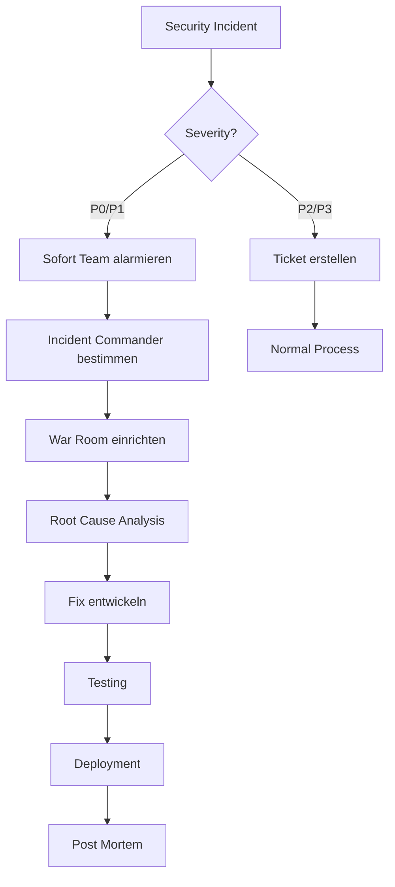

# Security Policy

## 🛡️ Sicherheit bei SKAMP

Die Sicherheit von SKAMP und den Daten unserer Nutzer hat höchste Priorität. Dieses Dokument beschreibt unsere Sicherheitsmaßnahmen und wie Sicherheitslücken gemeldet werden können.

## 📋 Inhaltsverzeichnis

- [Unterstützte Versionen](#unterstützte-versionen)
- [Sicherheitslücken melden](#sicherheitslücken-melden)
- [Sicherheitsmaßnahmen](#sicherheitsmaßnahmen)
- [Datenschutz & Compliance](#datenschutz--compliance)
- [Best Practices für Nutzer](#best-practices-für-nutzer)
- [Incident Response](#incident-response)
- [Security Changelog](#security-changelog)

## 🔒 Unterstützte Versionen

Sicherheitsupdates werden für folgende Versionen bereitgestellt:

| Version | Unterstützt | Support bis |
| ------- | ----------- | ----------- |
| 1.0.x   | ✅          | Januar 2026 |
| 0.9.x   | ❌          | -           |
| < 0.9   | ❌          | -           |

## 🚨 Sicherheitslücken melden

### Meldeprozess

**WICHTIG**: Bitte melden Sie Sicherheitslücken **NICHT** öffentlich über GitHub Issues!

1. **E-Mail an**: security@skamp.de
2. **PGP-Key** (optional): [Öffentlicher Schlüssel](https://keybase.io/skamp)
3. **Betreff**: "Security Vulnerability - SKAMP"

### Was sollte die Meldung enthalten?

```markdown
**Schweregrad**: Kritisch / Hoch / Mittel / Niedrig

**Betroffene Komponente**: 
z.B. Authentication, CRM Module, API Endpoint

**Beschreibung**:
Detaillierte Beschreibung der Sicherheitslücke

**Reproduktion**:
1. Schritt-für-Schritt Anleitung
2. Verwendete Tools/Scripts
3. Proof of Concept (falls vorhanden)

**Auswirkungen**:
Was könnte ein Angreifer damit tun?

**Lösungsvorschlag** (optional):
Ihre Ideen zur Behebung
```

### Reaktionszeit

- **Erste Antwort**: Innerhalb von 48 Stunden
- **Statusupdate**: Alle 5 Werktage
- **Patch-Zeitrahmen**:
  - Kritisch: 24-48 Stunden
  - Hoch: 3-5 Tage
  - Mittel: 7-14 Tage
  - Niedrig: 30 Tage

### Responsible Disclosure

- Wir bitten um 90 Tage Zeit zur Behebung vor Veröffentlichung
- Anerkennung in unserer Hall of Fame (wenn gewünscht)
- Keine Bug Bounties derzeit (als Startup)

## 🔐 Sicherheitsmaßnahmen

### 1. Authentifizierung & Autorisierung

#### Firebase Authentication
- **Passwort-Richtlinien**: Mind. 8 Zeichen, Komplexität empfohlen
- **Session-Management**: Sichere Session-Tokens
- **Account-Sicherheit**:
  ```typescript
  // Brute-Force Schutz
  auth.settings.appVerificationDisabledForTesting = false;
  
  // Session-Timeout nach 24h Inaktivität
  auth.setPersistence(browserSessionPersistence);
  ```

#### Zukünftig geplant:
- [ ] Multi-Factor Authentication (MFA)
- [ ] OAuth2 Provider (Google, Microsoft)
- [ ] Passwordless Authentication
- [ ] Hardware-Token Support

### 2. Datenverschlüsselung

#### In Transit
- **HTTPS überall**: TLS 1.3 erzwungen
- **HSTS Header**: Strict-Transport-Security
- **Certificate Pinning**: Für mobile Apps (geplant)

```nginx
# Nginx Konfiguration
add_header Strict-Transport-Security "max-age=31536000; includeSubDomains" always;
add_header X-Content-Type-Options "nosniff" always;
add_header X-Frame-Options "DENY" always;
add_header X-XSS-Protection "1; mode=block" always;
add_header Content-Security-Policy "default-src 'self'; script-src 'self' 'unsafe-inline' 'unsafe-eval' https://www.googletagmanager.com; style-src 'self' 'unsafe-inline';" always;
```

#### At Rest
- **Firebase Storage**: Automatische Verschlüsselung
- **Firestore**: AES-256 Verschlüsselung
- **Sensitive Daten**: Zusätzliche App-Level Verschlüsselung

```typescript
// Beispiel: API Keys verschlüsseln
import { encrypt, decrypt } from '@/lib/crypto';

// Speichern
const encryptedKey = encrypt(apiKey, process.env.ENCRYPTION_KEY);

// Abrufen
const apiKey = decrypt(encryptedKey, process.env.ENCRYPTION_KEY);
```

### 3. API-Sicherheit

#### Rate Limiting
```typescript
// middleware/rateLimit.ts
export const rateLimiter = {
  api: {
    windowMs: 15 * 60 * 1000, // 15 Minuten
    max: 100, // Max 100 Requests
    message: 'Zu viele Anfragen, bitte später erneut versuchen'
  },
  auth: {
    windowMs: 15 * 60 * 1000,
    max: 5, // Max 5 Login-Versuche
    skipSuccessfulRequests: true
  },
  ai: {
    windowMs: 60 * 1000,
    max: 10 // Max 10 AI-Requests pro Minute
  }
};
```

#### Input Validation
```typescript
// Zod Schemas für Validierung
import { z } from 'zod';

const campaignSchema = z.object({
  title: z.string().min(1).max(200),
  content: z.string().max(50000),
  recipients: z.array(z.string().email()).max(1000),
  // XSS Prevention
  subject: z.string().regex(/^[^<>]*$/, 'HTML nicht erlaubt')
});

// Sanitization
import DOMPurify from 'isomorphic-dompurify';
const cleanContent = DOMPurify.sanitize(userInput);
```

### 4. Firebase Security Rules

Siehe [DEPLOYMENT.md](./DEPLOYMENT.md#firebase-security-rules) für vollständige Rules.

Wichtige Prinzipien:
- **Row-Level Security**: Nutzer sehen nur eigene Daten
- **Least Privilege**: Minimale notwendige Rechte
- **Explicit Deny**: Alles verboten, außer explizit erlaubt

### 5. Dependency Security

```json
// package.json
{
  "scripts": {
    "audit": "npm audit --production",
    "audit:fix": "npm audit fix --force",
    "check:deps": "npx depcheck",
    "update:deps": "npx npm-check-updates -u"
  }
}
```

**Automatisierung**:
- GitHub Dependabot aktiviert
- Weekly Security Updates
- Automated Testing bei Updates

### 6. Logging & Monitoring

```typescript
// lib/security/logger.ts
export const securityLogger = {
  loginAttempt: (email: string, success: boolean, ip?: string) => {
    console.log({
      event: 'LOGIN_ATTEMPT',
      email: hashEmail(email), // Pseudonymisiert
      success,
      ip: ip ? hashIP(ip) : null,
      timestamp: new Date().toISOString()
    });
  },
  
  accessDenied: (userId: string, resource: string) => {
    console.error({
      event: 'ACCESS_DENIED',
      userId,
      resource,
      timestamp: new Date().toISOString()
    });
    // Alert an Admin
  },
  
  suspiciousActivity: (details: any) => {
    console.warn({
      event: 'SUSPICIOUS_ACTIVITY',
      details,
      timestamp: new Date().toISOString()
    });
    // Trigger Alert
  }
};
```

## 🔏 Datenschutz & Compliance

### DSGVO-Konformität

1. **Datenminimierung**: Nur notwendige Daten sammeln
2. **Zweckbindung**: Daten nur für angegebene Zwecke
3. **Löschkonzept**: Automatische Löschung nach Ablauf
4. **Auskunftsrecht**: Export-Funktion für Nutzer
5. **Recht auf Vergessenwerden**: Vollständige Löschung

```typescript
// DSGVO-konforme Löschung
export async function deleteUserData(userId: string) {
  const batch = writeBatch(db);
  
  // 1. Alle Nutzer-Collections durchgehen
  const collections = [
    'companies', 'contacts', 'campaigns', 
    'media_assets', 'distribution_lists'
  ];
  
  for (const collectionName of collections) {
    const q = query(
      collection(db, collectionName),
      where('userId', '==', userId)
    );
    const snapshot = await getDocs(q);
    snapshot.forEach(doc => batch.delete(doc.ref));
  }
  
  // 2. Storage-Daten löschen
  const storageRef = ref(storage, `users/${userId}`);
  await deleteFolder(storageRef);
  
  // 3. Auth-Account löschen
  await deleteUser(auth.currentUser);
  
  await batch.commit();
}
```

### Datenaufbewahrung

| Datentyp | Aufbewahrung | Automatische Löschung |
|----------|--------------|----------------------|
| Kampagnen | 2 Jahre | ✅ |
| Kontakte | Unbegrenzt* | ❌ |
| Logs | 90 Tage | ✅ |
| Backups | 30 Tage | ✅ |
| Gelöschte Daten | 30 Tage Soft Delete | ✅ |

*Außer explizite Löschanfrage

## 👤 Best Practices für Nutzer

### Sichere Passwörter
- Mindestens 12 Zeichen
- Groß-/Kleinbuchstaben, Zahlen, Sonderzeichen
- Keine Wiederverwendung
- Passwort-Manager empfohlen

### Account-Sicherheit
- [ ] Regelmäßiger Passwort-Wechsel (alle 90 Tage)
- [ ] Verdächtige Aktivitäten melden
- [ ] Keine Credential-Weitergabe
- [ ] Logout bei öffentlichen Computern

### API-Keys & Tokens
```bash
# NIEMALS API-Keys committen!
# .env.local
SENDGRID_API_KEY=SG.xxxxx # ❌ NICHT ins Repository!

# Stattdessen Umgebungsvariablen nutzen
vercel env add SENDGRID_API_KEY
```

### Phishing-Schutz
- SKAMP fragt NIEMALS nach Passwort per E-Mail
- Immer URL prüfen: https://app.skamp.de
- Bei Unsicherheit: security@skamp.de

## 🚑 Incident Response

### Severity Levels

| Level | Beschreibung | Beispiel | Reaktionszeit |
|-------|--------------|----------|---------------|
| P0 - Kritisch | Vollständiger Ausfall oder Datenleck | SQL Injection, Auth Bypass | < 1 Stunde |
| P1 - Hoch | Teilausfall oder Sicherheitsrisiko | XSS, CSRF | < 4 Stunden |
| P2 - Mittel | Feature-Ausfall | API Rate Limit Fehler | < 24 Stunden |
| P3 - Niedrig | Kleine Bugs | UI Glitch | < 1 Woche |

### Response Plan



### Kommunikation

1. **Intern**: Slack #security-incidents
2. **Nutzer**: Status Page + E-Mail bei Datenleck
3. **Behörden**: DSGVO-Meldung binnen 72h bei Datenleck

## 📅 Security Changelog

### 2025-01-15 (v1.0.0)
- ✅ Firebase Security Rules implementiert
- ✅ HTTPS everywhere
- ✅ Input Validation auf allen API Routes
- ✅ Rate Limiting für AI und Auth

### Geplante Verbesserungen (Q1 2025)
- [ ] Multi-Factor Authentication
- [ ] Security Headers optimieren
- [ ] Web Application Firewall (WAF)
- [ ] Penetration Testing

### Geplante Verbesserungen (Q2 2025)
- [ ] SOC 2 Compliance
- [ ] Bug Bounty Programm
- [ ] Security Audit extern
- [ ] ISO 27001 Vorbereitung

## 🏆 Security Hall of Fame

Wir danken folgenden Sicherheitsforschern:

| Forscher | Entdeckung | Datum |
|----------|------------|-------|
| *Noch keine Einträge* | - | - |

## 📞 Kontakt

- **Security Team**: security@skamp.de
- **Notfall-Hotline**: +49 (0) 123 456789 (nur für P0)
- **PGP Key**: [Download](https://keybase.io/skamp)

---

*Letzte Aktualisierung: Januar 2025*  
*Nächste Review: April 2025*