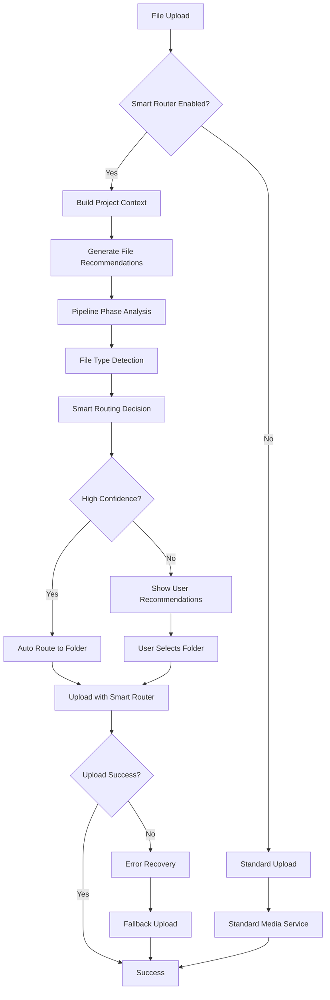

# Smart Upload Router Integration - Project Folder System

**Phase 3 Implementation des Media Multi-Tenancy Masterplans**

## Übersicht

Die Smart Upload Router Integration erweitert das Project Folder System um intelligente Upload-Funktionalität mit Pipeline-Phase-basiertem Routing, File-Type-Erkennung und automatischen Ordner-Empfehlungen.

### Hauptfeatures

- **Pipeline-Phase-basiertes Routing**: Automatische Ordner-Zuordnung basierend auf der aktuellen Projekt-Phase
- **File-Type-intelligente Empfehlungen**: Smart Routing abhängig vom Dateityp
- **Enhanced Drag & Drop**: Visuelles Feedback und Smart Routing Preview
- **Batch Upload Optimization**: Parallele Verarbeitung mit Smart Grouping
- **Robustes Error Handling**: Graceful Fallbacks und Recovery-Mechanismen
- **Feature Flag System**: Stufenweise Rollout-Unterstützung

## Architektur

### Komponenten-Struktur

```
src/components/projects/
├── utils/
│   ├── project-folder-context-builder.ts     # Smart Context-Erkennung
│   └── project-upload-error-handler.ts       # Error Handling & Fallbacks
├── config/
│   └── project-folder-feature-flags.ts       # Feature Flag System
├── components/
│   └── SmartUploadInfoPanel.tsx              # UI-Komponenten
└── ProjectFoldersView.tsx                     # Hauptkomponente (erweitert)

src/lib/firebase/
└── project-upload-service.ts                 # Upload Service Integration
```

### Integration-Flow



## Implementation Details

### 1. Project Folder Context Builder

**Datei**: `src/components/projects/utils/project-folder-context-builder.ts`

#### Pipeline-Phase-basierte Routing-Regeln

```typescript
const PIPELINE_ROUTING_RULES = {
  'ideas_planning': {
    defaultFolder: 'Dokumente',
    fileTypeOverrides: {
      'image': 'Medien',
      'video': 'Medien'
    }
  },
  'creation': {
    defaultFolder: 'Medien',
    fileTypeOverrides: {
      'pdf': 'Dokumente',
      'document': 'Dokumente'
    }
  },
  'customer_approval': {
    defaultFolder: 'Pressemeldungen',
    fileTypeOverrides: {
      'image': 'Medien'
    }
  }
  // ... weitere Phasen
};
```

#### Verwendung

```typescript
import { projectFolderContextBuilder } from './utils/project-folder-context-builder';

// Context aufbauen
const context = projectFolderContextBuilder.buildProjectFolderContext({
  projectId: 'project_123',
  projectTitle: 'Neue Kampagne',
  currentStage: 'creation',
  organizationId: 'org_456',
  userId: 'user_789'
});

// Smart Recommendation generieren
const recommendation = projectFolderContextBuilder.generateFolderRecommendation(
  file,
  context,
  availableFolders
);

console.log(`Empfohlen: ${recommendation.folderName} (${recommendation.confidence}%)`);
```

### 2. Feature Flag System

**Datei**: `src/components/projects/config/project-folder-feature-flags.ts`

#### Feature-Aktivierung

```typescript
import { getUploadFeatureConfig } from './config/project-folder-feature-flags';

const featureConfig = getUploadFeatureConfig(userId, organizationId);

if (featureConfig.useSmartRouter) {
  // Smart Router Features verwenden
}

if (featureConfig.showRecommendations) {
  // UI-Empfehlungen anzeigen
}
```

#### Verfügbare Feature Flags

| Flag | Beschreibung | Default |
|------|-------------|---------|
| `USE_PROJECT_SMART_ROUTER` | Haupt-Smart-Router | `true` |
| `PIPELINE_AWARE_ROUTING` | Pipeline-basiertes Routing | `true` |
| `FILE_TYPE_ROUTING` | Dateityp-basiertes Routing | `true` |
| `SMART_FOLDER_SUGGESTIONS` | UI-Empfehlungen | `true` |
| `BATCH_UPLOAD_OPTIMIZATION` | Batch-Optimierung | `true` |
| `SMART_DRAG_DROP_FEEDBACK` | Enhanced Drag & Drop | `true` |
| `PARALLEL_UPLOAD_PROCESSING` | Parallele Uploads | `false` |

### 3. Project Upload Service

**Datei**: `src/lib/firebase/project-upload-service.ts`

#### Smart Upload

```typescript
import { projectUploadService } from '@/lib/firebase/project-upload-service';

const config = {
  projectId: 'project_123',
  projectTitle: 'Kampagne',
  currentStage: 'creation' as PipelineStage,
  organizationId: 'org_456',
  userId: 'user_789',
  availableFolders: folders,
  useSmartRouting: true
};

// Einzelne Datei
const result = await projectUploadService.uploadToProject(
  file,
  config,
  (progress) => console.log(`${progress}%`)
);

// Batch Upload
const batchResult = await projectUploadService.uploadBatchToProject(
  files,
  config,
  (fileIndex, progress) => console.log(`File ${fileIndex}: ${progress}%`)
);
```

### 4. Enhanced UI-Komponenten

#### SmartUploadInfoPanel

```typescript
import SmartUploadInfoPanel from './components/SmartUploadInfoPanel';

<SmartUploadInfoPanel
  isEnabled={smartRouterEnabled}
  currentStage={project.currentStage}
  projectTitle={project.title}
  customerName={project.customer?.name}
  recommendations={fileRecommendations}
  warnings={pipelineWarnings}
  pipelineLocked={isApprovalPhase}
  onToggleSmartRouting={() => setUseSmartRouting(!useSmartRouting)}
/>
```

#### Enhanced Drag & Drop

```typescript
// In ProjectFoldersView.tsx
const handleFolderDrop = async (e, folderId, folderName) => {
  const files = Array.from(e.dataTransfer.files);
  
  if (smartRouterEnabled) {
    // Smart Router Upload direkt zum Ordner
    const batchResult = await projectUploadService.uploadBatchToProject(
      files,
      { ...config, currentFolderId: folderId }
    );
    
    showAlert('success', `${batchResult.successfulUploads} Dateien erfolgreich hochgeladen`);
  } else {
    // Standard Fallback
    setSelectedFiles(files);
    setShowUploadModal(true);
  }
};
```

### 5. Error Handling

**Datei**: `src/components/projects/utils/project-upload-error-handler.ts`

#### Automatisches Error Recovery

```typescript
import { safeUploadWithFallback } from './utils/project-upload-error-handler';

const uploadResult = await safeUploadWithFallback(
  file,
  config,
  (progress) => setProgress(progress)
);

if (uploadResult.success) {
  console.log(`Upload erfolgreich: ${uploadResult.assetId}`);
  if (uploadResult.warnings.length > 0) {
    console.warn('Warnings:', uploadResult.warnings);
  }
} else {
  console.error('Upload fehlgeschlagen:', uploadResult.error);
}
```

## Integration in bestehende Komponenten

### ProjectFoldersView Integration

```typescript
// In der Komponente, die ProjectFoldersView verwendet
<ProjectFoldersView
  projectId={projectId}
  organizationId={organizationId}
  projectFolders={projectFolders}
  foldersLoading={loading}
  onRefresh={handleRefresh}
  clientId={clientId}
  project={{
    title: project.title,
    currentStage: project.currentStage,
    customer: project.customer
  }}
/>
```

## Pipeline-Phase-spezifische Empfehlungen

### Ideen & Planung (`ideas_planning`)
- **Standard-Ordner**: Dokumente
- **Empfohlene Dateitypen**: 
  - Briefings → Dokumente
  - Konzepte → Dokumente
  - Referenzmaterial → Medien

### Erstellung (`creation`)
- **Standard-Ordner**: Medien
- **Empfohlene Dateitypen**:
  - Bilder/Videos → Medien
  - Texte → Dokumente
  - Rohmaterial → Medien

### Interne Freigabe (`internal_approval`)
- **Standard-Ordner**: Dokumente
- **Pipeline-Sperre**: Aktiviert
- **Empfohlene Dateitypen**:
  - Review-Dokumente → Dokumente
  - Finale Assets → Medien

### Kunden-Freigabe (`customer_approval`)
- **Standard-Ordner**: Pressemeldungen
- **Pipeline-Sperre**: Aktiviert
- **Empfohlene Dateitypen**:
  - Finale Texte → Pressemeldungen
  - Freigabe-Dokumente → Dokumente

### Verteilung (`distribution`)
- **Standard-Ordner**: Pressemeldungen
- **Empfohlene Dateitypen**:
  - Versandfertige Inhalte → Pressemeldungen
  - Distribution-Listen → Dokumente

### Monitoring (`monitoring`)
- **Standard-Ordner**: Dokumente
- **Empfohlene Dateitypen**:
  - Reports → Dokumente
  - Analytics → Dokumente
  - Clippings → Medien

## Performance-Optimierungen

### Batch Upload Optimization

- **Gruppierung**: Dateien werden nach Typ und Zielordner gruppiert
- **Parallele Verarbeitung**: Konfigurierbare Batch-Größe (Standard: 3 parallel)
- **Smart Caching**: Recommendations werden für ähnliche Dateien gecacht

### Feature Flag Performance

- **Lazy Loading**: Features werden nur bei Bedarf aktiviert
- **Client-Side Caching**: Feature-Status wird lokal gecacht
- **Rollout Control**: Stufenweise Aktivierung nach User-Percentage

## Monitoring & Analytics

### Upload-Metriken

```typescript
// Automatisches Tracking (falls UPLOAD_ANALYTICS aktiviert)
{
  uploadMethod: 'smart_router' | 'standard' | 'fallback',
  filesCount: number,
  averageConfidence: number,
  routingOptimizations: number,
  errorRecoveries: number,
  uploadDuration: number
}
```

### Error-Tracking

```typescript
{
  errorType: 'validation' | 'network' | 'smart_router' | 'unknown',
  errorCode: string,
  recoverySuccess: boolean,
  fallbackUsed: boolean
}
```

## Testing

### Unit Tests

```typescript
// Beispiel: Context Builder Tests
describe('ProjectFolderContextBuilder', () => {
  it('should recommend Medien folder for images in creation phase', () => {
    const context = buildContext({ currentStage: 'creation' });
    const file = new File([''], 'image.jpg', { type: 'image/jpeg' });
    
    const recommendation = projectFolderContextBuilder.generateFolderRecommendation(
      file, context, folders
    );
    
    expect(recommendation.folderType).toBe('Medien');
    expect(recommendation.confidence).toBeGreaterThan(80);
  });
});
```

### Integration Tests

```typescript
// Beispiel: End-to-End Upload Test
describe('Smart Upload Integration', () => {
  it('should upload files with smart routing', async () => {
    const files = [
      new File([''], 'brief.pdf', { type: 'application/pdf' }),
      new File([''], 'logo.png', { type: 'image/png' })
    ];
    
    const result = await projectUploadService.uploadBatchToProject(files, config);
    
    expect(result.successfulUploads).toBe(2);
    expect(result.routingOptimizations).toBeGreaterThan(0);
  });
});
```

## Rollout-Strategie

### Phase 1: Alpha (20% User)
- Core Smart Router Features
- Basic UI-Enhancements
- Standard Error Handling

### Phase 2: Beta (50% User)
- Parallel Upload Processing
- Advanced UI Features
- Enhanced Analytics

### Phase 3: Stable (100% User)
- Alle Features aktiviert
- Full Performance Monitoring
- Advanced Error Recovery

## Bekannte Limitierungen

1. **Pipeline-Lock-Awareness**: Funktioniert nur für definierte Approval-Phasen
2. **File-Type-Detection**: Basiert auf MIME-Types, nicht auf Content-Analysis
3. **Batch-Size-Limit**: Maximal 10 Dateien parallel für Performance
4. **Context-Caching**: Recommendations werden nicht persistiert

## Troubleshooting

### Häufige Probleme

#### Smart Router aktiviert sich nicht
- Prüfe Feature Flags: `USE_PROJECT_SMART_ROUTER`
- Validiere User-Berechtigung
- Überprüfe Projekt-Kontext (Pipeline-Stage)

#### Empfehlungen haben niedrige Konfidenz
- Prüfe Pipeline-Phase-Mapping
- Validiere verfügbare Ordner-Struktur
- Überprüfe Dateiname-Pattern

#### Drag & Drop funktioniert nicht
- Prüfe `SMART_DRAG_DROP_FEEDBACK` Feature Flag
- Validiere Browser-Kompatibilität
- Überprüfe Ordner-Berechtigungen

### Debug-Modus

```typescript
// Aktiviere Debug-Logging
const featureFlags = projectFolderFeatureFlags;
if (featureFlags.isEnabled('SMART_ROUTER_DEBUG_MODE')) {
  console.log('Smart Router Debug Informationen:', 
    featureFlags.getDebugInfo()
  );
}
```

## Erweiterungsmöglichkeiten

### Geplante Features (Phase 4+)

1. **KI-basierte Content-Analyse**: Intelligentere Datei-Kategorisierung
2. **Custom Routing Rules**: Projekt-spezifische Routing-Konfiguration
3. **Bulk-Operations**: Smart Routing für Asset-Bibliothek
4. **Integration mit Campaign System**: Cross-Projekt Asset-Sharing
5. **Advanced Analytics**: Detailed Upload-Pattern-Analysis

### API-Erweiterungen

```typescript
// Geplante API-Erweiterungen
interface FutureUploadConfig extends ProjectUploadConfig {
  customRoutingRules?: RoutingRule[];
  aiContentAnalysis?: boolean;
  crossProjectSharing?: boolean;
  bulkOperationMode?: boolean;
}
```

## Support & Wartung

Bei Fragen oder Problemen:

1. Prüfe Feature Flag Status
2. Überprüfe Browser-Konsole auf Errors
3. Validiere Projekt-Kontext und Berechtigungen
4. Teste mit deaktivierten Smart Router Features
5. Kontaktiere Development Team mit Debug-Informationen

---

**Implementation Status**: ✅ Completed  
**Version**: 1.0.0  
**Last Updated**: 2024-12-15  
**Next Review**: Phase 4 Planning