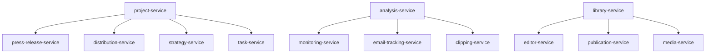

# Masterplan: CeleroPress Neustrukturierung

## Executive Summary
Komplette Neustrukturierung der CeleroPress-Anwendung mit Fokus auf projekt-zentrierte Architektur, vereinfachte Navigation und Eliminierung redundanter Bereiche. Migration erfolgt als Greenfield-Ansatz ohne Datenübernahme aus dem Altsystem.

## 1. Neue Navigationsstruktur (Komplett)

### 1.1 Hauptnavigation (Sidebar)
```
├── KONTAKTE
│   ├── Unternehmen
│   │   ├── TAB: Firmen
│   │   └── TAB: Personen
│   ├── Personen
│   │   ├── TAB: Firmen
│   │   └── TAB: Personen
│   └── Listen
│
├── BIBLIOTHEK
│   ├── Redakteure (NEU)
│   │   ├── TAB: Redakteure
│   │   └── TAB: Publikationen
│   ├── Publikationen
│   │   ├── TAB: Redakteure
│   │   └── TAB: Publikationen
│   │       ├── SUB-TAB: Übersicht
│   │       ├── SUB-TAB: Metriken & Zahlen
│   │       ├── SUB-TAB: Redaktion & Einreichung
│   │       └── SUB-TAB: Identifikatoren & Links
│   ├── Boilerplates
│   └── Mediatek
│
├── PROJEKTE
│   └── [Projekt-Detailseite]
│       ├── TAB: Übersicht
│       ├── TAB: Tasks
│       ├── TAB: Strategie
│       ├── TAB: Daten
│       ├── TAB: Verteiler
│       ├── TAB: Pressemeldung
│       │   ├── Neue Pressemeldung
│       │   ├── Pressemeldung bearbeiten
│       │   └── Versandmodal
│       └── TAB: Monitoring
│
└── ANALYSE
    └── [Analyse-Detailseite]
        ├── TAB: Analytics
        ├── TAB: E-Mail Performance
        ├── TAB: Empfänger & Veröffentlichungen
        └── TAB: Clipping-Archiv
```

### 1.2 Top-Navigation (Header)
```
├── Inbox Icon (mit Counter-Bubble für neue Nachrichten)
├── Benachrichtigungen Icon (mit Dropdown-Menü)
├── Settings Icon (öffnet Settings-Sidebar)
└── Avatar (mit Dropdown-Menü)
```

### 1.3 Settings-Sidebar (nach Klick auf Settings Icon)
```
├── Branding
├── PR Templates
├── Team
├── Domains
├── E-Mail
├── Monitoring & AVE
└── Import / Export
```

### 1.4 Avatar-Menü (Admin)
```
├── Profil
├── API-Verwaltung
├── Developer Portal
├── Abrechnung
├── Vertragsdetails
├── Integrationen
├── Dokumentation
└── Abmelden
```

### 1.5 Avatar-Menü (Team-Mitglieder)
```
├── Dokumentation
└── Abmelden
```

### 1.6 Dashboard-Widgets
```
├── Tasks (heute / überfällig)
├── Kampagnen Performance (aggregiert, konfigurierbar)
├── Inbox Analyse
├── Ereignisprotokoll (Benachrichtigungen historisch)
└── Ankündigungen (CeleroPress News Feed)
```

## 2. Zu entfernende Bereiche und Seiten

### 2.1 Komplette Menüpunkte (entfernen)
- **PR-Tools** (gesamter Bereich)
  - `/dashboard/pr-tools/*`
  - Kampagnen → Bereits in Projekte/Pressemeldung integriert (Links prüfen)
  - Freigaben → Bereits in Projekt-Tasks integriert (Links prüfen)
  - Kalender → Entfällt komplett
  - Monitoring → Verschoben zu Analyse

- **Kommunikation** (gesamter Bereich)
  - `/dashboard/communication/*`
  - Benachrichtigungen → Nur noch über Icon in Top-Navigation (Dropdown-Menü)
  - Inbox → Nur noch über Icon in Top-Navigation (mit Counter-Bubble)

- **Academy** (gesamter Bereich)
  - `/dashboard/academy/*`
  - Einsteiger Tutorial → Entfällt
  - Blog → Entfällt

### 2.2 Einzelne Seiten/Tabs (entfernen)
- Bibliothek → Dashboard
- Bibliothek → Werbemittel
- Bibliothek → Publikationen → SUB-TAB: Werbemittel

### 2.3 Komponenten-Migration
| Alt | Neu | Status |
|-----|-----|--------|
| PR-Tools/Kampagnen | Projekte/Pressemeldung | Bereits integriert |
| PR-Tools/Freigaben | Projekte/Tasks (Freigabe-Phase) | Bereits integriert |
| PR-Tools/Monitoring | Analyse/[Detail] | Verschiebung |
| Kommunikation/Benachrichtigungen | Top-Nav Icon mit Dropdown | Vereinfachung |
| Kommunikation/Inbox | Top-Nav Icon mit Counter | Vereinfachung |
| Settings-Dropdown | Settings-Sidebar | Neu |

## 3. Projekt-Kanban Anpassungen

### 3.1 Phasen-Reduktion (7 → 6)
**Alt:**
1. Ideen & Planung
2. Content und Materialien erstellen
3. Interne Freigabe
4. Kunden-Freigabe
5. Verteilung
6. Monitoring
7. Abgeschlossen

**Neu:**
1. Ideen & Planung
2. Content und Materialien erstellen
3. Freigabe (kombiniert Intern + Kunde)
4. Verteilung
5. Monitoring
6. Abgeschlossen

### 3.2 Weitere Kanban-Änderungen
- Alle Sublines/Beschreibungen unter den Phasen entfernen
- Card-Verschiebe-Logik anpassen
- Menü-basierte Phasenänderung prüfen

## 4. Technische Auswirkungen

### 4.1 Routing-Änderungen
```typescript
// ENTFERNEN
/dashboard/pr-tools/*
/dashboard/pr-tools/campaigns/*
/dashboard/pr-tools/approvals/*
/dashboard/pr-tools/calendar/*
/dashboard/communication/*
/dashboard/academy/*
/dashboard/library/dashboard
/dashboard/library/advertising

// NEU
/dashboard/library/editors/* (Redakteure)
/dashboard/projects/[id]/press-release/*
/dashboard/projects/[id]/distribution/*
/dashboard/projects/[id]/strategy/*
/dashboard/analysis/*
/dashboard/settings/* (dedizierte Settings-Seiten)
```

### 4.2 Service-Layer Anpassungen
| Service | Änderung | Priorität |
|---------|----------|-----------|
| campaign-service.ts | Bereits in project-service integriert, Links prüfen | Mittel |
| approval-service.ts | Bereits für Single-Phase angepasst, Links prüfen | Mittel |
| project-service.ts | Bereits erweitert, ggf. optimieren | Niedrig |
| notification-service.ts | Icon-basierte Anzeige in Top-Nav | Hoch |
| inbox-service.ts | Counter-Logik für Top-Nav Icon | Hoch |
| monitoring-service.ts | Verschiebung zu Analyse-Bereich | Mittel |

### 4.3 State Management
- Projekt-Context erweitern für alle Sub-Features
- Campaign-State bereits in Project-State integriert
- Approval-Flow bereits vereinfacht
- Settings-State für neue Sidebar
- Notification-State für Top-Nav Dropdown
- Inbox-Counter-State für Top-Nav Icon

### 4.4 Datenbank-Schema
```typescript
// Anpassungen
projects: {
  pressReleases: [], // BEREITS INTEGRIERT
  distributions: [], // NEU: Projekt-spezifische Verteiler
  strategy: {},     // NEU: Strategie-Dokumente
  phases: []        // ANPASSEN: 6 statt 7 Phasen
}

// PRÜFEN
campaigns (bereits in projects integriert, alte Referenzen prüfen)
approvals (bereits in projects integriert, alte Referenzen prüfen)
```

## 5. Feature-Spezifikationen

### 5.1 Bibliothek → Redakteure (NEU)
**Wichtiger Hinweis:** Wird in dieser Implementierung nur als Platzhalter angelegt!

**Initiale Implementierung:**
- Einfache Seite als Platzhalter
- Verlinkung in der Navigation
- Grundlegende Tab-Struktur (Redakteure/Publikationen)
- Keine Funktionalität in Phase 1

**Zukünftiges Konzept (nicht Teil dieser Implementierung):**
- Import-Hub für externe Mediendaten
- CSV/API Import
- Sync mit externen Datenbanken
- Integration in Verteilerlisten

### 5.2 Projekt → Pressemeldung Tab
**Integration (bereits vorhanden):**
- Automatische Projektzuordnung (keine Auswahlbox)
- Automatische Kundenzuordnung (aus Projekt)
- Direkter Versand aus Projekt-Kontext
- Versionierung innerhalb des Projekts

**Zu prüfen:**
- Alte Links zu `/dashboard/pr-tools/campaigns/*`
- Redirects einrichten für bestehende URLs

### 5.3 Analyse-Bereich (skalierbar)
**Basis-Module:**
- Analytics Dashboard
- E-Mail Performance
- Empfänger-Tracking
- Clipping-Archiv

**Premium-Module (Zukunft):**
- Live Clipping Monitoring
- Social Media Analytics
- Sentiment-Analyse
- Competitor Tracking
- Agentur-Reporting

### 5.4 Dashboard-Widgets (konfigurierbar)
**Konfigurationsoptionen pro Widget:**
- **Tasks:** Filter (heute/überfällig/alle/nach Projekt)
- **Kampagnen Performance:** Metriken-Auswahl, Zeitraum
- **Inbox Analyse:** Kategorien, Zeitraum (Icon-Counter in Top-Nav)
- **Ereignisprotokoll:** Event-Typen, Anzahl
- **Ankündigungen:** An/Aus, Kategorien

### 5.5 Top-Navigation Icons
**Inbox Icon:**
- Counter-Bubble für neue Nachrichten
- Klick öffnet Inbox-Sidebar oder Modal
- Real-time Updates

**Benachrichtigungen Icon:**
- Dropdown-Menü mit letzten Benachrichtigungen
- Klick zeigt kompakte Liste
- Mark als gelesen Funktion
- Keine separate Settings-Seite mehr nötig

## 6. Implementierungs-Roadmap

### Phase 1: Vorbereitung (2 Wochen)
- [ ] Detaillierte UI/UX Mockups erstellen
- [ ] API-Endpunkte definieren
- [ ] Datenmodelle finalisieren
- [ ] Test-Strategie entwickeln
- [ ] Feature-Flags Setup

### Phase 2: Backend-Grundlagen (3 Wochen)
- [ ] Projekt-Service erweitern
- [ ] Neue Routing-Struktur
- [ ] Settings-Service anpassen
- [ ] Redakteure-Platzhalter anlegen (nur Routing)
- [ ] Analyse-Service strukturieren

### Phase 3: Frontend-Komponenten (4 Wochen)
- [ ] Neue Sidebar-Navigation
- [ ] Settings-Sidebar
- [ ] Projekt-Tabs implementieren
- [ ] Dashboard-Widgets (konfigurierbar)
- [ ] Analyse-Bereich Grundstruktur

### Phase 4: Migration & Integration (3 Wochen)
- [ ] Pressemeldung in Projekt integrieren
- [ ] Kanban-Phasen anpassen
- [ ] Freigabe-Flow vereinfachen
- [ ] Monitoring verschieben
- [ ] Alte Routes deaktivieren

### Phase 5: Testing & Refinement (2 Wochen)
- [ ] E2E Tests
- [ ] Performance-Optimierung
- [ ] UI-Polish
- [ ] Dokumentation
- [ ] Beta-Testing

### Phase 6: Rollout (1 Woche)
- [ ] Feature-Flag Aktivierung
- [ ] Schrittweiser Rollout
- [ ] Monitoring
- [ ] Hotfixes
- [ ] Alte Struktur abschalten

## 7. Risiko-Analyse

### 7.1 Technische Risiken
| Risiko | Wahrscheinlichkeit | Impact | Mitigation |
|--------|-------------------|---------|------------|
| Performance-Probleme durch Projekt-Zentrierung | Mittel | Hoch | Lazy Loading, Caching |
| Routing-Konflikte | Niedrig | Mittel | Saubere Migration, Redirects |
| State-Management Komplexität | Mittel | Mittel | Context-Splitting |
| Widget-Konfiguration Performance | Niedrig | Niedrig | LocalStorage Caching |

### 7.2 User Experience Risiken
| Risiko | Wahrscheinlichkeit | Impact | Mitigation |
|--------|-------------------|---------|------------|
| Verwirrung durch neue Navigation | Hoch | Mittel | Onboarding, Tooltips |
| Verlust gewohnter Workflows | Mittel | Hoch | Dokumentation, Training |
| Längere Klickpfade | Niedrig | Mittel | Quick-Actions, Shortcuts |

### 7.3 Business Risiken
| Risiko | Wahrscheinlichkeit | Impact | Mitigation |
|--------|-------------------|---------|------------|
| Keine Datenübernahme | Sicher | Hoch | Klare Kommunikation |
| Feature-Verlust temporär | Mittel | Mittel | Priorisierung wichtiger Features |
| Adoption-Probleme | Mittel | Hoch | Schrittweise Einführung |

## 8. Erfolgs-Metriken

### 8.1 Performance KPIs
- Time to First Interaction < 2s
- Projekt-Tab Wechsel < 500ms
- Dashboard Load Time < 3s
- Widget-Update < 1s

### 8.2 User Experience KPIs
- Durchschnittliche Klicks zum Ziel -30%
- User Satisfaction Score > 8/10
- Support-Tickets -50%
- Feature Adoption Rate > 80%

### 8.3 Business KPIs
- Projekt-Erstellungszeit -40%
- Pressemeldung-Workflow -25%
- Cross-Feature Usage +50%
- Premium-Feature Upsell +30%

## 9. Offene Punkte & Entscheidungen

### 9.1 Noch zu klären
- [ ] Exact API-Struktur für Redakteure-Import
- [ ] Widget-Persistierung (User vs. Organization Level)
- [ ] Archivierung alter Daten
- [ ] Backup-Strategie während Migration

### 9.2 Technologie-Entscheidungen
- [ ] State Management für Settings (Context vs. Zustand)
- [ ] Routing Library (Next.js App Router confirmed?)
- [ ] Widget Framework (Custom vs. Library)
- [ ] Import-Format Standards

## 10. Nächste Schritte

### Sofort (diese Woche)
1. Review und Approval des Masterplans
2. UI/UX Mockups beginnen
3. Technical Spike für kritische Komponenten

### Kurzfristig (nächste 2 Wochen)
1. Detaillierte API-Spezifikation
2. Datenmodell-Finalisierung
3. Erste Prototypen

### Mittelfristig (nächster Monat)
1. Phase 1 & 2 Implementation
2. Interne Demo
3. Feedback-Integration

## Anhang A: Komponenten-Mapping

```typescript
// Alte Struktur → Neue Struktur
const COMPONENT_MIGRATION = {
  'components/campaigns/*': 'components/projects/press-release/*',
  'components/approvals/*': 'components/projects/tasks/approval/*',
  'components/pr-tools/*': 'components/projects/*',
  'components/monitoring/*': 'components/analysis/monitoring/*',
  'app/dashboard/pr-tools/*': 'REMOVE',
  'app/dashboard/communication/*': 'REMOVE',
  'app/dashboard/academy/*': 'REMOVE',
}
```

## Anhang B: Service-Dependencies



## Anhang C: Datenbank-Migration Strategy

Da keine Datenübernahme erfolgt, ist die Migration-Strategy:
1. Neue Collections parallel anlegen
2. Neue Struktur komplett aufbauen
3. Feature-Flag für Umschaltung
4. Alte Collections nach Bestätigung löschen

---

**Dokument Version:** 1.0
**Erstellt:** ${new Date().toLocaleDateString('de-DE')}
**Status:** ENTWURF
**Nächste Review:** Nach UI/UX Mockups