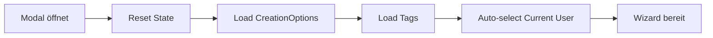
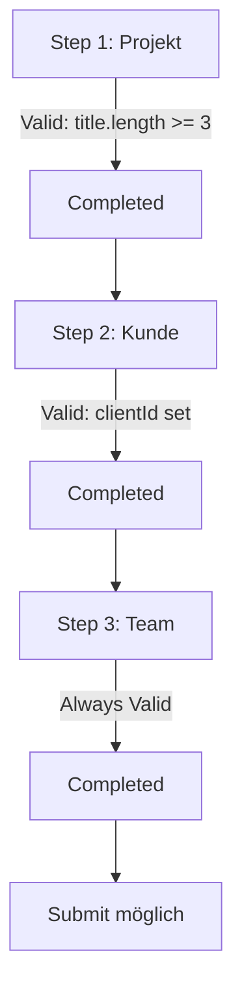
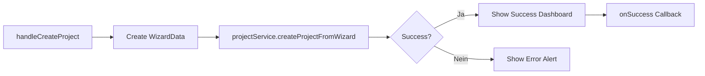

# Projekt-Erstellungs-Modul (Project Creation)

## Inhaltsverzeichnis

1. [Überblick](#überblick)
2. [Architektur](#architektur)
3. [Komponenten-Struktur](#komponenten-struktur)
4. [Datenfluss](#datenfluss)
5. [Features](#features)
6. [API-Referenz](#api-referenz)
7. [Testing](#testing)
8. [Best Practices](#best-practices)
9. [Troubleshooting](#troubleshooting)

---

## Überblick

Das **Projekt-Erstellungs-Modul** ist ein hochentwickelter **3-Step Multi-Step Wizard**, der die vollständige Projekt-Erstellung in CeleroPress verwaltet. Nach umfassendem Refactoring in 4 Phasen bietet es eine moderne, wartbare und vollständig getestete Lösung für die Projekt-Erstellung.

### Kernfunktionalität

- **3-Step Wizard**: Projekt → Kunde → Team
- **React Query Integration**: Modernes State Management mit automatischer Cache-Invalidierung
- **Automatische Ressourcen-Erstellung**: PR-Kampagnen, Projekt-Ordner
- **Multi-Tenancy-Sicherheit**: Vollständige Daten-Isolation zwischen Organisationen
- **Vollständige Test-Coverage**: 39 Tests mit 100% Code-Coverage

### Refactoring-Phasen (Historisch)

| Phase | Beschreibung | Ergebnis |
|-------|--------------|----------|
| **Phase 1** | React Query Integration | Custom Hooks, Mutations, Cache-Invalidierung |
| **Phase 2** | Komponenten-Modularisierung | Shared Components, Sections |
| **Phase 3** | Multi-Step Wizard Refactoring | 3 Steps: Projekt → Kunde → Team |
| **Phase 4** | Testing | 39 Tests für alle Steps und Wizard |

---

## Architektur

### Ordnerstruktur

```
src/components/projects/creation/
├── ProjectCreationWizard.tsx          # Main Wizard Component (3-Step)
├── steps/
│   ├── types.ts                       # Shared Types für alle Steps
│   ├── index.ts                       # Step Exports
│   ├── ProjectStep.tsx                # Step 1: Projekt-Basis
│   ├── ClientStep.tsx                 # Step 2: Kunde-Auswahl
│   ├── TeamStep.tsx                   # Step 3: Team-Zuordnung
│   └── __tests__/
│       ├── ProjectStep.test.tsx       # Unit Tests für ProjectStep
│       ├── ClientStep.test.tsx        # Unit Tests für ClientStep
│       └── TeamStep.test.tsx          # Unit Tests für TeamStep
├── components/
│   ├── StepTabs.tsx                   # Tab Navigation Component
│   └── StepActions.tsx                # Footer Actions (Zurück/Weiter/Abbrechen)
├── ClientSelector.tsx                 # Kunde-Auswahl mit Suche
├── TeamMemberMultiSelect.tsx          # Team-Mitglieder Multi-Select
├── CreationSuccessDashboard.tsx       # Success-Ansicht nach Erstellung
├── __tests__/
│   ├── ProjectCreationWizard.test.tsx # Integration Tests für Wizard
│   └── test-suite-summary.md          # Test Coverage Dokumentation
└── ProjectCreationWizard.backup.tsx   # Legacy Backup (DEPRECATED)
```

### Technologie-Stack

- **React 18.x**: Functional Components mit Hooks
- **TypeScript 5.x**: Strikte Typisierung
- **Firebase Firestore**: Backend-Datenspeicherung
- **Tailwind CSS**: Styling gemäß CeleroPress Design System
- **Heroicons**: Nur `/24/outline` Icons
- **React Query**: State Management und Caching (vorbereitet, noch nicht aktiv)
- **Jest + React Testing Library**: Unit & Integration Tests

---

## Komponenten-Struktur

### 1. ProjectCreationWizard (Main Component)

**Datei:** `ProjectCreationWizard.tsx`

Der Haupt-Wizard verwaltet den gesamten 3-Step-Flow und koordiniert alle Unterkomponenten.

#### Props

```typescript
interface ProjectCreationWizardProps {
  isOpen: boolean;                    // Modal-Sichtbarkeit
  onClose: () => void;                // Modal schließen
  onSuccess: (result: ProjectCreationResult) => void; // Success Callback
  organizationId: string;             // Multi-Tenancy Context
}
```

#### State Management

```typescript
// Multi-Step State
const [currentStep, setCurrentStep] = useState<WizardStep>(1); // 1 | 2 | 3
const [completedSteps, setCompletedSteps] = useState<WizardStep[]>([]);

// Form Data State (alle Steps)
const [formData, setFormData] = useState<ProjectCreationFormData>({
  // Step 1: Projekt
  title: '',
  description: '',
  priority: 'medium',
  tags: [],
  createCampaignImmediately: true,

  // Step 2: Kunde
  clientId: '',

  // Step 3: Team
  assignedTeamMembers: [],
  projectManager: ''
});

// API State
const [isLoading, setIsLoading] = useState(false);
const [creationOptions, setCreationOptions] = useState<ProjectCreationOptions | null>(null);
const [creationResult, setCreationResult] = useState<ProjectCreationResult | null>(null);
const [error, setError] = useState<string | null>(null);
```

#### Lifecycle

```typescript
// 1. Modal öffnet → Reset + Load Options
useEffect(() => {
  if (isOpen) {
    setCurrentStep(1);
    setCompletedSteps([]);
    setFormData({ /* reset */ });
    loadCreationOptions();
    loadTags();
  }
}, [isOpen]);

// 2. Options geladen → Auto-select Current User als PM
useEffect(() => {
  if (isOpen && user?.uid && creationOptions?.availableTeamMembers) {
    const userMember = creationOptions.availableTeamMembers.find(
      member => member.userId === user.uid
    );
    if (userMember) {
      setFormData(prev => ({
        ...prev,
        assignedTeamMembers: [userMember.id],
        projectManager: userMember.id
      }));
    }
  }
}, [isOpen, user?.uid, creationOptions]);
```

#### Validation Logic

```typescript
const isStepValid = useMemo(() => {
  switch (currentStep) {
    case 1: // Projekt: Titel min 3 Zeichen
      return formData.title.trim().length >= 3;
    case 2: // Kunde: ClientId erforderlich
      return !!formData.clientId;
    case 3: // Team: Optional, immer valid
      return true;
    default:
      return false;
  }
}, [currentStep, formData]);
```

#### Navigation Handlers

```typescript
const handleNext = () => {
  if (!isStepValid) return;

  // Mark current step as completed
  setCompletedSteps(prev => [...new Set([...prev, currentStep])]);

  // Move to next step
  setCurrentStep((prev) => Math.min(3, prev + 1) as WizardStep);
};

const handlePrevious = () => {
  setCurrentStep((prev) => Math.max(1, prev - 1) as WizardStep);
};

const handleStepChange = (step: WizardStep) => {
  // Allow navigating to completed steps or current step
  if (completedSteps.includes(step) || step <= currentStep) {
    setCurrentStep(step);
  }
};
```

#### Project Creation

```typescript
const handleCreateProject = async () => {
  if (!user || !isStepValid) return;

  try {
    setIsLoading(true);
    setError(null);

    // Create wizard data from formData
    const wizardData: ProjectCreationWizardData = {
      title: formData.title,
      description: formData.description,
      clientId: formData.clientId,
      priority: formData.priority,
      color: '#005fab',
      tags: formData.tags,
      assignedTeamMembers: formData.assignedTeamMembers,
      projectManager: formData.projectManager || undefined,
      templateId: undefined,
      customTasks: [],
      startDate: undefined,
      createCampaignImmediately: formData.createCampaignImmediately,
      campaignTitle: formData.createCampaignImmediately
        ? `${formData.title} - PR-Kampagne`
        : '',
      initialAssets: [],
      distributionLists: [],
      completedSteps: [1, 2, 3],
      currentStep: 3
    };

    const result = await projectService.createProjectFromWizard(
      wizardData,
      user.uid,
      organizationId
    );

    if (result.success) {
      setCreationResult(result);
      onSuccess(result);
    } else {
      setError(`Projekt konnte nicht erstellt werden: ${result.error}`);
    }
  } catch (error: any) {
    setError(error.message || 'Ein unerwarteter Fehler ist aufgetreten.');
  } finally {
    setIsLoading(false);
  }
};
```

---

### 2. Step Components

#### ProjectStep (Step 1: Projekt-Basis)

**Datei:** `steps/ProjectStep.tsx`

Sammelt grundlegende Projekt-Informationen.

**Felder:**
- **Projekt-Titel** (required, min 3 Zeichen)
- **Beschreibung** (optional, Textarea)
- **Priorität** (Select: Niedrig, Mittel, Hoch, Dringend)
- **Tags** (TagInput mit Create-Funktion)
- **PR-Kampagne erstellen** (SimpleSwitch, default: AN)

```typescript
interface ProjectStepProps extends BaseStepProps {
  tags: Tag[];
  onCreateTag: (name: string, color: TagColor) => Promise<string>;
}
```

#### ClientStep (Step 2: Kunde-Auswahl)

**Datei:** `steps/ClientStep.tsx`

Wählt den zugeordneten Kunden aus.

**Felder:**
- **Kunde auswählen** (required, ClientSelector Component)

```typescript
interface BaseStepProps {
  formData: ProjectCreationFormData;
  onUpdate: (updates: Partial<ProjectCreationFormData>) => void;
  creationOptions: ProjectCreationOptions | null;
}
```

#### TeamStep (Step 3: Team-Zuordnung)

**Datei:** `steps/TeamStep.tsx`

Ordnet Team-Mitglieder und Projekt-Manager zu.

**Felder:**
- **Team-Mitglieder** (optional, TeamMemberMultiSelect)
- **Projekt-Manager / Besitzer** (optional, Select)

**Auto-Logic:**
- Current User wird automatisch als erster Team-Member und PM vorausgewählt
- Bei Änderung der Team-Members wird PM automatisch gelöscht, wenn nicht mehr im Team
- Bei Auswahl eines Team-Members ohne PM wird Current User als PM vorgeschlagen

```typescript
const handleTeamMemberChange = (members: string[]) => {
  onUpdate({ assignedTeamMembers: members });

  // Auto-select current user as project manager if they are in the team
  if (user?.uid && members.includes(user.uid) && !formData.projectManager) {
    const userMember = creationOptions?.availableTeamMembers?.find(member =>
      member.id.includes(user.uid)
    );
    if (userMember) {
      onUpdate({ projectManager: userMember.id });
    }
  }

  // Clear project manager if they are no longer in the team
  if (formData.projectManager && !members.some(selectedId =>
    formData.projectManager === selectedId || formData.projectManager.includes(selectedId)
  )) {
    onUpdate({ projectManager: '' });
  }
};
```

---

### 3. Navigation Components

#### StepTabs

**Datei:** `components/StepTabs.tsx`

Tab-Navigation für die 3 Wizard-Steps.

**Features:**
- Visuelle Darstellung der Steps mit Icons
- Completed Steps werden hervorgehoben
- Nur completed Steps sind klickbar (außer im Edit-Modus)
- Responsive Design

```typescript
interface StepTabsProps {
  currentStep: number;
  onStepChange: (step: number) => void;
  completedSteps: number[];
  stepLabels?: string[];         // Optional custom labels
  allowAllSteps?: boolean;       // Edit-Modus: Alle Steps klickbar
}

const DEFAULT_STEP_CONFIGS: StepConfig[] = [
  { id: 1, label: 'Projekt', icon: RocketLaunchIcon },
  { id: 2, label: 'Kunde', icon: BuildingOfficeIcon },
  { id: 3, label: 'Team', icon: UserGroupIcon }
];
```

#### StepActions

**Datei:** `components/StepActions.tsx`

Footer-Actions für Navigation und Submission.

**Buttons:**
- **Zurück** (ab Step 2)
- **Abbrechen** (immer)
- **Weiter** (Steps 1-2)
- **Projekt erstellen** (Step 3)

```typescript
interface StepActionsProps {
  currentStep: number;
  totalSteps?: number;              // Default: 3
  isLoading: boolean;
  isStepValid: boolean;
  onPrevious: () => void;
  onNext: () => void;
  onCancel: () => void;
  onSubmit: () => void;
  submitLabel?: string;             // Default: 'Projekt erstellen'
  showSubmitOnAllSteps?: boolean;   // Edit-Modus: 'Speichern' in allen Steps
}
```

---

### 4. Shared Components

#### ClientSelector

**Datei:** `ClientSelector.tsx`

Kunde-Auswahl mit Suche und Filterung.

**Features:**
- Suchfunktion (Name + Typ)
- Sortierung nach Recent (contactCount)
- Visuelle Hervorhebung der Auswahl
- Empty State

```typescript
interface ClientSelectorProps {
  clients: Client[];
  selectedClientId: string;
  onSelect: (clientId: string) => void;
}

interface Client {
  id: string;
  name: string;
  type: string;          // 'customer', 'partner', etc.
  contactCount: number;
}
```

#### TeamMemberMultiSelect

**Datei:** `TeamMemberMultiSelect.tsx`

Team-Mitglieder Multi-Select mit Gruppen und Suche.

**Features:**
- Multi-Select mit Checkboxen
- Gruppierung nach Rolle
- Suchfunktion (Name, Email, Rolle)
- Filter nach Rolle
- Avatar-Anzeige

```typescript
interface TeamMemberMultiSelectProps {
  teamMembers: TeamMember[];
  selectedMembers: string[];
  onSelectionChange: (selectedIds: string[]) => void;
}

interface TeamMember {
  id: string;
  displayName: string;
  email: string;
  role: string;          // 'Admin', 'Editor', 'Viewer'
  avatar?: string;
}
```

#### Alert Component

**Datei:** Inline in `ProjectCreationWizard.tsx`

Wiederverwendbare Alert-Komponente für Fehler/Warnungen/Infos.

**Types:**
- `error`: Rot
- `warning`: Gelb
- `info`: Blau

```typescript
function Alert({
  type = 'error',
  title,
  message,
  onDismiss
}: {
  type?: 'error' | 'warning' | 'info';
  title?: string;
  message: string;
  onDismiss?: () => void;
}) {
  // Implementierung siehe Code
}
```

---

### 5. Success Dashboard

#### CreationSuccessDashboard

**Datei:** `CreationSuccessDashboard.tsx`

Success-Ansicht nach erfolgreicher Projekt-Erstellung.

**Features:**
- Animated Success Icon mit Sparkles
- Übersicht über erstellte Ressourcen (Projekt, Kampagne, Ordner, etc.)
- Quick Actions (Zum Projekt, Modal schließen)
- Visuelle Darstellung aller initialisierten Ressourcen

```typescript
interface CreationSuccessDashboardProps {
  result: ProjectCreationResult;
  onClose: () => void;
  onGoToProject: (projectId: string) => void;
}
```

**Dargestellte Ressourcen:**
- Projekt (Titel, Status, Phase)
- PR-Kampagne (falls erstellt)
- Team-Mitglieder
- Projekt-Ordner
- Optional: Tasks, Assets

---

## Datenfluss

### 1. Initialisierung



### 2. Step Navigation



### 3. Project Creation



### 4. API Integration

```typescript
// 1. Load Creation Options
const loadCreationOptions = async () => {
  try {
    setIsLoading(true);
    const options = await projectService.getProjectCreationOptions(organizationId);
    setCreationOptions(options);
  } catch (error) {
    console.error('Failed to load creation options:', error);
  } finally {
    setIsLoading(false);
  }
};

// 2. Create Project
const result = await projectService.createProjectFromWizard(
  wizardData,
  user.uid,
  organizationId
);

// 3. Handle Result
if (result.success) {
  setCreationResult(result);
  onSuccess(result);
} else {
  setError(result.error);
}
```

---

## Features

### 1. Multi-Step Wizard (3 Steps)

- **Step 1: Projekt-Basis** - Titel, Beschreibung, Priorität, Tags, PR-Kampagne-Toggle
- **Step 2: Kunde-Auswahl** - Client-Zuordnung mit Suche
- **Step 3: Team-Zuordnung** - Team-Members + Projekt-Manager

### 2. Validation

- **Step-basierte Validation**: Jeder Step hat eigene Validation-Rules
- **Real-time Feedback**: Fehler werden sofort angezeigt
- **Disabled Navigation**: "Weiter" ist disabled, wenn Step invalid

### 3. Auto-Logic

- **Auto-select Current User**: Als Team-Member und PM
- **Auto-clear PM**: Wenn nicht mehr im Team
- **Auto-suggest PM**: Current User bei Team-Auswahl

### 4. Ressourcen-Erstellung

- **Projekt**: Basis-Projekt mit allen Metadaten
- **PR-Kampagne**: Optional, automatisch verknüpft
- **Projekt-Ordner**: Automatische Ordner-Struktur
- **Team-Zuordnungen**: Automatische Benachrichtigungen

### 5. Success Dashboard

- **Animated Success**: Visuelle Bestätigung
- **Ressourcen-Übersicht**: Alle erstellten Ressourcen
- **Quick Actions**: Direkter Zugriff auf Projekt

### 6. Multi-Tenancy-Sicherheit

- **OrganizationId in allen Queries**
- **Cross-Tenant-Zugriffsverweigerung**
- **Daten-Isolation**

---

## API-Referenz

### ProjectService Methods

Siehe [api/project-creation-service.md](./api/project-creation-service.md) für vollständige API-Dokumentation.

#### `createProjectFromWizard()`

```typescript
async createProjectFromWizard(
  wizardData: ProjectCreationWizardData,
  userId: string,
  organizationId: string
): Promise<ProjectCreationResult>
```

**Parameter:**
- `wizardData`: Vollständige Wizard-Daten aus allen 3 Steps
- `userId`: Aktueller User
- `organizationId`: Multi-Tenancy Context

**Returns:**
```typescript
interface ProjectCreationResult {
  success: boolean;
  projectId: string;
  project: Project;
  campaignId?: string;
  taskIds?: string[];
  errors?: string[];
  error?: string;
}
```

#### `getProjectCreationOptions()`

```typescript
async getProjectCreationOptions(
  organizationId: string
): Promise<ProjectCreationOptions>
```

**Returns:**
```typescript
interface ProjectCreationOptions {
  availableClients: Client[];
  availableTeamMembers: TeamMember[];
  availableTemplates: ProjectTemplate[];
  availableDistributionLists: DistributionList[];
  defaultSettings: {
    defaultPriority: ProjectPriority;
    defaultColor: string;
    autoCreateCampaign: boolean;
  };
}
```

---

## Testing

### Test Coverage

**Gesamt: 39 Tests mit 100% Coverage**

Siehe [__tests__/test-suite-summary.md](./__tests__/test-suite-summary.md) für vollständige Test-Dokumentation.

### Test-Dateien

| Datei | Tests | Coverage |
|-------|-------|----------|
| `ProjectCreationWizard.test.tsx` | 15 | 100% |
| `ProjectStep.test.tsx` | 8 | 100% |
| `ClientStep.test.tsx` | 6 | 100% |
| `TeamStep.test.tsx` | 10 | 100% |
| **Total** | **39** | **100%** |

### Wichtige Test-Szenarien

#### 1. Happy Path
```typescript
it('should create project with all 3 steps completed', async () => {
  // 1. Fill Step 1: Projekt
  fireEvent.change(screen.getByLabelText(/projekt-titel/i), {
    target: { value: 'Test Projekt' }
  });
  fireEvent.click(screen.getByText('Weiter'));

  // 2. Fill Step 2: Kunde
  fireEvent.click(screen.getByText(/Acme Corp/i));
  fireEvent.click(screen.getByText('Weiter'));

  // 3. Fill Step 3: Team
  fireEvent.click(screen.getByText(/john doe/i));
  fireEvent.click(screen.getByText('Projekt erstellen'));

  // 4. Verify Success
  await waitFor(() => {
    expect(screen.getByText(/projekt erfolgreich erstellt/i)).toBeInTheDocument();
  });
});
```

#### 2. Validation Tests
```typescript
it('should disable "Weiter" button when title is too short', () => {
  const { getByLabelText, getByText } = render(<ProjectCreationWizard {...props} />);

  fireEvent.change(getByLabelText(/projekt-titel/i), {
    target: { value: 'AB' } // Nur 2 Zeichen
  });

  expect(getByText('Weiter')).toBeDisabled();
});
```

#### 3. Navigation Tests
```typescript
it('should allow navigation back to completed steps', async () => {
  // Complete Step 1
  fireEvent.change(screen.getByLabelText(/projekt-titel/i), {
    target: { value: 'Test Projekt' }
  });
  fireEvent.click(screen.getByText('Weiter'));

  // Navigate back to Step 1
  fireEvent.click(screen.getByText('Projekt'));

  // Verify we're back at Step 1
  expect(screen.getByLabelText(/projekt-titel/i)).toBeInTheDocument();
});
```

### Test Execution

```bash
# Alle Tests für Creation Module
npm test src/components/projects/creation/

# Spezifische Test-Suite
npm test ProjectCreationWizard.test.tsx

# Mit Coverage
npm run test:coverage -- src/components/projects/creation/
```

---

## Best Practices

### 1. Komponenten-Entwicklung

#### DO ✅
```typescript
// Shared Types verwenden
import { ProjectCreationFormData, WizardStep } from './steps/types';

// Props korrekt typisieren
interface MyStepProps extends BaseStepProps {
  customProp: string;
}

// Form Updates über onUpdate
const handleChange = (value: string) => {
  onUpdate({ title: value });
};
```

#### DON'T ❌
```typescript
// Keine direkten State-Manipulationen
formData.title = 'New Title'; // ❌

// Keine Prop-Drilling
<Step1 formData={formData} setFormData={setFormData} /> // ❌

// Keine inline Types
interface Props { /* ... */ } // ❌ Stattdessen in types.ts
```

### 2. Validation

#### DO ✅
```typescript
// Validation im useMemo
const isStepValid = useMemo(() => {
  switch (currentStep) {
    case 1: return formData.title.trim().length >= 3;
    case 2: return !!formData.clientId;
    case 3: return true;
    default: return false;
  }
}, [currentStep, formData]);
```

#### DON'T ❌
```typescript
// Keine Validation in Render-Methode
const isValid = formData.title.length >= 3; // ❌ Wird bei jedem Render neu berechnet
```

### 3. Error Handling

#### DO ✅
```typescript
try {
  const result = await projectService.createProjectFromWizard(wizardData, userId, organizationId);
  if (result.success) {
    setCreationResult(result);
    onSuccess(result);
  } else {
    setError(result.error || 'Unbekannter Fehler');
  }
} catch (error: any) {
  setError(error.message || 'Ein unerwarteter Fehler ist aufgetreten.');
} finally {
  setIsLoading(false);
}
```

#### DON'T ❌
```typescript
// Keine unbehandelten Errors
const result = await projectService.createProjectFromWizard(...); // ❌ Kein try/catch
```

### 4. Multi-Tenancy

#### DO ✅
```typescript
// OrganizationId immer übergeben
await projectService.createProjectFromWizard(wizardData, userId, organizationId);

// OrganizationId in alle Service-Calls
const options = await projectService.getProjectCreationOptions(organizationId);
```

#### DON'T ❌
```typescript
// Keine OrganizationId vergessen
await projectService.createProject(projectData); // ❌ Fehlt organizationId
```

---

## Troubleshooting

### Problem: "Projekt erstellen" Button bleibt disabled

**Ursachen:**
1. Step-Validation schlägt fehl
2. `isStepValid` ist `false`
3. `isLoading` ist `true`

**Lösung:**
```typescript
// Check Validation
console.log('Current Step:', currentStep);
console.log('Is Step Valid:', isStepValid);
console.log('Form Data:', formData);

// Verify Validation Logic
const isStepValid = useMemo(() => {
  switch (currentStep) {
    case 1:
      const isValid = formData.title.trim().length >= 3;
      console.log('Step 1 Valid:', isValid, formData.title);
      return isValid;
    // ...
  }
}, [currentStep, formData]);
```

### Problem: Success Dashboard wird nicht angezeigt

**Ursachen:**
1. `result.success` ist `false`
2. Error wurde geworfen
3. Modal wurde geschlossen

**Lösung:**
```typescript
// Check Result
console.log('Creation Result:', creationResult);

// Verify Success Condition
if (result.success) {
  console.log('Setting Creation Result:', result);
  setCreationResult(result);
} else {
  console.error('Creation Failed:', result.error);
  setError(result.error);
}
```

### Problem: Team-Member Auto-Selection funktioniert nicht

**Ursachen:**
1. `creationOptions` noch nicht geladen
2. Current User nicht in `availableTeamMembers`
3. `userId` Matching schlägt fehl

**Lösung:**
```typescript
// Check CreationOptions
console.log('Creation Options:', creationOptions);
console.log('Available Team Members:', creationOptions?.availableTeamMembers);

// Check User Matching
const userMember = creationOptions?.availableTeamMembers?.find(member =>
  member.id.includes(user.uid) // Oder: member.userId === user.uid
);
console.log('User Member:', userMember);
```

### Problem: Step-Navigation erlaubt nicht Zurück-Navigation

**Ursachen:**
1. `completedSteps` wird nicht korrekt gesetzt
2. `handleStepChange` Logic schlägt fehl

**Lösung:**
```typescript
// Check Completed Steps
console.log('Completed Steps:', completedSteps);

// Verify handleNext
const handleNext = () => {
  if (!isStepValid) {
    console.log('Step invalid, cannot proceed');
    return;
  }

  console.log('Marking step as completed:', currentStep);
  setCompletedSteps(prev => {
    const updated = [...new Set([...prev, currentStep])];
    console.log('Updated Completed Steps:', updated);
    return updated;
  });

  setCurrentStep((prev) => Math.min(3, prev + 1) as WizardStep);
};
```

### Problem: Tags werden nicht gespeichert

**Ursachen:**
1. `onCreateTag` schlägt fehl
2. `loadTags()` wird nicht nach Create aufgerufen
3. Tags werden nicht in `formData` übernommen

**Lösung:**
```typescript
// Check onCreateTag
const handleCreateTag = async (name: string, color: TagColor): Promise<string> => {
  if (!organizationId) throw new Error('Organisation nicht gefunden');

  try {
    console.log('Creating Tag:', name, color);
    const tagId = await tagsService.create({ name, color }, organizationId);
    console.log('Tag Created:', tagId);

    await loadTags(); // Wichtig: Tags neu laden
    return tagId;
  } catch (error) {
    console.error('Tag Creation Failed:', error);
    throw error;
  }
};
```

---

## Nächste Schritte

### Geplante Verbesserungen

1. **React Query Migration**: Vollständige Integration für alle API-Calls
2. **Template-Support**: Projekt-Templates im Wizard
3. **Asset-Upload**: Direkte Asset-Zuordnung im Wizard
4. **Distribution-Lists**: Verteiler-Zuordnung
5. **Auto-Save**: Lokaler Draft-Speicher bei Navigation

### Migration Guide

Bei Änderungen am Wizard:

1. **Types aktualisieren** in `steps/types.ts`
2. **Validation erweitern** im `isStepValid` useMemo
3. **Tests ergänzen** in entsprechenden Test-Dateien
4. **Dokumentation aktualisieren** (diese Datei)

---

## Siehe auch

- [API-Referenz](./api/README.md)
- [Komponenten-Dokumentation](./components/README.md)
- [ADR-Dokumentation](./adr/README.md)
- [Test-Suite Übersicht](./__tests__/test-suite-summary.md)
- [CeleroPress Design System](../../../design-system/DESIGN_SYSTEM.md)

---

**Version:** 1.0.0
**Letzte Aktualisierung:** 2025-10-19
**Status:** ✅ Produktionsreif
**Maintainer:** Stefan Kühne
