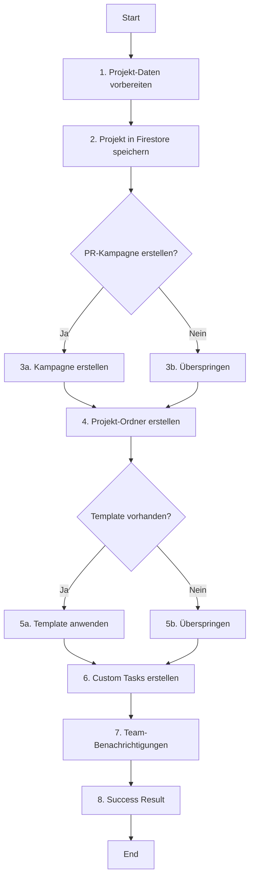
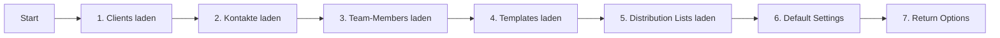

# ProjectService - Projekt-Erstellungs-Methoden

## Inhaltsverzeichnis

1. [Überblick](#überblick)
2. [createProjectFromWizard()](#createprojectfromwizard)
3. [getProjectCreationOptions()](#getprojectcreationoptions)
4. [validateProjectData()](#validateprojectdata)
5. [createProjectFolderStructure()](#createprojectfolderstructure)
6. [Interne Helper-Methoden](#interne-helper-methoden)
7. [Fehlerbehandlung](#fehlerbehandlung)
8. [Multi-Tenancy](#multi-tenancy)
9. [Performance-Optimierung](#performance-optimierung)

---

## Überblick

Der ProjectService bietet spezialisierte Methoden für die Wizard-basierte Projekt-Erstellung. Diese Dokumentation beschreibt die technische Implementierung aller relevanten Service-Methoden.

**Datei:** `src/lib/firebase/project-service.ts`

### Methoden-Übersicht

| Methode | Zeilen | Zweck | Status |
|---------|--------|-------|--------|
| `createProjectFromWizard()` | 1445-1658 | Projekt aus Wizard erstellen | ✅ Produktiv |
| `getProjectCreationOptions()` | 1660-1748 | Options laden | ✅ Produktiv |
| `validateProjectData()` | 1750-1810 | Daten validieren | ✅ Produktiv |
| `createProjectFolderStructure()` | (intern) | Ordner-Struktur erstellen | ✅ Produktiv |

---

## createProjectFromWizard()

Erstellt ein vollständiges Projekt aus Wizard-Daten mit automatischer Ressourcen-Initialisierung.

### Signatur

```typescript
async createProjectFromWizard(
  wizardData: ProjectCreationWizardData,
  userId: string,
  organizationId: string
): Promise<ProjectCreationResult>
```

### Parameter

#### wizardData: ProjectCreationWizardData

```typescript
interface ProjectCreationWizardData {
  // Basis-Informationen (Step 1)
  title: string;                          // Min 3 Zeichen
  description: string;
  priority: ProjectPriority;              // 'low' | 'medium' | 'high' | 'urgent'
  color: string;                          // Hex-Color
  tags: string[];                         // Tag-IDs

  // Kunde (Step 2)
  clientId: string;                       // Required

  // Team (Step 3)
  assignedTeamMembers: string[];          // Team-Member-IDs
  projectManager?: string;                // Optional PM-ID

  // Optional: Template & Tasks
  templateId?: string;
  customTasks: ProjectTask[];

  // Optional: Ressourcen-Erstellung
  createCampaignImmediately: boolean;     // PR-Kampagne erstellen?
  campaignTitle?: string;
  initialAssets: string[];                // Asset-IDs
  distributionLists: string[];            // Verteiler-IDs

  // Wizard State (intern)
  completedSteps: number[];
  currentStep: number;
  startDate?: Date;
}
```

#### userId: string

Aktueller Benutzer (Firebase Auth UID).

#### organizationId: string

Multi-Tenancy Context (Organisation-ID).

### Returns

```typescript
interface ProjectCreationResult {
  success: boolean;                       // true bei Erfolg
  projectId: string;                      // Neue Projekt-ID
  project: Project;                       // Vollständiges Projekt-Objekt

  // Optional: Erstellte Ressourcen
  campaignId?: string;                    // PR-Kampagne-ID
  taskIds?: string[];                     // Task-IDs
  folderId?: string;                      // Projekt-Ordner-ID

  // Optional: Fehler
  errors?: string[];                      // Teil-Fehler (nicht kritisch)
  error?: string;                         // Kritischer Fehler
}
```

### Implementierung

```typescript
async createProjectFromWizard(
  wizardData: ProjectCreationWizardData,
  userId: string,
  organizationId: string
): Promise<ProjectCreationResult> {
  try {
    const projectId = nanoid();

    // 1. Projekt-Basis-Daten aus Wizard extrahieren
    const projectData: Omit<Project, 'id'> = {
      userId,
      organizationId,
      title: wizardData.title,
      description: wizardData.description,
      status: 'active',
      currentStage: 'ideas_planning',
      assignedTo: wizardData.assignedTeamMembers,
      projectManager: wizardData.projectManager,

      // Tags und Priority aus Wizard-Daten
      tags: wizardData.tags || [],
      priority: wizardData.priority,
      color: wizardData.color,

      // Client-Zuordnung
      clientId: wizardData.clientId,

      // Wizard-Metadaten speichern
      creationContext: {
        source: 'wizard',
        wizardVersion: '3-step',
        templateId: wizardData.templateId,
        completedSteps: wizardData.completedSteps
      },

      // Setup-Status initialisieren
      setupStatus: {
        isComplete: true,
        tasksCreated: wizardData.customTasks.length > 0,
        teamAssigned: wizardData.assignedTeamMembers.length > 0,
        assetsLinked: wizardData.initialAssets.length > 0
      },

      // Standard-Felder
      progress: 0,
      totalTasks: wizardData.customTasks.length,
      completedTasks: 0,
      createdAt: Timestamp.now(),
      updatedAt: Timestamp.now()
    };

    // 2. Projekt in Firestore speichern
    const dataToSave = this.cleanUndefinedValues(projectData);
    const docRef = await addDoc(collection(db, 'projects'), dataToSave);

    console.log(`✅ Projekt erstellt: ${docRef.id}`);

    // 3. PR-Kampagne erstellen (optional)
    let campaignId: string | undefined;
    if (wizardData.createCampaignImmediately && wizardData.campaignTitle) {
      try {
        const { prService } = await import('./pr-service');

        const campaignData = {
          title: wizardData.campaignTitle,
          description: `Automatisch erstellte PR-Kampagne für Projekt "${wizardData.title}"`,
          projectId: docRef.id,
          organizationId,
          userId,
          status: 'planning' as const,
          startDate: wizardData.startDate || new Date(),
          assignedTeamMembers: wizardData.assignedTeamMembers,
          distributionLists: wizardData.distributionLists,
          timeline: {
            phases: [
              {
                id: nanoid(),
                name: 'Planung',
                status: 'active',
                startDate: new Date(),
                tasks: []
              }
            ]
          },
          assets: wizardData.initialAssets,
          createdAt: Timestamp.now(),
          updatedAt: Timestamp.now()
        };

        campaignId = await prService.create(campaignData);
        console.log(`✅ PR-Kampagne erstellt: ${campaignId}`);

      } catch (campaignError) {
        console.error('Fehler bei PR-Kampagnen-Erstellung:', campaignError);
        // Nicht kritisch, Projekt-Erstellung fortsetzen
      }
    }

    // 4. Projekt-Ordner-Struktur erstellen
    try {
      await this.createProjectFolderStructure(docRef.id, organizationId, {
        organizationId,
        userId
      });
      console.log(`✅ Projekt-Ordner erstellt für: ${docRef.id}`);
    } catch (folderError) {
      console.error('Fehler bei automatischer Ordner-Erstellung:', folderError);
      // Nicht kritisch, Projekt-Erstellung fortsetzen
    }

    // 5. Template anwenden (falls vorhanden)
    let taskIds: string[] = [];
    if (wizardData.templateId) {
      try {
        const { projectTemplateService } = await import('./project-template-service');
        const templateResult = await projectTemplateService.applyTemplate(
          wizardData.templateId,
          docRef.id,
          organizationId
        );
        taskIds = templateResult.taskIds || [];
        console.log(`✅ Template angewendet: ${taskIds.length} Tasks erstellt`);
      } catch (templateError) {
        console.error('Fehler bei Template-Anwendung:', templateError);
      }
    }

    // 6. Custom Tasks erstellen (falls vorhanden)
    if (wizardData.customTasks.length > 0) {
      try {
        // TODO: Task-Erstellung implementieren
        console.log(`⚠️ Custom Tasks noch nicht implementiert: ${wizardData.customTasks.length}`);
      } catch (taskError) {
        console.error('Fehler bei Custom-Task-Erstellung:', taskError);
      }
    }

    // 7. Team-Benachrichtigungen erstellen
    if (wizardData.assignedTeamMembers.length > 0) {
      try {
        await this.notifyTeamMembers(
          docRef.id,
          wizardData.assignedTeamMembers,
          userId,
          organizationId
        );
        console.log(`✅ Team-Benachrichtigungen versendet: ${wizardData.assignedTeamMembers.length}`);
      } catch (notificationError) {
        console.error('Fehler bei Team-Benachrichtigungen:', notificationError);
      }
    }

    // 8. Success Result zurückgeben
    return {
      success: true,
      projectId: docRef.id,
      project: { id: docRef.id, ...projectData } as Project,
      campaignId,
      taskIds,
      errors: []
    };

  } catch (error: any) {
    console.error('❌ Fehler bei Projekt-Erstellung:', error);
    return {
      success: false,
      projectId: '',
      project: {} as Project,
      error: error.message || 'Unbekannter Fehler bei Projekt-Erstellung'
    };
  }
}
```

### Workflow



### Beispiel

```typescript
const wizardData: ProjectCreationWizardData = {
  title: 'Produktlaunch Q2 2024',
  description: 'Launch unserer neuen Produktlinie',
  priority: 'high',
  color: '#005fab',
  tags: ['produktlaunch', 'q2-2024'],
  createCampaignImmediately: true,
  campaignTitle: 'Produktlaunch Q2 2024 - PR-Kampagne',
  clientId: 'client-xyz-789',
  assignedTeamMembers: ['user-1', 'user-2'],
  projectManager: 'user-1',
  templateId: undefined,
  customTasks: [],
  initialAssets: [],
  distributionLists: [],
  completedSteps: [1, 2, 3],
  currentStep: 3
};

const result = await projectService.createProjectFromWizard(
  wizardData,
  currentUser.uid,
  currentOrganization.id
);

if (result.success) {
  console.log('Projekt erstellt:', result.projectId);
  console.log('Kampagne erstellt:', result.campaignId);
} else {
  console.error('Fehler:', result.error);
}
```

---

## getProjectCreationOptions()

Lädt alle verfügbaren Optionen für die Projekt-Erstellung (Clients, Team-Members, Templates, etc.).

### Signatur

```typescript
async getProjectCreationOptions(
  organizationId: string
): Promise<ProjectCreationOptions>
```

### Parameter

**organizationId: string**

Multi-Tenancy Context - nur Daten dieser Organisation werden geladen.

### Returns

```typescript
interface ProjectCreationOptions {
  availableClients: Client[];
  availableTeamMembers: TeamMember[];
  availableTemplates: ProjectTemplate[];
  availableDistributionLists: DistributionList[];
  defaultSettings: {
    defaultPriority: ProjectPriority;
    defaultColor: string;
    autoCreateCampaign: boolean;
  };
}
```

### Implementierung

```typescript
async getProjectCreationOptions(
  organizationId: string
): Promise<ProjectCreationOptions> {
  try {
    // 1. Clients laden über companyServiceEnhanced
    const { companyServiceEnhanced } = await import('./company-service-enhanced');
    const companies = await companyServiceEnhanced.getAll(organizationId);

    // 2. Kontakte laden für contactCount-Berechnung
    const { contactsEnhancedService } = await import('./crm-service-enhanced');
    const allContacts = await contactsEnhancedService.getAll(organizationId);

    const availableClients = companies.map(company => ({
      id: company.id!,
      name: company.name,
      type: company.type || 'company',
      contactCount: allContacts.filter(contact => contact.companyId === company.id).length
    }));

    console.log(`✅ Clients geladen: ${availableClients.length}`);

    // 3. Team-Members laden über teamServiceEnhanced
    const { teamMemberEnhancedService } = await import('./team-service-enhanced');
    const members = await teamMemberEnhancedService.getAll(organizationId);

    const availableTeamMembers = members.map(member => ({
      id: member.id!,
      displayName: member.displayName,
      email: member.email,
      role: member.role,
      avatar: member.avatar,
      userId: member.userId // Für Auto-Selection des aktuellen Users
    }));

    console.log(`✅ Team-Members geladen: ${availableTeamMembers.length}`);

    // 4. Templates laden (aktuell leer, für zukünftige Erweiterung)
    const availableTemplates: ProjectTemplate[] = [];
    console.log(`⚠️ Templates noch nicht implementiert`);

    // 5. Distribution Lists laden (aktuell leer, für zukünftige Erweiterung)
    const availableDistributionLists: any[] = [];
    console.log(`⚠️ Distribution Lists noch nicht implementiert`);

    // 6. Default Settings definieren
    const defaultSettings = {
      defaultPriority: 'medium' as ProjectPriority,
      defaultColor: '#005fab',
      autoCreateCampaign: true
    };

    // 7. Alle Options zurückgeben
    return {
      availableClients,
      availableTeamMembers,
      availableTemplates,
      availableDistributionLists,
      defaultSettings
    };

  } catch (error) {
    console.error('❌ Fehler beim Laden der Creation Options:', error);
    throw error;
  }
}
```

### Workflow



### Beispiel

```typescript
// Options beim Wizard-Start laden
useEffect(() => {
  if (isOpen) {
    loadCreationOptions();
  }
}, [isOpen]);

const loadCreationOptions = async () => {
  try {
    setIsLoading(true);
    const options = await projectService.getProjectCreationOptions(organizationId);

    console.log('Verfügbare Clients:', options.availableClients.length);
    console.log('Verfügbare Team-Members:', options.availableTeamMembers.length);

    setCreationOptions(options);
  } catch (error) {
    console.error('Failed to load creation options:', error);
    setError('Optionen konnten nicht geladen werden');
  } finally {
    setIsLoading(false);
  }
};
```

### Performance-Optimierung

**Parallele Requests:**

```typescript
// ✅ OPTIMIERT: Parallele Requests
const [companies, contacts, members] = await Promise.all([
  companyServiceEnhanced.getAll(organizationId),
  contactsEnhancedService.getAll(organizationId),
  teamMemberEnhancedService.getAll(organizationId)
]);
```

**Caching:**

```typescript
// ✅ MIT CACHING (für zukünftige Implementierung)
const CACHE_DURATION = 5 * 60 * 1000; // 5 Minuten

let cachedOptions: ProjectCreationOptions | null = null;
let cacheTimestamp: number = 0;

async getProjectCreationOptions(organizationId: string): Promise<ProjectCreationOptions> {
  const now = Date.now();

  // Check Cache
  if (cachedOptions && (now - cacheTimestamp) < CACHE_DURATION) {
    console.log('⚡ Returning cached options');
    return cachedOptions;
  }

  // Load fresh data
  const options = await this.loadFreshOptions(organizationId);

  // Update cache
  cachedOptions = options;
  cacheTimestamp = now;

  return options;
}
```

---

## validateProjectData()

Validiert Wizard-Daten für einen bestimmten Step.

### Signatur

```typescript
async validateProjectData(
  data: ProjectCreationWizardData,
  step: number
): Promise<ValidationResult>
```

### Parameter

**data: ProjectCreationWizardData**

Vollständige Wizard-Daten.

**step: number**

Step-Nummer (1-3):
- 1: Projekt-Basis
- 2: Kunde
- 3: Team

### Returns

```typescript
interface ValidationResult {
  isValid: boolean;
  errors: Record<string, string>;
}
```

### Implementierung

```typescript
async validateProjectData(
  data: ProjectCreationWizardData,
  step: number
): Promise<ValidationResult> {
  const errors: Record<string, string> = {};

  console.log(`=== PROJECT VALIDATION DEBUG ===`);
  console.log(`Step: ${step}`);
  console.log(`Data title: "${data.title}"`);
  console.log(`Data clientId: "${data.clientId}"`);
  console.log(`Data priority: "${data.priority}"`);
  console.log(`Data assignedTeamMembers:`, data.assignedTeamMembers);

  try {
    switch (step) {
      case 1: // Basis-Informationen
        if (!data.title || data.title.trim().length < 3) {
          errors.title = 'Titel muss mindestens 3 Zeichen lang sein';
        }

        if (!data.clientId) {
          errors.clientId = 'Bitte wählen Sie einen Kunden aus';
        }

        if (!['low', 'medium', 'high', 'urgent'].includes(data.priority)) {
          errors.priority = 'Ungültige Priorität';
        }
        break;

      case 2: // Kunde
        if (!data.clientId) {
          errors.clientId = 'Bitte wählen Sie einen Kunden aus';
        }
        break;

      case 3: // Team (optional, immer valid)
        // Keine Validation erforderlich
        // Team-Zuordnung ist optional
        break;

      default:
        errors.step = 'Ungültiger Step';
    }

    const isValid = Object.keys(errors).length === 0;

    console.log(`Validation Result: ${isValid ? '✅ VALID' : '❌ INVALID'}`);
    if (!isValid) {
      console.log('Validation Errors:', errors);
    }

    return {
      isValid,
      errors
    };

  } catch (error: any) {
    console.error('❌ Validation Exception:', error);
    return {
      isValid: false,
      errors: { general: error.message || 'Validierung fehlgeschlagen' }
    };
  }
}
```

### Validation Rules

| Step | Feld | Regel | Fehlermeldung |
|------|------|-------|---------------|
| 1 | title | Min 3 Zeichen | "Titel muss mindestens 3 Zeichen lang sein" |
| 1 | clientId | Required | "Bitte wählen Sie einen Kunden aus" |
| 1 | priority | Enum | "Ungültige Priorität" |
| 2 | clientId | Required | "Bitte wählen Sie einen Kunden aus" |
| 3 | - | - | Immer valid (Team optional) |

### Beispiel

```typescript
// Validation vor Submit
const handleCreateProject = async () => {
  // Validate alle Steps
  for (let step = 1; step <= 3; step++) {
    const validation = await projectService.validateProjectData(wizardData, step);
    if (!validation.isValid) {
      console.error(`Step ${step} Validation Failed:`, validation.errors);

      // Zeige Fehler an
      const errorMessages = Object.values(validation.errors).join(', ');
      setError(`Validierung fehlgeschlagen (Step ${step}): ${errorMessages}`);

      // Navigiere zurück zum fehlerhaften Step
      setCurrentStep(step);
      return;
    }
  }

  // Proceed with creation
  const result = await projectService.createProjectFromWizard(wizardData, userId, organizationId);
  // ...
};
```

---

## createProjectFolderStructure()

Erstellt automatisch eine Ordner-Struktur für das neue Projekt in der Media Library.

### Signatur

```typescript
async createProjectFolderStructure(
  projectId: string,
  organizationId: string,
  context: { organizationId: string; userId: string }
): Promise<void>
```

### Parameter

**projectId: string**

Neue Projekt-ID.

**organizationId: string**

Multi-Tenancy Context.

**context: { organizationId: string; userId: string }**

Auth Context für Ordner-Erstellung.

### Implementierung

```typescript
async createProjectFolderStructure(
  projectId: string,
  organizationId: string,
  context: { organizationId: string; userId: string }
): Promise<void> {
  try {
    // Media Service importieren
    const { mediaService } = await import('./media-service');

    // Projekt-Haupt-Ordner erstellen
    const projectFolderId = await mediaService.createFolder({
      name: `Projekt ${projectId}`,
      parentId: null,  // Root-Level
      organizationId: context.organizationId,
      userId: context.userId,
      metadata: {
        projectId,
        type: 'project'
      }
    });

    console.log(`✅ Projekt-Haupt-Ordner erstellt: ${projectFolderId}`);

    // Sub-Ordner erstellen
    const subFolders = [
      'PR-Materialien',
      'Pressemitteilungen',
      'Bilder',
      'Videos',
      'Clippings'
    ];

    for (const folderName of subFolders) {
      await mediaService.createFolder({
        name: folderName,
        parentId: projectFolderId,
        organizationId: context.organizationId,
        userId: context.userId,
        metadata: {
          projectId,
          type: 'project-subfolder'
        }
      });
    }

    console.log(`✅ ${subFolders.length} Sub-Ordner erstellt`);

  } catch (error) {
    console.error('❌ Fehler bei Ordner-Struktur-Erstellung:', error);
    throw error;
  }
}
```

### Ordner-Struktur

```
Projekt {projectId}/
├── PR-Materialien/
├── Pressemitteilungen/
├── Bilder/
├── Videos/
└── Clippings/
```

---

## Interne Helper-Methoden

### notifyTeamMembers()

Erstellt Benachrichtigungen für zugeordnete Team-Mitglieder.

```typescript
async notifyTeamMembers(
  projectId: string,
  teamMemberIds: string[],
  userId: string,
  organizationId: string
): Promise<void> {
  try {
    const { notificationService } = await import('./notification-service');

    for (const memberId of teamMemberIds) {
      // Skip current user (selbst keine Benachrichtigung)
      if (memberId === userId) continue;

      await notificationService.create({
        userId: memberId,
        organizationId,
        type: 'project_assigned',
        title: 'Neues Projekt zugewiesen',
        message: `Sie wurden einem neuen Projekt zugewiesen`,
        linkType: 'project' as LinkType,
        linkId: projectId,
        isRead: false,
        createdAt: Timestamp.now()
      });
    }

    console.log(`✅ ${teamMemberIds.length} Team-Benachrichtigungen erstellt`);
  } catch (error) {
    console.error('❌ Fehler bei Team-Benachrichtigungen:', error);
    throw error;
  }
}
```

### cleanUndefinedValues()

Entfernt `undefined`-Werte aus Objekten für Firebase-Kompatibilität.

```typescript
cleanUndefinedValues(obj: any): any {
  const cleaned: any = {};

  for (const key in obj) {
    if (obj[key] !== undefined) {
      if (typeof obj[key] === 'object' && obj[key] !== null && !Array.isArray(obj[key])) {
        cleaned[key] = this.cleanUndefinedValues(obj[key]);
      } else {
        cleaned[key] = obj[key];
      }
    }
  }

  return cleaned;
}
```

---

## Fehlerbehandlung

### Error Types

| Error Type | Ursache | Handling | Kritisch? |
|------------|---------|----------|-----------|
| Validation Error | Ungültige Daten | Error Alert, Zurück zu Step | ❌ Nein |
| Firestore Error | DB-Zugriff fehlgeschlagen | Retry + Error Message | ✅ Ja |
| Campaign Error | Kampagne konnte nicht erstellt werden | Warnung, Projekt-Erstellung fortsetzen | ❌ Nein |
| Folder Error | Ordner konnte nicht erstellt werden | Log, Projekt-Erstellung fortsetzen | ❌ Nein |
| Template Error | Template konnte nicht angewendet werden | Warnung, ohne Template fortfahren | ❌ Nein |

### Error Response Pattern

```typescript
// ✅ Nicht-kritischer Fehler: Log + Fortfahren
try {
  await this.createProjectFolderStructure(projectId, organizationId, context);
} catch (folderError) {
  console.error('Fehler bei Ordner-Erstellung:', folderError);
  // Projekt-Erstellung NICHT abbrechen
}

// ✅ Kritischer Fehler: Throw Exception
try {
  const docRef = await addDoc(collection(db, 'projects'), projectData);
} catch (error) {
  console.error('❌ Kritischer Fehler:', error);
  throw error; // Abbruch der Projekt-Erstellung
}
```

---

## Multi-Tenancy

### OrganizationId Enforcement

```typescript
// ✅ OrganizationId in ALLEN Daten
const projectData = {
  ...wizardData,
  organizationId,  // ← Required
  userId
};

// ✅ OrganizationId an alle Sub-Services
await prService.create({
  ...campaignData,
  organizationId  // ← Weitergegeben
});

await mediaService.createFolder({
  ...folderData,
  organizationId  // ← Weitergegeben
});
```

### Query Security

```typescript
// ✅ Sichere Queries mit OrganizationId
const q = query(
  collection(db, 'projects'),
  where('organizationId', '==', organizationId),
  where('userId', '==', userId)
);

// ❌ UNSICHER: Keine OrganizationId
const q = query(
  collection(db, 'projects'),
  where('userId', '==', userId)
);
// ← Cross-Tenant-Zugriff möglich!
```

---

## Performance-Optimierung

### Parallele Requests

```typescript
// ✅ OPTIMIERT: Parallele Requests
const [options, tags] = await Promise.all([
  projectService.getProjectCreationOptions(organizationId),
  tagsService.getAll(organizationId, userId)
]);
```

### Caching

```typescript
// ✅ Options-Caching (5 Minuten)
let cachedOptions: ProjectCreationOptions | null = null;
let cacheTimestamp: number = 0;

const loadCreationOptions = async () => {
  const now = Date.now();

  if (cachedOptions && (now - cacheTimestamp) < 5 * 60 * 1000) {
    return cachedOptions;
  }

  cachedOptions = await projectService.getProjectCreationOptions(organizationId);
  cacheTimestamp = now;

  return cachedOptions;
};
```

### Lazy Loading

```typescript
// ✅ Services nur bei Bedarf laden
if (wizardData.createCampaignImmediately) {
  const { prService } = await import('./pr-service');
  // ...
}
```

---

## Siehe auch

- [README.md](./README.md) - API-Übersicht
- [../README.md](../README.md) - Modul-Dokumentation
- [../components/README.md](../components/README.md) - Komponenten-Referenz

---

**Version:** 1.0.0
**Letzte Aktualisierung:** 2025-10-19
**Status:** ✅ Produktionsreif
**Maintainer:** Stefan Kühne
