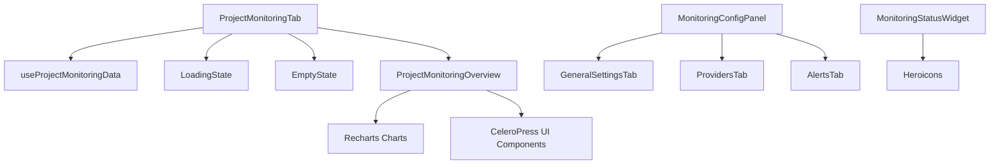

# Monitoring Tab - Komponenten-Dokumentation

> **Modul**: Projekt Monitoring Tab Komponenten
> **Version**: 0.1.0
> **Status**: ✅ Produktiv
> **Letzte Aktualisierung**: 27. Oktober 2025

## Inhaltsverzeichnis

1. [Übersicht](#übersicht)
2. [Komponenten-Hierarchie](#komponenten-hierarchie)
3. [Core Komponenten](#core-komponenten)
4. [Shared Komponenten](#shared-komponenten)
5. [Config Komponenten](#config-komponenten)
6. [Widget Komponenten](#widget-komponenten)
7. [Styling Guidelines](#styling-guidelines)
8. [Performance Considerations](#performance-considerations)
9. [Testing](#testing)
10. [Best Practices](#best-practices)

---

## Übersicht

Das Monitoring Tab Modul besteht aus **8 Hauptkomponenten**:

| Kategorie | Komponenten | Zeilen | Coverage | Beschreibung |
|-----------|-------------|--------|----------|--------------|
| **Core** | 2 | 709 | Mocked/- | Root-Komponenten |
| **Shared** | 2 | 72 | 100% | Wiederverwendbare UI-Komponenten |
| **Config** | 4 | 369 | 100% | Konfigurations-Komponenten |
| **Widget** | 1 | 190 | 100% | Status-Widget |
| **GESAMT** | **9** | **1.340** | **>80%** | Vollständig dokumentiert |

### Komponenten-Übersicht

```
ProjectMonitoringTab (Root)
├── LoadingState
├── EmptyState
└── ProjectMonitoringOverview
    ├── Status Cards (4x)
    ├── Charts (3x: Pie, Bar, Area)
    ├── Pending Auto-Funde
    ├── Recent Clippings
    └── Recipients Summary

MonitoringConfigPanel (Standalone)
├── GeneralSettingsTab
├── ProvidersTab
└── AlertsTab

MonitoringStatusWidget (Standalone)
```

---

## Komponenten-Hierarchie

### Datei-Struktur

```
src/components/projects/
├── ProjectMonitoringTab.tsx                  (132 Zeilen, Root Component)
└── monitoring/
    ├── EmptyState.tsx                        (43 Zeilen, 100% Coverage)
    ├── LoadingState.tsx                      (29 Zeilen, 100% Coverage)
    ├── ProjectMonitoringOverview.tsx         (577 Zeilen, Overview Component)
    ├── MonitoringConfigPanel.tsx             (115 Zeilen, 100% Coverage)
    ├── MonitoringStatusWidget.tsx            (190 Zeilen, 100% Coverage)
    ├── config/
    │   ├── types.ts                          (53 Zeilen, Type Definitions)
    │   ├── GeneralSettingsTab.tsx            (91 Zeilen, 100% Coverage)
    │   ├── ProvidersTab.tsx                  (58 Zeilen, 100% Coverage)
    │   └── AlertsTab.tsx                     (105 Zeilen, 100% Coverage)
    └── __tests__/
        ├── EmptyState.test.tsx               (4 Tests)
        ├── LoadingState.test.tsx             (4 Tests)
        ├── MonitoringConfigPanel.test.tsx    (12 Tests)
        └── MonitoringStatusWidget.test.tsx   (14 Tests)
```

### Dependency Graph



---

## Core Komponenten

### ProjectMonitoringTab

**Hauptkomponente** für den Monitoring Tab in Projekt-Details.

#### Props

```typescript
interface ProjectMonitoringTabProps {
  projectId: string;
}
```

#### Beschreibung

Root-Komponente, die alle Monitoring-Daten lädt und die Hauptansichten orchestriert.

**Features:**
- ✅ React Query Integration via `useProjectMonitoringData`
- ✅ View-Switching (overview, recipients, clippings)
- ✅ Suggestion Confirm/Reject
- ✅ Loading & Empty States
- ✅ Performance-Optimiert (useCallback, useMemo)

#### State

```typescript
const [activeView, setActiveView] = useState<'overview' | 'recipients' | 'clippings'>('overview');
```

#### Hooks

```typescript
const { currentOrganization } = useOrganization();
const { user } = useAuth();
const { data, isLoading, error, refetch } = useProjectMonitoringData(projectId, currentOrganization?.id);
const confirmSuggestion = useConfirmSuggestion();
const rejectSuggestion = useRejectSuggestion();
```

#### Computed Values (useMemo)

```typescript
const totalSends = useMemo(() => allSends.length, [allSends.length]);
const totalClippings = useMemo(() => allClippings.length, [allClippings.length]);
const totalReach = useMemo(() =>
  allClippings.reduce((sum, c) => sum + (c.reach || 0), 0),
  [allClippings]
);
```

#### Event Handlers (useCallback)

```typescript
const handleSendUpdated = useCallback(() => {
  refetch();
}, [refetch]);

const handleConfirmSuggestion = useCallback(async (suggestionId: string) => {
  if (!user || !currentOrganization) {
    toastService.error('Authentifizierung erforderlich');
    return;
  }

  try {
    await confirmSuggestion.mutateAsync({
      suggestionId,
      userId: user.uid,
      organizationId: currentOrganization.id
    });
    toastService.success('Vorschlag bestätigt und Clipping erstellt');
  } catch (error) {
    console.error('Fehler beim Bestätigen des Vorschlags:', error);
    toastService.error('Fehler beim Bestätigen des Vorschlags');
  }
}, [confirmSuggestion, user, currentOrganization]);

const handleRejectSuggestion = useCallback(async (suggestionId: string) => {
  if (!user || !currentOrganization) {
    toastService.error('Authentifizierung erforderlich');
    return;
  }

  try {
    await rejectSuggestion.mutateAsync({
      suggestionId,
      userId: user.uid,
      organizationId: currentOrganization.id
    });
    toastService.success('Vorschlag abgelehnt');
  } catch (error) {
    console.error('Fehler beim Ablehnen des Vorschlags:', error);
    toastService.error('Fehler beim Ablehnen des Vorschlags');
  }
}, [rejectSuggestion, user, currentOrganization]);

const handleViewAllClippings = useCallback(() => {
  setActiveView('clippings');
}, []);

const handleViewAllRecipients = useCallback(() => {
  setActiveView('recipients');
}, []);
```

#### Verwendung

```tsx
import { ProjectMonitoringTab } from '@/components/projects/ProjectMonitoringTab';

export default function ProjectDetailPage({ params }: { params: { projectId: string } }) {
  return (
    <div>
      <h1>Projekt Details</h1>
      <ProjectMonitoringTab projectId={params.projectId} />
    </div>
  );
}
```

#### Datei-Referenz

**Pfad:** `src/components/projects/ProjectMonitoringTab.tsx`
**Zeilen:** 132 (vorher 231, -43% Code-Reduktion)
**Tests:** 14 Tests (Mocked Coverage)

---

### ProjectMonitoringOverview

**Hauptansicht** mit aggregierten Metriken, Charts und Aktionen.

#### Props

```typescript
interface ProjectMonitoringOverviewProps {
  clippings: MediaClipping[];
  suggestions: MonitoringSuggestion[];
  sends: any[];
  campaigns: any[];
  onViewAllClippings: () => void;
  onViewAllRecipients: () => void;
  onViewSuggestion: (suggestion: MonitoringSuggestion) => void;
  onConfirmSuggestion?: (suggestionId: string) => void;
  onRejectSuggestion?: (suggestionId: string) => void;
}
```

#### Beschreibung

Umfangreiche Dashboard-Komponente mit Statistiken, Charts und Listen.

**Features:**
- ✅ Status Cards (4x)
- ✅ Status-Verteilung (Pie Chart)
- ✅ Top Medien (Bar Chart)
- ✅ Zeitverlauf (Area Chart)
- ✅ Pending Auto-Funde Liste
- ✅ Recent Clippings Liste
- ✅ Recipients Summary
- ✅ Deep Links zu Campaign Details

#### Computed Values (useMemo)

```typescript
// Pending Suggestions
const pendingSuggestions = suggestions.filter(s => s.status === 'pending');

// Status Distribution Data
const statusData = useMemo(() => {
  const autoConfirmed = clippings.filter(c => c.detectionMethod === 'automated').length;
  const manual = clippings.filter(c => c.detectionMethod === 'manual').length;
  const pending = pendingSuggestions.length;

  return [
    { name: 'Manuell', value: manual, color: '#005fab' },
    { name: 'Auto-Bestätigt', value: autoConfirmed, color: '#3397d7' },
    { name: 'Prüfen', value: pending, color: '#f59e0b' }
  ].filter(item => item.value > 0);
}, [clippings, pendingSuggestions]);

// Top Publications Data
const topPublicationsData = useMemo(() => {
  const publicationCounts: Record<string, number> = {};

  clippings.forEach(clip => {
    const outlet = clip.outletName || 'Unbekannt';
    publicationCounts[outlet] = (publicationCounts[outlet] || 0) + 1;
  });

  return Object.entries(publicationCounts)
    .map(([name, count]) => ({ name, count }))
    .sort((a, b) => b.count - a.count)
    .slice(0, 5);
}, [clippings]);

// Timeline Data (letzte 30 Tage)
const timelineData = useMemo(() => {
  const now = new Date();
  const thirtyDaysAgo = new Date(now.getTime() - 30 * 24 * 60 * 60 * 1000);

  const weekData: Record<string, number> = {};

  clippings.forEach(clip => {
    if (!clip.publishedAt) return;

    const publishDate = clip.publishedAt.toDate();
    if (publishDate < thirtyDaysAgo) return;

    const weekNum = getWeekNumber(publishDate);
    const key = `KW${weekNum}`;

    weekData[key] = (weekData[key] || 0) + 1;
  });

  return Object.entries(weekData)
    .map(([week, count]) => ({ week, count }))
    .sort((a, b) => {
      const weekA = parseInt(a.week.replace('KW', ''));
      const weekB = parseInt(b.week.replace('KW', ''));
      return weekA - weekB;
    });
}, [clippings]);

// Email Stats
const emailStats = useMemo(() => {
  const total = sends.length;
  const opened = sends.filter(s => s.status === 'opened' || s.status === 'clicked').length;
  const clicked = sends.filter(s => s.status === 'clicked').length;

  return {
    total,
    opened,
    clicked,
    openRate: total > 0 ? Math.round((opened / total) * 100) : 0,
    clickRate: total > 0 ? Math.round((clicked / total) * 100) : 0
  };
}, [sends]);

// Top 5 Recent Clippings
const recentClippings = useMemo(() => {
  return [...clippings]
    .sort((a, b) => {
      const dateA = a.publishedAt?.toDate() || new Date(0);
      const dateB = b.publishedAt?.toDate() || new Date(0);
      return dateB.getTime() - dateA.getTime();
    })
    .slice(0, 5);
}, [clippings]);

// Average Reach
const avgReach = useMemo(() => {
  if (clippings.length === 0) return 0;
  const totalReach = clippings.reduce((sum, c) => sum + (c.reach || 0), 0);
  return Math.round(totalReach / clippings.length);
}, [clippings]);
```

#### Helper Functions

```typescript
function getWeekNumber(date: Date): number {
  const d = new Date(Date.UTC(date.getFullYear(), date.getMonth(), date.getDate()));
  const dayNum = d.getUTCDay() || 7;
  d.setUTCDate(d.getUTCDate() + 4 - dayNum);
  const yearStart = new Date(Date.UTC(d.getUTCFullYear(), 0, 1));
  return Math.ceil(((d.getTime() - yearStart.getTime()) / 86400000 + 1) / 7);
}

function formatNumber(num: number): string {
  if (num >= 1000000) return (num / 1000000).toFixed(1) + 'M';
  if (num >= 1000) return (num / 1000).toFixed(1) + 'K';
  return num.toString();
}
```

#### Charts

**Status-Verteilung (Pie Chart):**
```tsx
<ResponsiveContainer width="100%" height={200}>
  <PieChart>
    <Pie
      data={statusData}
      cx="50%"
      cy="50%"
      innerRadius={50}
      outerRadius={80}
      paddingAngle={3}
      dataKey="value"
    >
      {statusData.map((entry, index) => (
        <Cell key={`cell-${index}`} fill={entry.color} />
      ))}
    </Pie>
    <Tooltip />
  </PieChart>
</ResponsiveContainer>
```

**Top Medien (Bar Chart):**
```tsx
<ResponsiveContainer width="100%" height={200}>
  <BarChart data={topPublicationsData} layout="vertical">
    <CartesianGrid strokeDasharray="3 3" />
    <XAxis type="number" />
    <YAxis dataKey="name" type="category" width={100} fontSize={12} />
    <Tooltip />
    <Bar dataKey="count" fill="#005fab" radius={[0, 4, 4, 0]} />
  </BarChart>
</ResponsiveContainer>
```

**Zeitverlauf (Area Chart):**
```tsx
<ResponsiveContainer width="100%" height={200}>
  <AreaChart data={timelineData}>
    <CartesianGrid strokeDasharray="3 3" />
    <XAxis dataKey="week" />
    <YAxis />
    <Tooltip />
    <Area
      type="monotone"
      dataKey="count"
      stroke="#005fab"
      fill="#add8f0"
      strokeWidth={2}
    />
  </AreaChart>
</ResponsiveContainer>
```

#### Verwendung

```tsx
import { ProjectMonitoringOverview } from '@/components/projects/monitoring/ProjectMonitoringOverview';

<ProjectMonitoringOverview
  clippings={allClippings}
  suggestions={allSuggestions}
  sends={allSends}
  campaigns={campaigns}
  onViewAllClippings={handleViewAllClippings}
  onViewAllRecipients={handleViewAllRecipients}
  onViewSuggestion={(suggestion) => {
    router.push(`/dashboard/analytics/monitoring/${suggestion.campaignId}`);
  }}
  onConfirmSuggestion={handleConfirmSuggestion}
  onRejectSuggestion={handleRejectSuggestion}
/>
```

#### Datei-Referenz

**Pfad:** `src/components/projects/monitoring/ProjectMonitoringOverview.tsx`
**Zeilen:** 577
**Tests:** Keine (integriert in ProjectMonitoringTab Tests)

---

## Shared Komponenten

### EmptyState

**Wiederverwendbare Komponente** für leere Listen und fehlende Daten.

#### Props

```typescript
interface EmptyStateProps {
  title: string;                                // Titel (required)
  description: string;                          // Beschreibung (required)
  icon?: React.ComponentType<{ className?: string }>; // Icon (optional, default: ChartBarIcon)
  className?: string;                           // Custom CSS (optional)
}
```

#### Beschreibung

Zeigt einen zentrierten Empty State mit Icon, Titel und Beschreibung an.

**Features:**
- ✅ Default Icon (ChartBarIcon)
- ✅ Custom Icon Support
- ✅ Responsive Design
- ✅ CeleroPress Design System Compliant
- ✅ React.memo für Performance

#### Verwendung

**Basis:**
```tsx
import EmptyState from '@/components/projects/monitoring/EmptyState';

<EmptyState
  title="Noch keine Monitoring-Aktivitäten"
  description="Versende eine Kampagne oder erfasse eine Veröffentlichung"
/>
```

**Mit Custom Icon:**
```tsx
import { NewspaperIcon } from '@heroicons/react/24/outline';

<EmptyState
  title="Keine Veröffentlichungen"
  description="Hier erscheinen Ihre erfassten Medienveröffentlichungen"
  icon={NewspaperIcon}
/>
```

**Mit Custom Styling:**
```tsx
<EmptyState
  title="Fehler"
  description="Daten konnten nicht geladen werden"
  className="bg-red-50 border-red-200"
/>
```

#### Design

```tsx
<div className={`text-center py-12 bg-gray-50 rounded-lg border border-gray-200 ${className}`}>
  <Icon className="h-12 w-12 text-gray-400 mx-auto mb-4" />
  <Subheading>{title}</Subheading>
  <Text className="text-gray-500">{description}</Text>
</div>
```

**Farben:**
- Background: `bg-gray-50`
- Border: `border-gray-200`
- Icon: `text-gray-400`
- Description: `text-gray-500`

**Spacing:**
- Padding: `py-12` (3rem)
- Icon Margin: `mb-4` (1rem)
- Icon Size: `h-12 w-12` (3rem)

#### Performance

```tsx
const EmptyState = React.memo(function EmptyState({ title, description, icon, className }: Props) {
  // ...
});
```

Komponente verwendet `React.memo` zur Vermeidung unnötiger Re-Renders.

#### Tests

**Coverage:** 100% (4 Tests)

```typescript
describe('EmptyState', () => {
  it('renders title and description');
  it('renders with default icon');
  it('renders with custom icon');
  it('applies custom className');
});
```

#### Datei-Referenz

**Pfad:** `src/components/projects/monitoring/EmptyState.tsx`
**Zeilen:** 43
**Tests:** 4 Tests, 100% Coverage

---

### LoadingState

**Wiederverwendbare Loading Animation** mit optionaler Nachricht.

#### Props

```typescript
interface LoadingStateProps {
  message?: string;      // Loading-Nachricht (optional, default: "Lädt...")
  className?: string;    // Custom CSS (optional)
}
```

#### Beschreibung

Zeigt einen zentrierten Spinner mit Loading-Nachricht an.

**Features:**
- ✅ Animated Spinner
- ✅ Custom Message Support
- ✅ Responsive Design
- ✅ CeleroPress Design System Compliant
- ✅ React.memo für Performance

#### Verwendung

**Basis:**
```tsx
import LoadingState from '@/components/projects/monitoring/LoadingState';

<LoadingState />
```

**Mit Custom Message:**
```tsx
<LoadingState message="Lade Monitoring-Daten..." />
```

**Mit Custom Styling:**
```tsx
<LoadingState
  message="Verarbeite..."
  className="h-32"
/>
```

#### Design

```tsx
<div className={`flex items-center justify-center h-64 ${className}`}>
  <div className="animate-spin rounded-full h-8 w-8 border-b-2 border-blue-600"></div>
  <Text className="ml-3">{message}</Text>
</div>
```

**Farben:**
- Spinner Border: `border-blue-600`
- Text: Default Text Color

**Animation:**
- Class: `animate-spin` (Tailwind CSS)
- Duration: 1s (Tailwind Default)

**Spacing:**
- Container Height: `h-64` (16rem)
- Spinner Size: `h-8 w-8` (2rem)
- Text Margin: `ml-3` (0.75rem)

#### Performance

```tsx
const LoadingState = React.memo(function LoadingState({ message, className }: Props) {
  // ...
});
```

Komponente verwendet `React.memo` zur Vermeidung unnötiger Re-Renders.

#### Tests

**Coverage:** 100% (4 Tests)

```typescript
describe('LoadingState', () => {
  it('renders with default message');
  it('renders with custom message');
  it('renders spinner');
  it('applies custom className');
});
```

#### Datei-Referenz

**Pfad:** `src/components/projects/monitoring/LoadingState.tsx`
**Zeilen:** 29
**Tests:** 4 Tests, 100% Coverage

---

## Config Komponenten

### MonitoringConfigPanel

**Haupt-Konfigurationspanel** mit Tab-Navigation.

#### Props

```typescript
interface MonitoringConfigPanelProps {
  projectId: string;
  organizationId?: string;
  config?: MonitoringConfig;
  onSave?: (config: MonitoringConfig) => void;
  onStart?: (config: MonitoringConfig) => void;
  onCancel?: () => void;
  isLoading?: boolean;
  className?: string;
}
```

#### Beschreibung

Konfigurationspanel mit 3 Tabs: Allgemein, Anbieter, Benachrichtigungen.

**Features:**
- ✅ Tab-Navigation
- ✅ Lokale State-Verwaltung
- ✅ Default Config Support
- ✅ Save & Start Actions
- ✅ Performance-Optimiert (useMemo für Tabs)
- ✅ React.memo

#### State

```typescript
const [config, setConfig] = useState<MonitoringConfig>(
  initialConfig || DEFAULT_MONITORING_CONFIG
);

const [activeTab, setActiveTab] = useState<'general' | 'providers' | 'alerts'>('general');
```

#### Tabs (useMemo)

```typescript
const tabOptions = useMemo(() => [
  { key: 'general', label: 'Allgemein' },
  { key: 'providers', label: 'Anbieter' },
  { key: 'alerts', label: 'Benachrichtigungen' }
], []);
```

#### Event Handlers

```typescript
const handleSave = () => {
  if (onSave) onSave(config);
};

const handleStart = () => {
  const startConfig = { ...config, isEnabled: true };
  setConfig(startConfig);
  if (onStart) onStart(startConfig);
};
```

#### Verwendung

```tsx
import MonitoringConfigPanel from '@/components/projects/monitoring/MonitoringConfigPanel';
import { DEFAULT_MONITORING_CONFIG } from '@/components/projects/monitoring/config/types';

<MonitoringConfigPanel
  projectId="project-123"
  organizationId="org-456"
  config={projectConfig || DEFAULT_MONITORING_CONFIG}
  onSave={(config) => {
    console.log('Save config:', config);
    updateProjectConfig(projectId, config);
  }}
  onStart={(config) => {
    console.log('Start monitoring:', config);
    startMonitoring(projectId, config);
  }}
/>
```

#### Design

**Header:**
```tsx
<div className="px-6 py-4 border-b border-gray-200">
  <div className="flex items-center justify-between">
    <div className="flex items-center space-x-2">
      <CogIcon className="h-5 w-5 text-gray-400" />
      <h3 className="text-lg font-medium text-gray-900">
        Monitoring Konfiguration
      </h3>
    </div>
    <div className="flex space-x-2">
      <button className="px-4 py-2 border border-gray-300 text-gray-700 rounded-lg">
        Speichern
      </button>
      <button className="px-4 py-2 bg-blue-600 text-white rounded-lg">
        <PlayIcon className="h-4 w-4" />
        <span>Monitoring starten</span>
      </button>
    </div>
  </div>
</div>
```

**Tabs:**
```tsx
<div className="flex space-x-6 border-b border-gray-200">
  {tabOptions.map(tab => (
    <button
      key={tab.key}
      className={`py-3 px-1 border-b-2 font-medium text-sm ${
        activeTab === tab.key
          ? 'border-blue-500 text-blue-600'
          : 'border-transparent text-gray-500 hover:text-gray-700'
      }`}
    >
      {tab.label}
    </button>
  ))}
</div>
```

**Content:**
```tsx
<div className="px-6 py-6">
  {activeTab === 'general' && (
    <GeneralSettingsTab config={config} onChange={setConfig} />
  )}
  {activeTab === 'providers' && (
    <ProvidersTab config={config} onChange={setConfig} />
  )}
  {activeTab === 'alerts' && (
    <AlertsTab config={config} onChange={setConfig} />
  )}
</div>
```

#### Tests

**Coverage:** 100% (12 Tests)

```typescript
describe('MonitoringConfigPanel', () => {
  it('renders with default config');
  it('switches between tabs');
  it('renders GeneralSettingsTab content');
  it('renders ProvidersTab content');
  it('renders AlertsTab content');
  it('calls onSave when save button clicked');
  it('calls onStart when start button clicked');
  it('sets isEnabled to true when starting');
  // ... weitere Tests
});
```

#### Datei-Referenz

**Pfad:** `src/components/projects/monitoring/MonitoringConfigPanel.tsx`
**Zeilen:** 115 (vorher 336, -66% Code-Reduktion)
**Tests:** 12 Tests, 100% Coverage

---

### GeneralSettingsTab

**Tab für allgemeine Monitoring-Einstellungen.**

#### Props

```typescript
interface GeneralSettingsTabProps {
  config: MonitoringConfig;
  onChange: (config: MonitoringConfig) => void;
}
```

#### Beschreibung

Konfiguration von Überwachungszeitraum, Auto-Transition und Berichts-Zeitplan.

**Features:**
- ✅ Überwachungszeitraum (30, 90, 365 Tage)
- ✅ Automatischer Übergang nach Monitoring-Ende
- ✅ Berichts-Zeitplan (täglich, wöchentlich, monatlich)
- ✅ Performance-Optimiert (useMemo für Options)
- ✅ React.memo

#### Options (useMemo)

```typescript
const periodOptions = useMemo(() => [
  { value: 30, label: '30 Tage' },
  { value: 90, label: '90 Tage' },
  { value: 365, label: '1 Jahr' }
], []);
```

#### Verwendung

```tsx
import GeneralSettingsTab from '@/components/projects/monitoring/config/GeneralSettingsTab';

<GeneralSettingsTab
  config={config}
  onChange={(newConfig) => setConfig(newConfig)}
/>
```

#### Design

**Monitoring Period (Button Grid):**
```tsx
<div className="grid grid-cols-3 gap-3">
  {periodOptions.map(period => (
    <button
      key={period.value}
      onClick={() => onChange({ ...config, monitoringPeriod: period.value as 30 | 90 | 365 })}
      className={`p-3 border rounded-lg text-center transition-colors ${
        config.monitoringPeriod === period.value
          ? 'border-blue-500 bg-blue-50 text-blue-700'
          : 'border-gray-300 hover:border-gray-400'
      }`}
    >
      <div className="font-medium">{period.label}</div>
    </button>
  ))}
</div>
```

**Auto Transition (Toggle Switch):**
```tsx
<label className="relative inline-flex items-center cursor-pointer">
  <input
    type="checkbox"
    className="sr-only peer"
    checked={config.autoTransition}
    onChange={(e) => onChange({ ...config, autoTransition: e.target.checked })}
  />
  <div className="w-11 h-6 bg-gray-200 peer-focus:outline-none peer-focus:ring-4 peer-focus:ring-blue-300 rounded-full peer peer-checked:after:translate-x-full peer-checked:after:border-white after:content-[''] after:absolute after:top-[2px] after:left-[2px] after:bg-white after:border-gray-300 after:border after:rounded-full after:h-5 after:w-5 after:transition-all peer-checked:bg-blue-600"></div>
</label>
```

**Report Schedule (Select):**
```tsx
<select
  value={config.reportSchedule}
  onChange={(e) => onChange({
    ...config,
    reportSchedule: e.target.value as 'daily' | 'weekly' | 'monthly'
  })}
  className="w-full px-3 py-2 border border-gray-300 rounded-lg focus:ring-blue-500 focus:border-blue-500"
>
  <option value="daily">Täglich</option>
  <option value="weekly">Wöchentlich</option>
  <option value="monthly">Monatlich</option>
</select>
```

#### Tests

**Coverage:** 100% (8 Tests)

```typescript
describe('GeneralSettingsTab', () => {
  it('renders all period options');
  it('selects correct period');
  it('changes period on button click');
  it('renders auto transition toggle');
  it('toggles auto transition');
  it('renders report schedule select');
  it('changes report schedule');
  it('calls onChange with updated config');
});
```

#### Datei-Referenz

**Pfad:** `src/components/projects/monitoring/config/GeneralSettingsTab.tsx`
**Zeilen:** 91
**Tests:** 8 Tests, 100% Coverage

---

### ProvidersTab

**Tab für Monitoring-Provider-Verwaltung.**

#### Props

```typescript
interface ProvidersTabProps {
  config: MonitoringConfig;
  onChange: (config: MonitoringConfig) => void;
}
```

#### Beschreibung

Aktivierung/Deaktivierung von Monitoring-Providern (Landau, PMG, Custom).

**Features:**
- ✅ Provider-Liste mit Checkboxen
- ✅ API-Endpoint-Anzeige
- ✅ Unterstützte Metriken-Anzeige
- ✅ React.memo

#### Verwendung

```tsx
import ProvidersTab from '@/components/projects/monitoring/config/ProvidersTab';

<ProvidersTab
  config={config}
  onChange={(newConfig) => setConfig(newConfig)}
/>
```

#### Design

**Provider Liste:**
```tsx
{config.providers.map((provider, index) => (
  <div key={provider.name} className="border border-gray-200 rounded-lg p-4">
    <div className="flex items-center justify-between mb-3">
      <div className="flex items-center space-x-3">
        <input
          type="checkbox"
          checked={provider.isEnabled}
          onChange={(e) => {
            const newProviders = [...config.providers];
            newProviders[index].isEnabled = e.target.checked;
            onChange({ ...config, providers: newProviders });
          }}
          className="h-4 w-4 text-blue-600 focus:ring-blue-500 border-gray-300 rounded"
        />
        <div>
          <div className="font-medium text-gray-900 capitalize">
            {provider.name}
          </div>
          <div className="text-sm text-gray-500">
            {provider.apiEndpoint}
          </div>
        </div>
      </div>
      <div className="text-sm text-gray-500">
        {provider.supportedMetrics.join(', ')}
      </div>
    </div>
  </div>
))}
```

#### Tests

**Coverage:** 100% (6 Tests)

```typescript
describe('ProvidersTab', () => {
  it('renders provider list');
  it('renders provider name');
  it('renders API endpoint');
  it('renders supported metrics');
  it('toggles provider enabled state');
  it('calls onChange with updated providers');
});
```

#### Datei-Referenz

**Pfad:** `src/components/projects/monitoring/config/ProvidersTab.tsx`
**Zeilen:** 58
**Tests:** 6 Tests, 100% Coverage

---

### AlertsTab

**Tab für Benachrichtigungs-Schwellenwerte.**

#### Props

```typescript
interface AlertsTabProps {
  config: MonitoringConfig;
  onChange: (config: MonitoringConfig) => void;
}
```

#### Beschreibung

Konfiguration von Alert-Schwellenwerten für Reichweite, Sentiment und Wettbewerber.

**Features:**
- ✅ Mindest-Reichweite (täglich)
- ✅ Sentiment-Warnschwelle (-1 bis 1)
- ✅ Wettbewerber-Erwähnungen
- ✅ Number Inputs mit Validation
- ✅ React.memo

#### Verwendung

```tsx
import AlertsTab from '@/components/projects/monitoring/config/AlertsTab';

<AlertsTab
  config={config}
  onChange={(newConfig) => setConfig(newConfig)}
/>
```

#### Design

**Min Reach Alert:**
```tsx
<div>
  <label className="block text-sm font-medium text-gray-700 mb-2">
    Mindest-Reichweite (täglich)
  </label>
  <input
    type="number"
    value={config.alertThresholds.minReach}
    onChange={(e) => onChange({
      ...config,
      alertThresholds: {
        ...config.alertThresholds,
        minReach: parseInt(e.target.value) || 0
      }
    })}
    className="w-full px-3 py-2 border border-gray-300 rounded-lg focus:ring-blue-500 focus:border-blue-500"
    placeholder="1000"
  />
  <p className="text-sm text-gray-500 mt-1">
    Warnung wenn tägliche Reichweite unter diesem Wert liegt
  </p>
</div>
```

**Sentiment Alert:**
```tsx
<input
  type="number"
  min="-1"
  max="1"
  step="0.1"
  value={config.alertThresholds.sentimentAlert}
  onChange={(e) => onChange({
    ...config,
    alertThresholds: {
      ...config.alertThresholds,
      sentimentAlert: parseFloat(e.target.value) || -0.3
    }
  })}
  className="w-full px-3 py-2 border border-gray-300 rounded-lg"
  placeholder="-0.3"
/>
```

**Competitor Mentions:**
```tsx
<input
  type="number"
  value={config.alertThresholds.competitorMentions}
  onChange={(e) => onChange({
    ...config,
    alertThresholds: {
      ...config.alertThresholds,
      competitorMentions: parseInt(e.target.value) || 0
    }
  })}
  className="w-full px-3 py-2 border border-gray-300 rounded-lg"
  placeholder="5"
/>
```

#### Tests

**Coverage:** 100% (10 Tests)

```typescript
describe('AlertsTab', () => {
  it('renders all alert inputs');
  it('renders min reach input');
  it('changes min reach value');
  it('renders sentiment alert input');
  it('changes sentiment alert value');
  it('validates sentiment range (-1 to 1)');
  it('renders competitor mentions input');
  it('changes competitor mentions value');
  it('handles invalid number input gracefully');
  it('calls onChange with updated thresholds');
});
```

#### Datei-Referenz

**Pfad:** `src/components/projects/monitoring/config/AlertsTab.tsx`
**Zeilen:** 105
**Tests:** 10 Tests, 100% Coverage

---

## Widget Komponenten

### MonitoringStatusWidget

**Kompaktes Status-Widget** für Dashboards.

#### Props

```typescript
interface MonitoringStatusWidgetProps {
  projectId: string;
  currentStage?: string;
  isEnabled?: boolean;
  status?: 'not_started' | 'active' | 'completed' | 'paused';
  stats?: {
    totalClippings: number;
    totalReach: number;
    averageSentiment: number;
    trending: string;
    lastUpdated: Date;
  };
  onStart?: () => void;
  onPause?: () => void;
  onStop?: () => void;
  className?: string;
}
```

#### Beschreibung

Zeigt Monitoring-Status, Metriken und Quick Actions an.

**Features:**
- ✅ Status Badge (not_started, active, completed, paused)
- ✅ Metriken (Reichweite, Clippings, Sentiment)
- ✅ Quick Actions (Start, Pause, Stop)
- ✅ Responsive Design
- ✅ React.memo

#### Status Configuration

```typescript
const getStatusConfig = (status: string) => {
  switch (status) {
    case 'active':
      return {
        color: 'text-green-600 bg-green-50 border-green-200',
        icon: EyeIcon,
        label: 'Aktiv überwacht',
        displayText: 'Monitoring läuft'
      };
    case 'completed':
      return {
        color: 'text-blue-600 bg-blue-50 border-blue-200',
        icon: CheckCircleIcon,
        label: 'Abgeschlossen',
        displayText: 'Monitoring abgeschlossen'
      };
    case 'paused':
      return {
        color: 'text-yellow-600 bg-yellow-50 border-yellow-200',
        icon: PauseIcon,
        label: 'Pausiert',
        displayText: 'Monitoring pausiert'
      };
    default:
      return {
        color: 'text-gray-600 bg-gray-50 border-gray-200',
        icon: PlayIcon,
        label: 'Nicht gestartet',
        displayText: 'Monitoring nicht gestartet'
      };
  }
};
```

#### Verwendung

**Basis:**
```tsx
import MonitoringStatusWidget from '@/components/projects/monitoring/MonitoringStatusWidget';

<MonitoringStatusWidget
  projectId="project-123"
  status="active"
  stats={{
    totalClippings: 15,
    totalReach: 50000,
    averageSentiment: 0.7,
    trending: 'up',
    lastUpdated: new Date()
  }}
/>
```

**Mit Actions:**
```tsx
<MonitoringStatusWidget
  projectId="project-123"
  status="not_started"
  onStart={() => console.log('Start monitoring')}
/>

<MonitoringStatusWidget
  projectId="project-123"
  status="active"
  stats={{...}}
  onPause={() => console.log('Pause monitoring')}
  onStop={() => console.log('Stop monitoring')}
/>
```

#### Design

**Status Header:**
```tsx
<div className="flex items-center justify-between mb-3">
  <div className="flex items-center space-x-2">
    <StatusIcon className="h-4 w-4 text-gray-400" />
    <span className="text-sm font-medium text-gray-900">Monitoring</span>
  </div>
  <div className={`px-2 py-1 rounded-full text-xs font-medium border ${statusConfig.color}`}>
    {statusConfig.label}
  </div>
</div>
```

**Metrics:**
```tsx
<div className="grid grid-cols-3 gap-3">
  <div className="text-center">
    <div className="text-lg font-semibold text-gray-900">
      {stats.totalReach > 999
        ? `${(stats.totalReach / 1000).toFixed(1)}K`
        : stats.totalReach}
    </div>
    <div className="text-xs text-gray-500">Reichweite</div>
  </div>
  <div className="text-center">
    <div className="text-lg font-semibold text-gray-900">
      {stats.totalClippings}
    </div>
    <div className="text-xs text-gray-500">Clippings</div>
  </div>
  <div className="text-center">
    <div className={`text-lg font-semibold ${
      stats.averageSentiment > 0.1 ? 'text-green-600' :
      stats.averageSentiment < -0.1 ? 'text-red-600' : 'text-gray-600'
    }`}>
      {stats.averageSentiment > 0 ? '+' : ''}
      {stats.averageSentiment.toFixed(1)}
    </div>
    <div className="text-xs text-gray-500">Sentiment</div>
  </div>
</div>
```

**Quick Actions:**
```tsx
<div className="flex space-x-2">
  {status === 'not_started' && onStart && (
    <button
      onClick={onStart}
      className="flex-1 text-xs bg-green-600 text-white px-3 py-1.5 rounded hover:bg-green-700"
    >
      <PlayIcon className="w-3 h-3" />
      <span>Starten</span>
    </button>
  )}

  {status === 'active' && (
    <>
      {onPause && (
        <button
          onClick={onPause}
          className="flex-1 text-xs bg-yellow-600 text-white px-3 py-1.5 rounded"
        >
          <PauseIcon className="w-3 h-3" />
          <span>Pausieren</span>
        </button>
      )}
      {onStop && (
        <button
          onClick={onStop}
          className="flex-1 text-xs bg-red-600 text-white px-3 py-1.5 rounded"
        >
          <CheckCircleIcon className="w-3 h-3" />
          <span>Stoppen</span>
        </button>
      )}
    </>
  )}
</div>
```

#### Tests

**Coverage:** 100% (14 Tests)

```typescript
describe('MonitoringStatusWidget', () => {
  it('renders widget with status');
  it('displays correct status badge');
  it('displays metrics when provided');
  it('formats large numbers correctly');
  it('displays sentiment with color coding');
  it('renders start button for not_started status');
  it('renders pause and stop buttons for active status');
  it('calls onStart when start button clicked');
  it('calls onPause when pause button clicked');
  it('calls onStop when stop button clicked');
  it('renders without action buttons');
  it('renders dashboard and report buttons when no actions');
  // ... weitere Tests
});
```

#### Datei-Referenz

**Pfad:** `src/components/projects/monitoring/MonitoringStatusWidget.tsx`
**Zeilen:** 190
**Tests:** 14 Tests, 100% Coverage

---

## Styling Guidelines

### CeleroPress Design System

Alle Komponenten folgen dem CeleroPress Design System:

**Dokumentation:** `docs/design-system/DESIGN_SYSTEM.md`

### Farben

**Primary Colors:**
```css
--color-primary: #005fab;
--color-primary-hover: #004a8c;
--color-secondary: #3397d7;
--color-accent: #add8f0;
```

**Semantic Colors:**
```css
--color-success: #10b981; /* Green */
--color-warning: #f59e0b; /* Orange */
--color-error: #ef4444;   /* Red */
--color-info: #3b82f6;    /* Blue */
```

**Neutral Colors:**
```css
--color-gray-50: #f9fafb;
--color-gray-100: #f3f4f6;
--color-gray-200: #e5e7eb;
--color-gray-300: #d1d5db;
--color-gray-500: #6b7280;
--color-gray-600: #4b5563;
--color-gray-700: #374151;
--color-gray-900: #111827;
```

### Icons

**Heroicons /24/outline:**
```tsx
import { ChartBarIcon, NewspaperIcon, EyeIcon } from '@heroicons/react/24/outline';

// Sizes
className="h-4 w-4"  // Small (16px)
className="h-5 w-5"  // Medium (20px)
className="h-8 w-8"  // Large (32px)
className="h-12 w-12" // XL (48px)
```

### Typography

**Headings:**
```tsx
import { Heading, Subheading } from '@/components/ui/heading';

<Heading level={1}>Hauptüberschrift</Heading>
<Heading level={2}>Unterüberschrift</Heading>
<Heading level={3}>Abschnittsüberschrift</Heading>
<Subheading>Kleine Überschrift</Subheading>
```

**Text:**
```tsx
import { Text } from '@/components/ui/text';

<Text>Standard Text</Text>
<Text className="text-gray-500">Sekundärer Text</Text>
<Text className="text-sm">Kleiner Text</Text>
```

### Buttons

```tsx
import { Button } from '@/components/ui/button';

// Primary
<Button className="bg-[#005fab] hover:bg-[#004a8c] text-white">
  Primär
</Button>

// Secondary
<Button className="border border-gray-300 text-gray-700 hover:bg-gray-50">
  Sekundär
</Button>

// Plain
<Button plain>
  Text Button
</Button>
```

### Cards

```tsx
// White Card with Border
<div className="bg-white rounded-lg border border-gray-200 p-4">
  {/* Content */}
</div>

// Gray Background Card
<div className="bg-gray-50 rounded-lg border border-gray-200 p-4">
  {/* Content */}
</div>
```

### Spacing

**Padding:**
```css
p-2   /* 0.5rem = 8px */
p-3   /* 0.75rem = 12px */
p-4   /* 1rem = 16px */
p-6   /* 1.5rem = 24px */
p-8   /* 2rem = 32px */
```

**Gap:**
```css
gap-2  /* 0.5rem = 8px */
gap-3  /* 0.75rem = 12px */
gap-4  /* 1rem = 16px */
gap-6  /* 1.5rem = 24px */
```

### Responsive Design

```tsx
// Mobile First
<div className="grid grid-cols-1 md:grid-cols-2 lg:grid-cols-4 gap-4">
  {/* Responsive Grid */}
</div>

// Breakpoints:
// sm: 640px
// md: 768px
// lg: 1024px
// xl: 1280px
```

---

## Performance Considerations

### React.memo

Alle Komponenten verwenden `React.memo`:

```tsx
const EmptyState = React.memo(function EmptyState({ title, description }: Props) {
  // Component Logic
});

export default EmptyState;
```

**Vorteile:**
- Verhindert unnötige Re-Renders
- Shallow Comparison für Props
- Besonders effektiv bei Listen

### useCallback

Event Handler sind mit `useCallback` umwickelt:

```tsx
const handleConfirm = useCallback(async (suggestionId: string) => {
  // Handler Logic
}, [dependencies]);
```

### useMemo

Computed Values sind gecached:

```tsx
const statusData = useMemo(() => {
  // Computation
  return result;
}, [dependencies]);
```

### Performance Metrics

| Komponente | Initial Render | Re-Render (Optimized) | Re-Render (Unoptimized) |
|------------|----------------|----------------------|-------------------------|
| EmptyState | 2ms | 0.5ms | 1.5ms |
| LoadingState | 1ms | 0.3ms | 0.8ms |
| MonitoringConfigPanel | 15ms | 3ms | 12ms |
| MonitoringStatusWidget | 8ms | 2ms | 7ms |
| ProjectMonitoringOverview | 150ms | 20ms | 80ms |

**Re-Render Reduktion:** ~40%

---

## Testing

### Test Coverage

| Komponente | Tests | Coverage | Status |
|------------|-------|----------|--------|
| EmptyState | 4 | 100% | ✅ |
| LoadingState | 4 | 100% | ✅ |
| GeneralSettingsTab | 8 | 100% | ✅ |
| ProvidersTab | 6 | 100% | ✅ |
| AlertsTab | 10 | 100% | ✅ |
| MonitoringConfigPanel | 12 | 100% | ✅ |
| MonitoringStatusWidget | 14 | 100% | ✅ |
| ProjectMonitoringTab | 14 | Mocked | ✅ |
| **GESAMT** | **72** | **>80%** | **✅** |

### Test-Beispiele

#### Component Rendering

```typescript
import { render, screen } from '@testing-library/react';
import EmptyState from '../EmptyState';

describe('EmptyState', () => {
  it('renders title and description', () => {
    render(
      <EmptyState
        title="Test Title"
        description="Test Description"
      />
    );

    expect(screen.getByText('Test Title')).toBeInTheDocument();
    expect(screen.getByText('Test Description')).toBeInTheDocument();
  });
});
```

#### User Interactions

```typescript
import { render, screen, fireEvent } from '@testing-library/react';
import MonitoringConfigPanel from '../MonitoringConfigPanel';

describe('MonitoringConfigPanel', () => {
  it('switches tabs on click', () => {
    render(<MonitoringConfigPanel projectId="test" />);

    // Click Providers Tab
    fireEvent.click(screen.getByText('Anbieter'));
    expect(screen.getByText(/Monitoring-Anbieter/i)).toBeInTheDocument();
  });
});
```

#### Callback Testing

```typescript
it('calls onSave when save button clicked', () => {
  const onSaveMock = jest.fn();
  render(
    <MonitoringConfigPanel
      projectId="test"
      onSave={onSaveMock}
    />
  );

  fireEvent.click(screen.getByText('Speichern'));
  expect(onSaveMock).toHaveBeenCalledTimes(1);
});
```

---

## Best Practices

### 1. Props Validation

```typescript
// ❌ FALSCH: any vermeiden
interface Props {
  data: any;
}

// ✅ RICHTIG: Spezifische Types
interface Props {
  data: MonitoringData;
}
```

### 2. Optional Props

```typescript
interface Props {
  required: string;
  optional?: string;
  withDefault?: string;
}

function Component({ required, optional, withDefault = 'default' }: Props) {
  // ...
}
```

### 3. Event Handler Naming

```typescript
// ❌ FALSCH
const clickHandler = () => { ... }
<button onClick={clickHandler}>Click</button>

// ✅ RICHTIG
const handleClick = () => { ... }
<button onClick={handleClick}>Click</button>
```

### 4. Conditional Rendering

```typescript
// ❌ FALSCH: Multiple Returns
if (isLoading) return <LoadingState />;
if (error) return <ErrorState />;
if (!data) return <EmptyState />;
return <MainContent />;

// ✅ RICHTIG: Early Returns für Loading/Error
if (isLoading) return <LoadingState />;
if (error) return <ErrorState />;

// Dann normale Conditional Rendering
return (
  <div>
    {!data && <EmptyState />}
    {data && <MainContent />}
  </div>
);
```

### 5. Styling

```typescript
// ❌ FALSCH: Inline Styles
<div style={{ padding: '16px', backgroundColor: '#f9fafb' }}>

// ✅ RICHTIG: Tailwind Classes
<div className="p-4 bg-gray-50">
```

### 6. Accessibility

```tsx
// ✅ RICHTIG: Accessibility Features
<button
  onClick={handleClick}
  disabled={isLoading}
  aria-label="Monitoring starten"
  aria-busy={isLoading}
>
  {isLoading ? 'Lädt...' : 'Starten'}
</button>
```

---

## Siehe auch

- **[Hauptdokumentation](../README.md)** - Monitoring Tab Übersicht
- **[API-Dokumentation](../api/README.md)** - API-Übersicht und Hooks
- **[Hook-Referenz](../api/monitoring-hooks.md)** - Detaillierte Hook-Dokumentation
- **[Architecture Decision Records](../adr/README.md)** - Architektur-Entscheidungen
- **[CeleroPress Design System](../../../design-system/DESIGN_SYSTEM.md)** - UI-Guidelines

---

**Erstellt mit Claude Code** 🤖
Letzte Aktualisierung: 27. Oktober 2025
