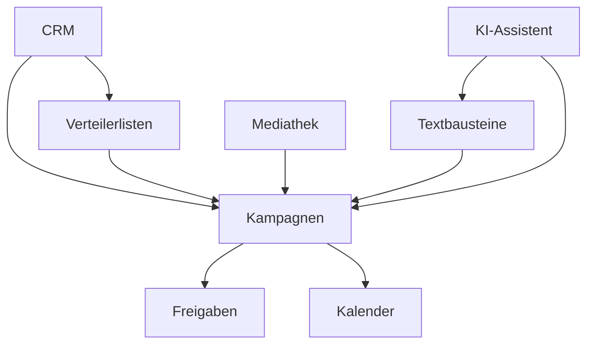

# SKAMP Features Übersicht

Diese Dokumentation bietet einen detaillierten Überblick über alle Hauptfunktionen von SKAMP - Die Online Suite für Pressemeldungen.

## 🎯 Feature-Module

SKAMP besteht aus 8 integrierten Modulen, die zusammen eine vollständige PR-Management-Lösung bilden:

### 📊 CRM & Kontakte
**[→ Zur Dokumentation](./crm.md)**

Das Herzstück für die Verwaltung von Medienkontakten und Firmen.
- **Status**: ✅ Produktiv
- **Highlights**: Publikationsverwaltung, erweiterte Filter, CSV-Import/Export
- **Priorität**: Aktivitäts-Historie, Dubletten-Erkennung

### 📨 Kampagnen-Management
**[→ Zur Dokumentation](./campaigns.md)**

Erstellen, freigeben und versenden Sie professionelle Pressemeldungen.
- **Status**: ✅ Produktiv
- **Highlights**: KI-Textgenerierung, Rich-Text Editor, SendGrid-Integration
- **Priorität**: Template-System, erweitertes Tracking

### 📋 Verteilerlisten
**[→ Zur Dokumentation](./distribution-lists.md)**

Intelligente Gruppierung von Kontakten für zielgerichtete Kommunikation.
- **Status**: ✅ Produktiv
- **Highlights**: Dynamische & statische Listen, Multi-Filter
- **Priorität**: Erweiterte Filter, Listen-Analyse

### 🖼️ Mediathek (DAM)
**[→ Zur Dokumentation](./media-library.md)**

Zentrale Verwaltung aller PR-relevanten Mediendateien.
- **Status**: ✅ Produktiv
- **Highlights**: Multi-Client Zuordnung, Ordner-System, Kampagnen-Integration
- **Priorität**: Bildbearbeitung, Versions-Management

### ✅ Freigabe-Workflow
**[→ Zur Dokumentation](./approvals.md)**

Strukturierter Approval-Prozess für Qualitätssicherung.
- **Status**: ✅ Produktiv
- **Highlights**: Eindeutige Share-Links, Kommentar-Funktion, E-Mail-Benachrichtigungen
- **Priorität**: Multi-Stakeholder Workflows, Annotations

### 📅 Kalender
**[→ Zur Dokumentation](./calendar.md)**

Zentrale Übersicht über alle PR-Aktivitäten und Termine.
- **Status**: ✅ Basis implementiert
- **Highlights**: FullCalendar Integration, Drag & Drop
- **Priorität**: Google Calendar Sync, automatische Events

### 📝 Textbausteine
**[→ Zur Dokumentation](./boilerplates.md)**

Wiederverwendbare Textblöcke für konsistente Kommunikation.
- **Status**: ✅ Produktiv
- **Highlights**: Rich-Text Support, Editor-Integration
- **Priorität**: Intelligente Platzhalter, Versionierung

### 🤖 KI-Assistent
**[→ Zur Dokumentation](./ai-assistant.md)**

Google Gemini Integration für intelligente Textunterstützung.
- **Status**: ✅ Produktiv
- **Highlights**: Strukturierte Generierung, Deutsche Sprache, Template-System
- **Priorität**: Text-Verbesserung, Personalisierung

## 📊 Feature-Status Matrix

| Modul | Implementiert | In Entwicklung | Geplant | Dokumentation |
|-------|:-------------:|:--------------:|:-------:|:-------------:|
| CRM | 85% | 5% | 10% | ✅ Vollständig |
| Kampagnen | 80% | 10% | 10% | ✅ Vollständig |
| Verteilerlisten | 75% | 5% | 20% | ✅ Vollständig |
| Mediathek | 70% | 10% | 20% | ✅ Vollständig |
| Freigaben | 75% | 10% | 15% | ✅ Vollständig |
| Kalender | 40% | 20% | 40% | ✅ Vollständig |
| Textbausteine | 65% | 15% | 20% | ✅ Vollständig |
| KI-Assistent | 60% | 15% | 25% | ✅ Vollständig |

## 🚀 Entwicklungs-Roadmap

### Phase 1 - Q1 2025 (Konsolidierung)
- [ ] CRM: Aktivitäts-Historie
- [ ] Kampagnen: Template-System
- [ ] Kalender: Google Calendar Integration
- [ ] KI: Text-Verbesserung Feature

### Phase 2 - Q2 2025 (Integration)
- [ ] Gmail/Outlook Integration
- [ ] Erweiterte Analytics
- [ ] Multi-Language Support
- [ ] Mobile App (React Native)

### Phase 3 - Q3 2025 (Enterprise)
- [ ] Multi-Tenant Architektur
- [ ] Advanced Workflows
- [ ] KI-Personalisierung
- [ ] White-Label Option

## 🔗 Feature-Abhängigkeiten

## 📈 Nutzungs-Prioritäten

1. **Täglich**: CRM, Kampagnen, Mediathek
2. **Wöchentlich**: Verteilerlisten, Kalender, KI-Assistent
3. **Monatlich**: Textbausteine, Freigaben
4. **Nach Bedarf**: Import/Export, Analytics

## 🛠️ Technische Integration

Alle Module teilen:
- **Datenbank**: Firebase Firestore
- **Authentifizierung**: Firebase Auth
- **Storage**: Firebase Storage
- **UI Framework**: Next.js 14 + Tailwind CSS
- **State Management**: React Context API

## 📚 Weitere Dokumentation

- [Architektur-Übersicht](../ARCHITECTURE.md)
- [API-Dokumentation](../API.md)
- [Deployment Guide](../DEPLOYMENT.md)
- [Entwicklungsrichtlinien](../CONTRIBUTING.md)

## 🤝 Feature Requests & Feedback

Neue Feature-Ideen oder Verbesserungsvorschläge können über folgende Kanäle eingereicht werden:
- GitHub Issues
- In-App Feedback
- E-Mail an feedback@skamp.de

---

*Letzte Aktualisierung: Juli 2025*